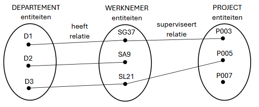

# DATABASES : Hoofdstuk 4 - EERD - Beperkingen van het ER model

## Inleiding

Naarmate de complexiteit van de datastructuren die gemodelleerd moesten worden, nam de behoefte om meer informatie vast te leggen toe. Zo ontstond **het enhanced entity relationship model (EERM)** (soms ook extended entity relationship model)

**Het Enhanced Entity Relationship Diagram (EERD)** is een uitbreiding van het ERD. Alle concepten uit het ERD (entiteittype, attribuuttype, relatietype) blijven behouden. Er worden nieuwe modelleringsconcepten toegevoegd, nl. specialisatie en generalisatie.

## Specialisatie en Generalisatie

### Specialisatie

> **Specialisatie** is het top-down proces van het identificeren van lagere, meer specifieke subentiteittypes vanuit een superentiteittype op een hoger niveau. Specialisatie is gebaseerd op het groeperen van de unieke kenmerken van relaties en subtypen.

**Voorbeeld:** Superklasse ARTIEST met subentiteittypes ZANGER en ACTEUR.

Het specialisatieproces definieert een "is een"-relatie.

- ZANGER is een ARTIEST
- ACTEUR is een ARTIEST

Omgekeerd is echter niet waar. Een ARTIEST is niet altijd een ZANGER. Of een ARTIEST is niet altijd een ACTEUR.

De specialisatie kan bijkomende attribuuttypes vastleggen voor elk subentiteittype. Een ZANGER kan een muziekstijl hebben, en een ACTEUR kan een toneelschool hebben.

Bij specialisaties kunnen er ook specifieke relaties bestaan tussen de subentiteittypes en andere entiteittypes. Een ACTEUR kan acteren in verschillende FILMs.

Specialisatie wordt gekenmerkt door een **disjoint constraint** en een **participatie constraint**.

Een superentiteittype kan disjunctie (volledig gescheiden) of overlappende subentiteittypes hebben.

- **Disjoint constraint:** specifieert tot welke subentiteittypes een entiteit van het superentiteittyoe kan behoren. Kan volgende waarden krijgen:
    - *disjunct(e) (specialisatie) (OR):* is een specialisatie waar een entiteit maar tot 1 subtype behoort
    - *overlappend(e) (specialisatie) (AND):* is een specialisatie waarbij dezelfde entiteit tot meer dan 1 subtype kan behoren.

**Voorbeeld:** ARTIEST kan zowel een ZANGER als ACTEUR tegelijk zijn == overlappende specialisatie (AND) 

- **Participatie constraint:** bepaalt of op elk ogenblik elke entiteit van het supertype ook entiteit moet zijn van ten minste één subtype of niet. Er zijn 2 mogelijkheden:
    - *totale participatie (Mandatory):* elke entiteit van het supertype moet entiteit zijn van het subtype
    - *partiële participatie (Optional):* entiteiten van het supertype kunnen niet tot een entiteit van de subtypes behoren. 

**Voorbeeld:** niet elke ARTIEST moet een ZANGER of ACTEUR zijn == partiële participatie (Optional) 

> De disjoint constraint en de participatie constraint bestaan onafhankelijk van elkaar. Er kunnen dus 4 mogelijkheden zijn: {Mandatory, AND} , {Mandatory, OR} , {Optional, AND} , {Optional, OR}

Een specialisatie verschillende niveaus diep zijn: (elk subtype kan echter één supertype hebben)

Subtypes erven de attribuuttypes en relatietypes van al zijn voorgangers-supertypes over.

### Generalisatie

> **Generalisatie** is het omgekeerde proces van specialisatie. Het is een bottom-up proces van een conceptuele synthese. Het is het identificeren van meer generieke superentiteittypes uit subentiteittypes op een lager niveau. Generalisatie is gebaseerd op het groeperen van de gemeenschappelijke kenmerken en relaties van de subtypes.

**Voorbeeld:** Meerder types muziekinstrumenten: PIANO, VIOOL, GITAAR

Met de generalisatiebenadering zouden we een superentiteittype STRIJKINSTRUMENT kunnen identificeren om de gemeenschappelijke kenmerken van meerdere subtypen vast te houden.

## Beperkingen van het ER-model

- Tijdelijke momementopnamen van de gegevensvereisten van een bedrijfsproces
    - beperkingen dit te maken hebben met een tijdsinterval kunnen niet gemodelleerd worden
    - bv. een project moet na een maand worden toegewezen aan een departement
    - deze regels moeten gedocumenteerd worden en afgedwongen worden door applicatiecode

- ER-model kan geen consistentie garanderen over meerdere relatietypes
    - bv. een werknemer moet werken op het departement waar hij/zij leiding aan geeft, of, werknemers moeten werken aan projecten die toegewezen zijn aan departementen waartoe werknemers behoren
    - ook deze bedrijfsregels moeten gedocumenteerd worden en afgedwongen worden door applicatiecode

- Het domein van de attributen wordt niet opgenomen in het ER-model
    - het is niet mogelijk om de verzameling van waarden te specifieren die aan een attribuuttype kunnen worden toegekend. (bv. gewerkte uren aan een project moet positief zijn)

- Het ER-model ondersteunt de definitie van functies niet
    - bv. functie om het salaris van een werknemer te berekenen in functie van zijn startdatum

### Fan Trap

**Een fan trap** treedt op wanneer één entiteittype, een 1..N relatie heeft met twee andere entiteittypes, waardoor er een schijnbare associatie bestaat tussen de twee andere entiteittypes, die echter niet uitgedrukt worden door het model. (dubbelzinnig pad tussen de twee andere entiteittypes)

**(potentieel) Voorbeeld:** 

*Welke WERKNEMERs werken aan welk PROJECT?*

Om dit te begrijpen nemen we enkele entiteiten als voorbeeld:

Wanneer we willen weten aan welk PROJECT de WERKNEMER "SG37" deelneemt kunnen we enkel stellen dat hij werkt op PROJECT "P003" of "P007" 

We kunnen deze fan trap oplossen door de juiste assiociaties tussen de entiteiten te leggen:

### Chasm Trap

**Een chasm trap** doet zich voor wanneer een model het bestaan van een relatie tussen entiteitstypes suggereert, terwijl er geen relatie bestaat tussen bepaalde entiteittypes.

Dit kan zich voordoen wanneer er een of meer relaties met een minimumcardinaliteit O deel uitmaken van de relatie.

Er onstaat een probleem wanneer we willen weten aan welk DEPARTEMENT welk PROJECTen toegewezen werden.

Wanneer we enkele entiteiten bekijken:

Aan welk DEPARTEMENT is het PROJECT "P007" toegewezen?

> Deze essentiële informatie missen we door de chasm trap

We kunnen dit oplossen door een extra relatie toe te voegen. Zo weten we op elk ogenblik aan welk DEPARTEMENT een PROJECT toegewezen is. Ookal is er nog geen WERKNEMER bekend die het PROJECT superviseert.

