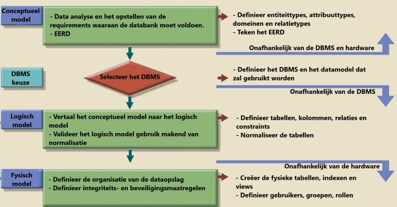
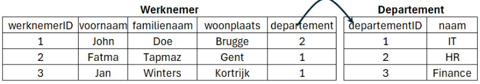

# DATABASES : Hoofdstuk 5 - Van het conceptueel naar het logisch model

## Inleiding

Databankproces:

Nadat het ERD van de databank ontworpen is, zetten we het om naar een relationele databank. (met tabbellen en kolommen)

> Dit hoeft niet naar een relationele databank (bv. NoSQL databank kan ook) deze cursus beperken we ons to relationele databanken.

Er bestaan verschillende databasemodelleertools die automatisch het (E)ER-model omzetten naar een relationeel datamodel. Wanneer de de juiste vertaalregels toegepast worden, is het resultaat automatisch genormaliseerd.

> Het manueel omzetten geeft ons inzichten in een goed databankontwerp en de gevolgen van bepaalde ontwerpbeslissingen, door de relationele concepten te koppelen aan hun (E)ER tegenhangers.

*Hoe gaan we een ERD naar tabellen met rijen en kolommen? Hoe mappen we een conceptueel ERD naar een relationeel model?*

## Bouwstenen voor het relationeel model

<table align="center">
    <thead>
        <tr>
            <th>Conceptueel model</th>
            <th>Logisch model</th>
        </tr>
    </thead>
    <tbody>
        <tr>
            <td>entiteittypes</td>
            <td>tabellen</td>
        </tr>
        <tr>
            <td>attribuuttypes</td>
            <td>kolommen</td>
        </tr>
        <tr>
            <td>entiteiten</td>
            <td>rijen (tupels)</td>
        </tr>
    </tbody>
</table>

### Tupel

> **Een tupel** is een geordende lijst met waarden van kenmerken die een object beschrijven.

> [!important]
> **Een tupel** is steeds uniek

**voorbeeld:** tupel van een product - *100, 'Pringles', 'Classic Paprika', '175g', 2.5*

### Attribuut

> **Een attribuut** is een benoemd kenmerk van een tupel. Het kan maar één waarde hebben, **de attribuutwaarde**.

**voorbeeld:** het attribuut *merk* uit de tupel *100, 'Pringles', 'Classic Paprika', '175g', 2.5* 

### Domein

> **Een domein** is een verzameling van waarden die voor de attributen in de tupels van een relatie mogen gebruikt worden.

**voorbeeld:** domein van prijs zijn alle toegestane prijzen die een product kan hebben

### Relatie

> **Een relatie** is een verzameling van tupels die gelijksoortige objecten beschrijven.

**voorbeeld:** verzameling tupels die producten beschrijven: *{(100, 'Pringles', 'Classic Paprika', '175g', 2.5), (101, 'Lays', 'Max Naturel', '185g', 2.3), (102, 'Croky', 'Barbecue Rings', '100g', 1.8)}*

Een relatie kunnen we ook zien als een gestructureerde verzameling gegevens. Het zijn gegevens die allemaal betrekking hebben op gelijkaardige objecten en ze komen in groepjes voor (tupels), en binnen elk groepje in dezelfde volgorde.

### Sleutels

In een relatie moet elk tupel uniek zijn. 

Attribuuttypen die toelaten de tupels van elkaar te onderscheiden worden **sleutelattribuuttypen** (of sleutels) genoemd. 

We spreken van een sleutel wanneer een minimale verzameling van attributen als combinatie de tupel binnen de relatie uniek kan identificeren.

Er zijn verschillende soorten sleutels:

- **Kandidaatsleutel**: verschillende mogelijke combinaties, deze mogelijke sleutels zijn kandidaatsleutels
- **Primaire sleutel**: een gekozen kandidaatsleutel die primair wordt aangeduid. Deze waarde kan niet *NULL* zijn. In het relationeel model wordt deze onderstreept.
- **Alternatieve sleutel**: Elke kandidaatsleutel die geen primaire sleutel is.
    - waarde kan *NULL* zijn, verliest echter dan welk de functie van sleutel
- **Vreemde sleutel**: sleutel gebruikt om verbanden te leggen met andere relaties in het relationeel model. Deze sleutel heeft niets te maken met de idenificatie vna de tupel.
    - De verbindende schakel tussen twee relaties.
    - Met deze waarde kunnen we in een andere tabel de juiste tupel opzoeken

## Vergelijking met het ER-model

### Entiteittypes en attribuuttypes

Elke tabel vertegenwoordigt een entiteittype, en de kolommen van de tabel vertegenwoordigen de attributen van het entiteittype. 

<table align="center">
    <thead>
        <tr>
            <th>ER-model</th>
            <th>Relationeel model</th>
            <th>Databank</th>
        </tr>
    </thead>
    <tbody>
        <tr>
            <td>Entiteittype</td>
            <td>Relatie</td>
            <td>Tabel</td>
        </tr>
        <tr>
            <td>Entiteit</td>
            <td>Tupel</td>
            <td>Rij</td>
        </tr>
        <tr>
            <td>Attribuuttype</td>
            <td>Attribuut</td>
            <td>Kolom</td>
        </tr>
        <tr>
            <td>Attribuutwaarde</td>
            <td>Attribuutwaarde</td>
            <td>Kolomwaarde</td>
        </tr>
    </tbody>
</table>

**Relatietypes**

Relaties tussen entiteiten worden in het ER-model weergegeven als lijnen of verbindingen tussen deze entiteiten. (vaak geassocieerd met cardinaliteiten)

## Regels van een relationeel model

Het relationeel model is een logisch model dat aan volgende regels voldoet:
- Elke tupel in een relatie is uniek
- Elk attribuut is enkelvoudig (samengestelde attribuutwaarden zijn niet toegestaan)
- Elk attribuut is enkelwaardig (meerwaardige attribuutwaarden zijn niet toegestaan)
- Verbanden tussen relaties worden gelegd aan de hand van **vreemde sleutels**

## Mapping

Het omzetten (mapping) van het conceptueel model naar het logisch model gebeurt in enkele stappen en volgens strikte regels. Door het volgen van volgende stappen is het relatief eenvoudig:

- STAP 1: Elk entiteittype wordt een relatie. Bij het mappen van een EERD waar specialisatie in voorkomt, kan het gebeuren dat entiteittypes verdwijnen.

- STAP 2: Enkelvoudige attribuuttypes overnemen

- STAP 3: Samengestelde attribuuttypes opsplitsen in enkelvoudige attribuuttypes

- STAP 4: Als er nog meerwaardige attributen in het conceptueel model aanwezig zijn, dienen deze in een nieuwe relatie geplaastst te worden.

- STAP 5: Primaire sleutel bepalen. Opgelet bij zwakke entiteiten

- STAP 6: Voor elke relatie: vreemde sleutel(s) bepalen op volgende wijze:
    - 1-op-1 relatie: vreemde sleutel in de één of andere relatie (afhankelijk van de minimumcardinaliteit)
    - 1-op-N relatie: vreemde sleutel in de relatie aan N-zijde
    - M-op-N relatie: aparte relatie met beide vreemde sleutels als samengestelde primaire sleutel
    - unaire 1-op-1 of 1-op-N relatie: vreemde sleutel in zelfde relatie

- STAP 7: Bij elke vreemde sleutel de integriteitregels bepalen:
    - naar welke primaire sleutel deze vreemde sleutel verwijst
    - of de vreemde sleutel verplicht of optioneel is
    - eventueel of de vreemde sleutel uniek is

### Mapping van entiteittypes

