# DATABASES : Hoofdstuk 5 - Van het conceptueel naar het logisch model

## Inleiding

Databankproces:

Nadat het ERD van de databank ontworpen is, zetten we het om naar een relationele databank. (met tabbellen en kolommen)

> Dit hoeft niet naar een relationele databank (bv. NoSQL databank kan ook) deze cursus beperken we ons to relationele databanken.

Er bestaan verschillende databasemodelleertools die automatisch het (E)ER-model omzetten naar een relationeel datamodel. Wanneer de de juiste vertaalregels toegepast worden, is het resultaat automatisch genormaliseerd.

> Het manueel omzetten geeft ons inzichten in een goed databankontwerp en de gevolgen van bepaalde ontwerpbeslissingen, door de relationele concepten te koppelen aan hun (E)ER tegenhangers.

*Hoe gaan we een ERD naar tabellen met rijen en kolommen? Hoe mappen we een conceptueel ERD naar een relationeel model?*

## Bouwstenen voor het relationeel model

<table align="center">
    <thead>
        <tr>
            <th>Conceptueel model</th>
            <th>Logisch model</th>
        </tr>
    </thead>
    <tbody>
        <tr>
            <td>entiteittypes</td>
            <td>tabellen</td>
        </tr>
        <tr>
            <td>attribuuttypes</td>
            <td>kolommen</td>
        </tr>
        <tr>
            <td>entiteiten</td>
            <td>rijen (tupels)</td>
        </tr>
    </tbody>
</table>

### Tupel

> **Een tupel** is een geordende lijst met waarden van kenmerken die een object beschrijven.

> [!important]
> **Een tupel** is steeds uniek

**voorbeeld:** tupel van een product - *100, 'Pringles', 'Classic Paprika', '175g', 2.5*

### Attribuut

> **Een attribuut** is een benoemd kenmerk van een tupel. Het kan maar één waarde hebben, **de attribuutwaarde**.

**voorbeeld:** het attribuut *merk* uit de tupel *100, 'Pringles', 'Classic Paprika', '175g', 2.5* 

### Domein

> **Een domein** is een verzameling van waarden die voor de attributen in de tupels van een relatie mogen gebruikt worden.

**voorbeeld:** domein van prijs zijn alle toegestane prijzen die een product kan hebben

### Relatie

> **Een relatie** is een verzameling van tupels die gelijksoortige objecten beschrijven.

**voorbeeld:** verzameling tupels die producten beschrijven: *{(100, 'Pringles', 'Classic Paprika', '175g', 2.5), (101, 'Lays', 'Max Naturel', '185g', 2.3), (102, 'Croky', 'Barbecue Rings', '100g', 1.8)}*

Een relatie kunnen we ook zien als een gestructureerde verzameling gegevens. Het zijn gegevens die allemaal betrekking hebben op gelijkaardige objecten en ze komen in groepjes voor (tupels), en binnen elk groepje in dezelfde volgorde.

### Sleutels

In een relatie moet elk tupel uniek zijn. 

Attribuuttypen die toelaten de tupels van elkaar te onderscheiden worden **sleutelattribuuttypen** (of sleutels) genoemd. 

We spreken van een sleutel wanneer een minimale verzameling van attributen als combinatie de tupel binnen de relatie uniek kan identificeren.

Er zijn verschillende soorten sleutels:

- **Kandidaatsleutel**: verschillende mogelijke combinaties, deze mogelijke sleutels zijn kandidaatsleutels
- **Primaire sleutel**: een gekozen kandidaatsleutel die primair wordt aangeduid. Deze waarde kan niet *NULL* zijn. In het relationeel model wordt deze onderstreept.
- **Alternatieve sleutel**: Elke kandidaatsleutel die geen primaire sleutel is.
    - waarde kan *NULL* zijn, verliest echter dan welk de functie van sleutel
- **Vreemde sleutel**: sleutel gebruikt om verbanden te leggen met andere relaties in het relationeel model. Deze sleutel heeft niets te maken met de idenificatie vna de tupel.
    - De verbindende schakel tussen twee relaties.
    - Met deze waarde kunnen we in een andere tabel de juiste tupel opzoeken

## Vergelijking met het ER-model

### Entiteittypes en attribuuttypes

Elke tabel vertegenwoordigt een entiteittype, en de kolommen van de tabel vertegenwoordigen de attributen van het entiteittype. 

<table align="center">
    <thead>
        <tr>
            <th>ER-model</th>
            <th>Relationeel model</th>
            <th>Databank</th>
        </tr>
    </thead>
    <tbody>
        <tr>
            <td>Entiteittype</td>
            <td>Relatie</td>
            <td>Tabel</td>
        </tr>
        <tr>
            <td>Entiteit</td>
            <td>Tupel</td>
            <td>Rij</td>
        </tr>
        <tr>
            <td>Attribuuttype</td>
            <td>Attribuut</td>
            <td>Kolom</td>
        </tr>
        <tr>
            <td>Attribuutwaarde</td>
            <td>Attribuutwaarde</td>
            <td>Kolomwaarde</td>
        </tr>
    </tbody>
</table>

**Relatietypes**

Relaties tussen entiteiten worden in het ER-model weergegeven als lijnen of verbindingen tussen deze entiteiten. (vaak geassocieerd met cardinaliteiten)

## Regels van een relationeel model

Het relationeel model is een logisch model dat aan volgende regels voldoet:
- Elke tupel in een relatie is uniek
- Elk attribuut is enkelvoudig (samengestelde attribuutwaarden zijn niet toegestaan)
- Elk attribuut is enkelwaardig (meerwaardige attribuutwaarden zijn niet toegestaan)
- Verbanden tussen relaties worden gelegd aan de hand van **vreemde sleutels**

## Mapping

Het omzetten (mapping) van het conceptueel model naar het logisch model gebeurt in enkele stappen en volgens strikte regels. Door het volgen van volgende stappen is het relatief eenvoudig:

- STAP 1: Elk entiteittype wordt een relatie. Bij het mappen van een EERD waar specialisatie in voorkomt, kan het gebeuren dat entiteittypes verdwijnen.

- STAP 2: Enkelvoudige attribuuttypes overnemen

- STAP 3: Samengestelde attribuuttypes opsplitsen in enkelvoudige attribuuttypes

- STAP 4: Als er nog meerwaardige attributen in het conceptueel model aanwezig zijn, dienen deze in een nieuwe relatie geplaastst te worden.

- STAP 5: Primaire sleutel bepalen. Opgelet bij zwakke entiteiten

- STAP 6: Voor elke relatie: vreemde sleutel(s) bepalen op volgende wijze:
    - 1-op-1 relatie: vreemde sleutel in de één of andere relatie (afhankelijk van de minimumcardinaliteit)
    - 1-op-N relatie: vreemde sleutel in de relatie aan N-zijde
    - M-op-N relatie: aparte relatie met beide vreemde sleutels als samengestelde primaire sleutel
    - unaire 1-op-1 of 1-op-N relatie: vreemde sleutel in zelfde relatie

- STAP 7: Bij elke vreemde sleutel de integriteitregels bepalen:
    - naar welke primaire sleutel deze vreemde sleutel verwijst
    - of de vreemde sleutel verplicht of optioneel is
    - eventueel of de vreemde sleutel uniek is

### Mapping van entiteittypes

De eerste stap is om elk entiteittype in een relatie te mappen. Eenvoudige attribuuttypes kunnen direct omgezet worden naar een kolom. Een samengesteld attribuuttype moet worden opgesplits in enkelvoudige attribuuttype. Een van de kandidaatsleutels van het entiteittype kan worden ingesteld als de primaire sleutel van de relatie.

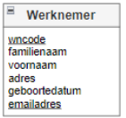

Hieronder tonen we een aantal voorbeeld tuples die intuïtief laten aanvoelen dat het bovenstaande entiteittype gemapt moet worden naar een relatie die er als volgt uitziet:

<table>
    <tr>
        <th>wncode</th>
        <td>voornaam</td>
        <td>familienaam</td>
        <td>straat</td>
        <td>huisnummer</td>
        <td>postcode</td>
        <td>woonplaats</td>
        <td>geboortedatum</td>
        <td>emailadres</td>
    </tr>
    <tr>
        <td>JJA60</td>
        <td>Jan</td>
        <td>Janssens</td>
        <td>Fonteinstraat</td>
        <td>7</td>
        <td>9000</td>
        <td>Gent</td>
        <td>1/02/1960</td>
        <td>jan.janssens@bedrijf.be</td>
    </tr>
    <tr>
        <td>MER70</td>
        <td>Mohamed</td>
        <td>Erdogan</td>
        <td>Marktweg</td>
        <td>5</td>
        <td>9700</td>
        <td>Oudenaarde</td>
        <td>5/12/1970</td>
        <td>mohamed.erdogan@bedrijf.be</td>
    </tr>
    <tr>
        <td>EME75</td>
        <td>Eva</td>
        <td>Mertens</td>
        <td>Steenstraat</td>
        <td>11</td>
        <td>8000</td>
        <td>Brugge</td>
        <td>2/09/1975</td>
        <td>eva.mertens@bedrijf.be</td>
    </tr>
    <tr>
        <td>FAR85</td>
        <td>Fatma</td>
        <td>Arici</td>
        <td>Kerkstraat</td>
        <td>10</td>
        <td>9090</td>
        <td>Melle</td>
        <td>22/11/1985</td>
        <td>fatma.arici@bedrijf.be</td>
    </tr>
    <tr>
        <td>MPA90</td>
        <td>Maarten</td>
        <td>Pauwels</td>
        <td>Brouwerijstraat</td>
        <td>5</td>
        <td>9850</td>
        <td>Aalter</td>
        <td>12/03/1990</td>
        <td>maarten.pauwels@bedrijf.be</td>
    </tr>
</table>

Het entiteittype WERKNEMER wordt daarom formeel gemapt naar volgende relatie:

WERKNEMER(<u>wncode</u>, voornaam, familienaam, straat, huisnummer, postcode, woonplaats, geboortedatum)

> Het samengestelde attribuut adres werd opgesplits in straat, huisnummer, postcode en woonplaats

### Mapping van Relatietypes

Het mappen van de attribuuttypes hangt af van de maximumcardinaliteit.

#### 1:1 - relatie met aan één kant minimumcardinaliteit=1

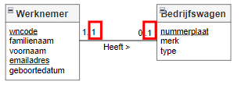

**Voorbeeldtuples voor Werknemer en Bedrijfswagen**

*WERKNEMER*

<table>
    <tr>
        <th>wncode</th>
        <td>voornaam</td>
        <td>familienaam</td>
        <td>emailadres</td>
        <td>geboortedatum</td>
    </tr>
    <tr>
        <td>JJA60</td>
        <td>Jan</td>
        <td>Janssens</td>
        <td>jan.janssens@bedrijf.be</td>
        <td>1/02/1960</td>
    </tr>
    <tr>
        <td>MER70</td>
        <td>Mohamed</td>
        <td>Erdogan</td>
        <td>mohamed.erdogan@bedrijf.be</td>
        <td>5/12/1970</td>
    </tr>
    <tr>
        <td>EME75</td>
        <td>Eva</td>
        <td>Mertens</td>
        <td>eva.mertens@bedrijf.be</td>
        <td>2/09/1975</td>
    </tr>
    <tr>
        <td>FAR85</td>
        <td>Fatma</td>
        <td>Arici</td>
        <td>fatma.arici@bedrijf.be</td>
        <td>22/11/1985</td>
    </tr>
    <tr>
        <td>MPA90</td>
        <td>Maarten</td>
        <td>Pauwels</td>
        <td>maarten.pauwels@bedrijf.be</td>
        <td>12/03/1990</td>
    </tr>
</table>

*BEDRIJFSWAGEN*

<table>
    <tr>
        <th>nummerplaat</th>
        <td>merk</td>
        <td>type</td>
    </tr>
    <tr>
        <td>1-POL-189</td>
        <td>Toyota</td>
        <td>Corolla</td>
    </tr>
    <tr>
        <td>1-OUL-784</td>
        <td>Mercedes</td>
        <td>A-Klasse</td>
    </tr>
    <tr>
        <td>1-MPO-965</td>
        <td>Ford</td>
        <td>Puma</td>
    </tr>
</table>

*Hoe kunnen we de entiteittypes WERKNEMER en BEDRIJFSWAGEN mappen naar het relationeel model?*

Er zijn twee mogelijkheden:

- **Mogelijkheid 1**: we voegen een kolom nummerplaat toe aan de WERKNEMER tabel. Elke nummerplaat kan slechts eenmaal voorkomen in de kolom nummerplaat in de WERKNEMER tabel. Omdat niet elke WERKNEMER een bedrijfswagen heeft (minimumcardinaliteit = 0) zijn er mogelijks wel *NULL* waarden

<table>
    <tr>
        <th>wncode</th>
        <td>voornaam</td>
        <td>familienaam</td>
        <td>emailadres</td>
        <td>geboortedatum</td>
        <td>nummerplaat</td>
    </tr>
    <tr>
        <td>JJA60</td>
        <td>Jan</td>
        <td>Janssens</td>
        <td>jan.janssens@bedrijf.be</td>
        <td>1/02/1960</td>
        <td>1-POL-189</td>
    </tr>
    <tr>
        <td>MER70</td>
        <td>Mohamed</td>
        <td>Erdogan</td>
        <td>mohamed.erdogan@bedrijf.be</td>
        <td>5/12/1970</td>
        <td></td>
    </tr>
    <tr>
        <td>EME75</td>
        <td>Eva</td>
        <td>Mertens</td>
        <td>eva.mertens@bedrijf.be</td>
        <td>2/09/1975</td>
        <td>1-OUL-784</td>
    </tr>
    <tr>
        <td>FAR85</td>
        <td>Fatma</td>
        <td>Arici</td>
        <td>fatma.arici@bedrijf.be</td>
        <td>22/11/1985</td>
        <td>1-MPO-965</td>
    </tr>
    <tr>
        <td>MPA90</td>
        <td>Maarten</td>
        <td>Pauwels</td>
        <td>maarten.pauwels@bedrijf.be</td>
        <td>12/03/1990</td>
        <td></td>
    </tr>
</table>

*BEDRIJFSWAGEN*

<table>
    <tr>
        <th>nummerplaat</th>
        <td>merk</td>
        <td>type</td>
    </tr>
    <tr>
        <td>1-POL-189</td>
        <td>Toyota</td>
        <td>Corolla</td>
    </tr>
    <tr>
        <td>1-OUL-784</td>
        <td>Mercedes</td>
        <td>A-Klasse</td>
    </tr>
    <tr>
        <td>1-MPO-965</td>
        <td>Ford</td>
        <td>Puma</td>
    </tr>
</table>

- **Mogelijkheid 2**: we voegen een kolom wncode toe aan de tabel BEDRIJFSWAGEN. Elke wncode kan slechts eenmaal voorkomen in de kolom wncode in de tabel BEDRIJFSWAGEN. Omdat elke BEDRIJFSWAGEN aan ten minste 1 WERKNEMER toebehoort (minimumcardinaliteit = 1) zijn er geen *NULL* waarden

<table>
    <tr>
        <th>wncode</th>
        <td>voornaam</td>
        <td>familienaam</td>
        <td>emailadres</td>
        <td>geboortedatum</td>
    </tr>
    <tr>
        <td>JJA60</td>
        <td>Jan</td>
        <td>Janssens</td>
        <td>jan.janssens@bedrijf.be</td>
        <td>1/02/1960</td>
    </tr>
    <tr>
        <td>MER70</td>
        <td>Mohamed</td>
        <td>Erdogan</td>
        <td>mohamed.erdogan@bedrijf.be</td>
        <td>5/12/1970</td>
    </tr>
    <tr>
        <td>EME75</td>
        <td>Eva</td>
        <td>Mertens</td>
        <td>eva.mertens@bedrijf.be</td>
        <td>2/09/1975</td>
    </tr>
    <tr>
        <td>FAR85</td>
        <td>Fatma</td>
        <td>Arici</td>
        <td>fatma.arici@bedrijf.be</td>
        <td>22/11/1985</td>
    </tr>
    <tr>
        <td>MPA90</td>
        <td>Maarten</td>
        <td>Pauwels</td>
        <td>maarten.pauwels@bedrijf.be</td>
        <td>12/03/1990</td>
    </tr>
</table>

*BEDRIJFSWAGEN*

<table>
    <tr>
        <th>nummerplaat</th>
        <td>merk</td>
        <td>type</td>
        <td>wncode</td>
    </tr>
    <tr>
        <td>1-POL-189</td>
        <td>Toyota</td>
        <td>Corolla</td>
        <td>JJA60</td>
    </tr>
    <tr>
        <td>1-OUL-784</td>
        <td>Mercedes</td>
        <td>A-Klasse</td>
        <td>EME75</td>
    </tr>
    <tr>
        <td>1-MPO-965</td>
        <td>Ford</td>
        <td>Puma</td>
        <td>FAR85</td>
    </tr>
</table>

> Mogelijkheid 2 geniet de voorkeur omdat er geen *NULL* waarden voorkomen. (ookal zijn beide mogelijkheden correct).

*Formele notatie*:

Werknemer(<u>wncode</u>, voornaam, familienaam, emailadres, geboortedatum)  
Bedrijfswagen(nummerplaat, merk, type,wncode)  
IR: Vreemde sleutel wncode verwijst naar wncode uit Werknemer, verplicht, uniek

#### 1:1 - relatie met aan beide kanten minimumcardinaliteit = 0

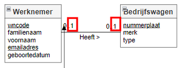

**Voorbeeldtuples voor Werknemer en Bedrijfswagen**

*WERKNEMER*

<table>
    <tr>
        <th>wncode</th>
        <td>voornaam</td>
        <td>familienaam</td>
        <td>emailadres</td>
        <td>geboortedatum</td>
    </tr>
    <tr>
        <td>JJA60</td>
        <td>Jan</td>
        <td>Janssens</td>
        <td>jan.janssens@bedrijf.be</td>
        <td>1/02/1960</td>
    </tr>
    <tr>
        <td>MER70</td>
        <td>Mohamed</td>
        <td>Erdogan</td>
        <td>mohamed.erdogan@bedrijf.be</td>
        <td>5/12/1970</td>
    </tr>
    <tr>
        <td>EME75</td>
        <td>Eva</td>
        <td>Mertens</td>
        <td>eva.mertens@bedrijf.be</td>
        <td>2/09/1975</td>
    </tr>
    <tr>
        <td>FAR85</td>
        <td>Fatma</td>
        <td>Arici</td>
        <td>fatma.arici@bedrijf.be</td>
        <td>22/11/1985</td>
    </tr>
    <tr>
        <td>MPA90</td>
        <td>Maarten</td>
        <td>Pauwels</td>
        <td>maarten.pauwels@bedrijf.be</td>
        <td>12/03/1990</td>
    </tr>
</table>

*BEDRIJFSWAGEN*

<table>
    <tr>
        <th>nummerplaat</th>
        <td>merk</td>
        <td>type</td>
    </tr>
    <tr>
        <td>1-POL-189</td>
        <td>Toyota</td>
        <td>Corolla</td>
    </tr>
    <tr>
        <td>1-OUL-784</td>
        <td>Mercedes</td>
        <td>A-Klasse</td>
    </tr>
    <tr>
        <td>1-MPO-965</td>
        <td>Ford</td>
        <td>Puma</td>
    </tr>
</table>

*Hoe kunnen we de entiteittypes WERKNEMER en BEDRIJFSWAGEN mappen naar het relationeel model?*

Er zijn twee mogelijkheden:

- **Mogelijkheid 1**:  we voegen een kolom nummerplaat toe aan de WERKNEMER tabel. Elke nummerplaat kan slechts eenmaal voorkomen in de kolom nummerplaat in de WERKNEMER tabel. Omdat niet elke WERKNEMER een bedrijfswagen heeft (minimumcardinaliteit = 0) zijn er mogelijks wel *NULL* waarden

<table>
    <tr>
        <th>wncode</th>
        <td>voornaam</td>
        <td>familienaam</td>
        <td>emailadres</td>
        <td>geboortedatum</td>
        <td>nummerplaat</td>
    </tr>
    <tr>
        <td>JJA60</td>
        <td>Jan</td>
        <td>Janssens</td>
        <td>jan.janssens@bedrijf.be</td>
        <td>1/02/1960</td>
        <td>1-POL-189</td>
    </tr>
    <tr>
        <td>MER70</td>
        <td>Mohamed</td>
        <td>Erdogan</td>
        <td>mohamed.erdogan@bedrijf.be</td>
        <td>5/12/1970</td>
        <td></td>
    </tr>
    <tr>
        <td>EME75</td>
        <td>Eva</td>
        <td>Mertens</td>
        <td>eva.mertens@bedrijf.be</td>
        <td>2/09/1975</td>
        <td></td>
    </tr>
    <tr>
        <td>FAR85</td>
        <td>Fatma</td>
        <td>Arici</td>
        <td>fatma.arici@bedrijf.be</td>
        <td>22/11/1985</td>
        <td>1-MPO-965</td>
    </tr>
    <tr>
        <td>MPA90</td>
        <td>Maarten</td>
        <td>Pauwels</td>
        <td>maarten.pauwels@bedrijf.be</td>
        <td>12/03/1990</td>
        <td></td>
    </tr>
</table>

*BEDRIJFSWAGEN*

<table>
    <tr>
        <th>nummerplaat</th>
        <td>merk</td>
        <td>type</td>
    </tr>
    <tr>
        <td>1-POL-189</td>
        <td>Toyota</td>
        <td>Corolla</td>
    </tr>
    <tr>
        <td>1-OUL-784</td>
        <td>Mercedes</td>
        <td>A-Klasse</td>
    </tr>
    <tr>
        <td>1-MPO-965</td>
        <td>Ford</td>
        <td>Puma</td>
    </tr>
</table>

- **Mogelijkheid 2**: we voegen een kolom wncode toe aan de tabel BEDRIJFSWAGEN. Elke wncode kan slechts eenmaal voorkomen in de kolom wncode in de tabel BEDRIJFSWAGEN. Omdat elke BEDRIJFSWAGEN niet noodzakelijk toebehoort aan een WERKNEMER (minimumcardinaliteit = 0) zijn er mogelijks *NULL* waarden

<table>
    <tr>
        <th>wncode</th>
        <td>voornaam</td>
        <td>familienaam</td>
        <td>emailadres</td>
        <td>geboortedatum</td>
    </tr>
    <tr>
        <td>JJA60</td>
        <td>Jan</td>
        <td>Janssens</td>
        <td>jan.janssens@bedrijf.be</td>
        <td>1/02/1960</td>
    </tr>
    <tr>
        <td>MER70</td>
        <td>Mohamed</td>
        <td>Erdogan</td>
        <td>mohamed.erdogan@bedrijf.be</td>
        <td>5/12/1970</td>
    </tr>
    <tr>
        <td>EME75</td>
        <td>Eva</td>
        <td>Mertens</td>
        <td>eva.mertens@bedrijf.be</td>
        <td>2/09/1975</td>
    </tr>
    <tr>
        <td>FAR85</td>
        <td>Fatma</td>
        <td>Arici</td>
        <td>fatma.arici@bedrijf.be</td>
        <td>22/11/1985</td>
    </tr>
    <tr>
        <td>MPA90</td>
        <td>Maarten</td>
        <td>Pauwels</td>
        <td>maarten.pauwels@bedrijf.be</td>
        <td>12/03/1990</td>
    </tr>
</table>

*BEDRIJFSWAGEN*

<table>
    <tr>
        <th>nummerplaat</th>
        <td>merk</td>
        <td>type</td>
        <td>wncode</td>
    </tr>
    <tr>
        <td>1-POL-189</td>
        <td>Toyota</td>
        <td>Corolla</td>
        <td>JJA60</td>
    </tr>
    <tr>
        <td>1-OUL-784</td>
        <td>Mercedes</td>
        <td>A-Klasse</td>
        <td></td>
    </tr>
    <tr>
        <td>1-MPO-965</td>
        <td>Ford</td>
        <td>Puma</td>
        <td>FAR85</td>
    </tr>
</table>

> Beide oplossingen zijn juist, maar mogelijkheid 2 geniet de voorkeur doordat hier minder *NULL* waarden zijn.

*Formele notatie*:

Werknemer(<u>wncode</u>, voornaam, familienaam, emailadres, geboortedatum)  
Bedrijfswagen(nummerplaat, merk, type,wncode)  
IR: Vreemde sleutel wncode verwijst naar wncode uit Werknemer, verplicht, optioneel

#### 1:N - relatie

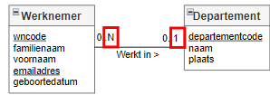

Elke werknemer werkt op maximaal één departement (= maximumcardinaliteit 1) Het kan ook zijn dat een werknemer aan geen enkel departement is toegewezen (= minimumcardinaliteit 0)

Een departement telt N werknemers (= maximumcardinaliteit N), maar kan ook geen werknemers hebben

**Voorbeeldtuples voor Werknemer en Departement**

*WERKNEMER*

<table>
    <tr>
        <th>wncode</th>
        <td>voornaam</td>
        <td>familienaam</td>
        <td>emailadres</td>
        <td>geboortedatum</td>
    </tr>
    <tr>
        <td>JJA60</td>
        <td>Jan</td>
        <td>Janssens</td>
        <td>jan.janssens@bedrijf.be</td>
        <td>1/02/1960</td>
    </tr>
    <tr>
        <td>MER70</td>
        <td>Mohamed</td>
        <td>Erdogan</td>
        <td>mohamed.erdogan@bedrijf.be</td>
        <td>5/12/1970</td>
    </tr>
    <tr>
        <td>EME75</td>
        <td>Eva</td>
        <td>Mertens</td>
        <td>eva.mertens@bedrijf.be</td>
        <td>2/09/1975</td>
    </tr>
    <tr>
        <td>FAR85</td>
        <td>Fatma</td>
        <td>Arici</td>
        <td>fatma.arici@bedrijf.be</td>
        <td>22/11/1985</td>
    </tr>
    <tr>
        <td>MPA90</td>
        <td>Maarten</td>
        <td>Pauwels</td>
        <td>maarten.pauwels@bedrijf.be</td>
        <td>12/03/1990</td>
    </tr>
</table>

*DEPARTEMENT*

<table>
    <tr>
        <th>departementcode</th>
        <td>naam</td>
        <td>plaats</td>
    </tr>
    <tr>
        <td>D1</td>
        <td>Marketing</td>
        <td>Brussel</td>
    </tr>
    <tr>
        <td>D2</td>
        <td>IT</td>
        <td>Aalst</td>
    </tr>
    <tr>
        <td>D3</td>
        <td>HR</td>
        <td>Gent</td>
    </tr>
</table>

*Hoe kunnen we de entiteittypes WERKNEMER en DEPARTEMENT mappen naar het relationeel model?*

Er zijn twee mogelijkheden:

- **Mogelijkheid 1**: de departementcode wordt toegevoegd aan de WERKNEMER tabel. Aangezien de werknemer op maximaal 1 DEPARTEMENT werkt, kan er zich maar één waarde in deze kolom bevinden. Een WERKNEMER is niet noodzakelijk aan een DEPARTEMENT toegewezen, dus kunnen hier ook *NULL* waarden in voorkomen. De vreemde sleutel departementcode is optioneel.

<table>
    <tr>
        <th>wncode</th>
        <td>voornaam</td>
        <td>familienaam</td>
        <td>emailadres</td>
        <td>geboortedatum</td>
        <td>departementcode</td>
    </tr>
    <tr>
        <td>JJA60</td>
        <td>Jan</td>
        <td>Janssens</td>
        <td>jan.janssens@bedrijf.be</td>
        <td>1/02/1960</td>
        <td>D2</td>
    </tr>
    <tr>
        <td>MER70</td>
        <td>Mohamed</td>
        <td>Erdogan</td>
        <td>mohamed.erdogan@bedrijf.be</td>
        <td>5/12/1970</td>
        <td></td>
    </tr>
    <tr>
        <td>EME75</td>
        <td>Eva</td>
        <td>Mertens</td>
        <td>eva.mertens@bedrijf.be</td>
        <td>2/09/1975</td>
        <td>D5</td>
    </tr>
    <tr>
        <td>FAR85</td>
        <td>Fatma</td>
        <td>Arici</td>
        <td>fatma.arici@bedrijf.be</td>
        <td>22/11/1985</td>
        <td>D2</td>
    </tr>
    <tr>
        <td>MPA90</td>
        <td>Maarten</td>
        <td>Pauwels</td>
        <td>maarten.pauwels@bedrijf.be</td>
        <td>12/03/1990</td>
        <td>D2</td>
    </tr>
</table>

<table>
    <tr>
        <th>departementcode</th>
        <td>naam</td>
        <td>plaats</td>
    </tr>
    <tr>
        <td>D1</td>
        <td>Marketing</td>
        <td>Brussel</td>
    </tr>
    <tr>
        <td>D2</td>
        <td>IT</td>
        <td>Aalst</td>
    </tr>
    <tr>
        <td>D3</td>
        <td>HR</td>
        <td>Gent</td>
    </tr>
</table>

- **Mogelijkheid 2**: wncode wordt toegevoegd aan het DEPARTEMENT. Aangezien er vaak meerdere WERKNEMERs op één DEPARTEMENT werken, ontstaat er op die manier een lijstje met wncode's in de kolom wncode. Hierdoor wordt wncode een meerwaardig attribuut in de tabel DEPARTEMENT.

<table>
    <tr>
        <th>wncode</th>
        <td>voornaam</td>
        <td>familienaam</td>
        <td>emailadres</td>
        <td>geboortedatum</td>
    </tr>
    <tr>
        <td>JJA60</td>
        <td>Jan</td>
        <td>Janssens</td>
        <td>jan.janssens@bedrijf.be</td>
        <td>1/02/1960</td>
    </tr>
    <tr>
        <td>MER70</td>
        <td>Mohamed</td>
        <td>Erdogan</td>
        <td>mohamed.erdogan@bedrijf.be</td>
        <td>5/12/1970</td>
    </tr>
    <tr>
        <td>EME75</td>
        <td>Eva</td>
        <td>Mertens</td>
        <td>eva.mertens@bedrijf.be</td>
        <td>2/09/1975</td>
    </tr>
    <tr>
        <td>FAR85</td>
        <td>Fatma</td>
        <td>Arici</td>
        <td>fatma.arici@bedrijf.be</td>
        <td>22/11/1985</td>
    </tr>
    <tr>
        <td>MPA90</td>
        <td>Maarten</td>
        <td>Pauwels</td>
        <td>maarten.pauwels@bedrijf.be</td>
        <td>12/03/1990</td>
    </tr>
</table>

<table>
    <tr>
        <th>departementcode</th>
        <td>naam</td>
        <td>plaats</td>
        <td>wncode</td>
    </tr>
    <tr>
        <td>D1</td>
        <td>Marketing</td>
        <td>Brussel</td>
        <td></td>
    </tr>
    <tr>
        <td>D2</td>
        <td>IT</td>
        <td>Aalst</td>
        <td>JJA60, MER70, FAR85</td>
    </tr>
    <tr>
        <td>D3</td>
        <td>HR</td>
        <td>Gent</td>
        <td>EME75</td>
    </tr>
</table>

> Enkel optie 1 is hier een geldige mogelijkheid. Er mogen geen meerwaardige attributen aanwezig zijn in het logisch model

*Formele notatie*:

Werknemer(<u>wncode</u>, voornaam, familienaam, emailadres, geboortedatum)  
IR: Vreemde sleutel departementcode verwijst naar departementcode uit Departement,  optioneel  
Departement(<u>departementcode</u>, naam, plaats)  

#### 1:N - unaire relatie

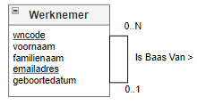

**Voorbeeldtuples voor Werknemer**

*WERKNEMER*

<table>
    <tr>
        <th>wncode</th>
        <td>voornaam</td>
        <td>familienaam</td>
        <td>emailadres</td>
        <td>geboortedatum</td>
    </tr>
    <tr>
        <td>JJA60</td>
        <td>Jan</td>
        <td>Janssens</td>
        <td>jan.janssens@bedrijf.be</td>
        <td>1/02/1960</td>
    </tr>
    <tr>
        <td>MER70</td>
        <td>Mohamed</td>
        <td>Erdogan</td>
        <td>mohamed.erdogan@bedrijf.be</td>
        <td>5/12/1970</td>
    </tr>
    <tr>
        <td>EME75</td>
        <td>Eva</td>
        <td>Mertens</td>
        <td>eva.mertens@bedrijf.be</td>
        <td>2/09/1975</td>
    </tr>
    <tr>
        <td>FAR85</td>
        <td>Fatma</td>
        <td>Arici</td>
        <td>fatma.arici@bedrijf.be</td>
        <td>22/11/1985</td>
    </tr>
    <tr>
        <td>MPA90</td>
        <td>Maarten</td>
        <td>Pauwels</td>
        <td>maarten.pauwels@bedrijf.be</td>
        <td>12/03/1990</td>
    </tr>
</table>

*Hoe kunnen we de baas toevoegen?*

<table>
    <tr>
        <th>wncode</th>
        <td>voornaam</td>
        <td>familienaam</td>
        <td>emailadres</td>
        <td>geboortedatum</td>
        <td>baas</td>
    </tr>
    <tr>
        <td>JJA60</td>
        <td>Jan</td>
        <td>Janssens</td>
        <td>jan.janssens@bedrijf.be</td>
        <td>1/02/1960</td>
        <td>EME75</td>
    </tr>
    <tr>
        <td>MER70</td>
        <td>Mohamed</td>
        <td>Erdogan</td>
        <td>mohamed.erdogan@bedrijf.be</td>
        <td>5/12/1970</td>
        <td></td>
    </tr>
    <tr>
        <td>EME75</td>
        <td>Eva</td>
        <td>Mertens</td>
        <td>eva.mertens@bedrijf.be</td>
        <td>2/09/1975</td>
        <td></td>
    </tr>
    <tr>
        <td>FAR85</td>
        <td>Fatma</td>
        <td>Arici</td>
        <td>fatma.arici@bedrijf.be</td>
        <td>22/11/1985</td>
        <td>EME75</td>
    </tr>
    <tr>
        <td>MPA90</td>
        <td>Maarten</td>
        <td>Pauwels</td>
        <td>maarten.pauwels@bedrijf.be</td>
        <td>12/03/1990</td>
        <td>EME75</td>
    </tr>
</table>

We voegen een nieuwe kolom baas toe die de wncode van de baas bevat. Aangezien een WERKNEMER baas kan zijn van verschillende werknemers zijn de wncode's in de kolom baas niet uniek. Omwille van de minimumcardinaliteit = 0, heeft niet elke WERKNEMER een baas, waardoor er ook *NULL* waarden kunnen optreden, met andere woorden baas is optioneel.

*Formele notatie*:

Werknemer(<u>wncode</u>, voornaam, familienaam, emailadres, geboortedatum, baas)  
IR: Vreemde sleutel bass verwijst naar wncode uit Werknemer, optioneel

#### N:M - relatie

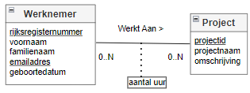

**Voorbeeldtuples voor WERKNEMER en PROJECT**

*WERKNEMER*

<table>
    <tr>
        <th>wncode</th>
        <td>voornaam</td>
        <td>familienaam</td>
        <td>emailadres</td>
        <td>geboortedatum</td>
    </tr>
    <tr>
        <td>JJA60</td>
        <td>Jan</td>
        <td>Janssens</td>
        <td>jan.janssens@bedrijf.be</td>
        <td>1/02/1960</td>
    </tr>
    <tr>
        <td>MER70</td>
        <td>Mohamed</td>
        <td>Erdogan</td>
        <td>mohamed.erdogan@bedrijf.be</td>
        <td>5/12/1970</td>
    </tr>
    <tr>
        <td>EME75</td>
        <td>Eva</td>
        <td>Mertens</td>
        <td>eva.mertens@bedrijf.be</td>
        <td>2/09/1975</td>
    </tr>
    <tr>
        <td>FAR85</td>
        <td>Fatma</td>
        <td>Arici</td>
        <td>fatma.arici@bedrijf.be</td>
        <td>22/11/1985</td>
    </tr>
    <tr>
        <td>MPA90</td>
        <td>Maarten</td>
        <td>Pauwels</td>
        <td>maarten.pauwels@bedrijf.be</td>
        <td>12/03/1990</td>
    </tr>
</table>

*PROJECT*

<table>
    <tr>
        <th>projectcode</th>
        <td>naam</td>
        <td>duur</td>
    </tr>
    <tr>
        <td>P101</td>
        <td>B2B</td>
        <td>100</td>
    </tr>
    <tr>
        <td>P102</td>
        <td>Analytics</td>
        <td>660</td>
    </tr>
    <tr>
        <td>P103</td>
        <td>Website</td>
        <td>50</td>
    </tr>
    <tr>
        <td>P104</td>
        <td>Spark</td>
        <td>900</td>
    </tr>
</table>

*Hoe leggen we de connectie tussen Werknemer en Project*

*En wat met het relatie-attribuut aantal uur?*

*WERKNEMER/PROJECT*

<table>
    <tr>
        <th>wncode</th>
        <th>projectcode</th>
        <td>aantal uur</td>
    </tr>
    <tr>
        <td>MER70</td>
        <td>P101</td>
        <td>10</td>
    </tr>
    <tr>
        <td>MER70</td>
        <td>P103</td>
        <td>5</td>
    </tr>
    <tr>
        <td>EME75</td>
        <td>P102</td>
        <td>10</td>
    </tr>
    <tr>
        <td>EME75</td>
        <td>P104</td>
        <td>25</td>
    </tr>
    <tr>
        <td>MPA90</td>
        <td>P101</td>
        <td>20</td>
    </tr>
    <tr>
        <td>MPA90</td>
        <td>P102</td>
        <td>25</td>
    </tr>
    <tr>
        <td>FAR85</td>
        <td>P103</td>
        <td>10</td>
    </tr>
</table>

Het relatietype "Werkt Aan" is een voorbeeld van een N:M relatietype. Een WERKNEMER werkt aan nul tot N PROJECTen, terwijl aan een PROJECT wordt gewerkt door 0 tot M WERKNEMERs. We beginnen, zoals altijd, met het creëren van relaties door de beide entiteittypen. We kunnen geen vreemde sleutel toevoegen aan de WERKNEMER relatie omtdat we dan een meerwaardig attribuut zouden krijgen aangezien een WERKNEMER aan meerdere PROJECTen kan werken. Op dezelfde manier kunnen we geen vreemde sleutel toevoegen aan de relatie PROJECT, omdat aan een PROJECT wordt gewerkt door meerdere WERKNEMERs. Met andere woorden, we moeten een nieuwe relatie, een 'tussentabel', maken om het ER-relatietype WerktAan te mappen. De primaire sleutel van deze nieuwe relatie bestaat uit de twee vreemde sleutels, namelijk wncode en projectcode en kunnen daarom niet *NULL* zijn, en zijn dus verplicht. De relatie attributen worden ook toegevoegd aan de nieuwe relatie.

*Formele notatie*:

Werknemer(<u>wncode</u>, voornaam, familienaam, emailadres, geboortedatum)  
Project(<u>projectcode</u>, naam, duur)  
Werknemer/Project(<u>wncode</u>,<u>projectcode</u>, duur)  
wncode: VS naar Werknemer.wncode, verplicht  
projectcode: VS naar Project.projectcode, verplicht  

#### Zwakke entiteiten

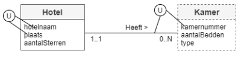

**Voorbeeldtuples voor HOTEL en KAMER**

*HOTEL*

<table>
    <tr>
        <th>naam</th>
        <th>plaats</th>
        <td>aantal sterren</td>
    </tr>
    <tr>
        <td>The Post</td>
        <td>Gent</td>
        <td>4</td>
    </tr>
    <tr>
        <td>Astor</td>
        <td>Oostende</td>
        <td>3</td>
    </tr>
    <tr>
        <td>Ibis</td>
        <td>Gent</td>
        <td>3</td>
    </tr>
    <tr>
        <td>Mariott</td>
        <td>Aalst</td>
        <td>3</td>
    </tr>
</table>

*KAMER*

<table>
    <tr>
        <th>kamernummer</th>
        <th>hotelnaam</th>
        <th>hotelplaats</th>
        <td>aantal bedden</td>
        <td>type</td>
    </tr>
    <tr>
        <td>12</td>
        <td>Ibis</td>
        <td>Gent</td>
        <td>2</td>
        <td>Suite</td>
    </tr>
    <tr>
        <td>14</td>
        <td>Astor</td>
        <td>Oostende</td>
        <td>4</td>
        <td>Zicht op zee</td>
    </tr>
    <tr>
        <td>15</td>
        <td>Astor</td>
        <td>Oostende</td>
        <td>2</td>
        <td>Klassiek</td>
    </tr>
</table>

Een zwakke entiteit is een entiteittype dat geen sleutelattribuut heeft om zichzelf te identificeren en bestaansafhankelijk is van een ander entiteittype. Men begint met een relatie te creëren waaraan alle attributen van de zwakke entiteit worden toegevoegd. Hieraan moet de primaire sleutel van het entiteittype waarvan het bestaansafhankelijk is, worden toegevoegd. Dit is een vreemde sleutel. Vanwege de bestaansafhankelijk moet deze vreemde sleutel *NOT NULL* zijn en is deze vreemde sleutel dus verplicht. De primaire sleutel van deze relatie is dan de combinatie van de partiële sleutel en de vreemde sleutel.

*Formele schrijfwijze:*

Hotel(<u>hotelnaam</u>, <u>plaats</u>, aantal sterren)  
Kamer(<u>hotelnaam</u>, <u>plaats</u>, <u>kamernummer</u>, aantal bedden, type)  
IR: hotelnaam, plaats: VS naar hotelnaam, plaats in Hotel, verplicht

#### {Mandatory, And}

In dit voorbeeld is een ARTIEST ofwel ZANGER, ofwel ACTEUR ofwel ZANGER en ACTEUR. Er kunnen geen ARTIESTen zijn die geen ZANGER of ACTEUR zijn.

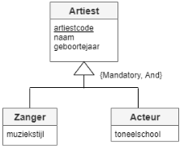

**Voorbeeldtuples**

<table>
    <tr>
        <th>artiestcode</th>
        <td>naam</td>
        <td>geboortejaar</td>
        <td>muziekstijl</td>
        <td>toneelschool</td>
        <td>isZanger</td>
        <td>isActeur</td>
    </tr>
    <tr>
        <td>LT</td>
        <td>Laura Tesoro</td>
        <td>1996</td>
        <td>pop</td>
        <td></td>
        <td>True</td>
        <td>False</td>
    </tr>
    <tr>
        <td>SVS</td>
        <td>Stan Van Samang</td>
        <td>1979</td>
        <td>pop</td>
        <td>Studio Herman Teirlinck</td>
        <td>True</td>
        <td>True</td>
    </tr>
    <tr>
        <td>TE</td>
        <td>Tine Embrechts</td>
        <td>1975</td>
        <td></td>
        <td>Studio Herman Teirlinck</td>
        <td>False</td>
        <td>True</td>
    </tr>
    <tr>
        <td>KDG</td>
        <td>Koen De Graeve</td>
        <td>1972</td>
        <td></td>
        <td>Studio Herman Teirlinck</td>
        <td>False</td>
        <td>True</td>
    </tr>
</table>

Alle informatie van het supertype en de subtypes wordt bijgehouden in één relatie. Er worden booleans gebruikt om de subtypes te onderscheiden van elkaar. Mandatory impliceert dat één van de subtypes True moet zijn. And kan bekomen worden door beide booleans op True te zetten. Het nadeel van deze oplossing is dat er veel *NULL* waarden kunnen zijn indien de ARTIEST enkel ZANGER of ACTEUR is en niet beide.

*Formele schrijfwijze:*

Artiest(<u>artiestcode</u>, naam, geboortejaar, muziekstijl, toneelschool, isZanger, isActeur)

#### {Optional, And}

In dit voorbeeld is een ARTIEST ofwel ARTIEST zonder meer, ofwel ACTEUR ofwel ZANGER ofwel ZANGER en ACTEUR. Er kunnen dus ARTIESTen zijn die geen ZANGER of ACTEUR zijn.

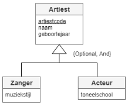

**Voorbeeldtuples**

*ARTIEST*

<table>
    <tr>
        <th>artiestcode</th>
        <td>naam</td>
        <td>geboortejaar</td>
    </tr>
    <tr>
        <td>PA</td>
        <td>Panamarenko</td>
        <td>1940</td>
    </tr>
    <tr>
        <td>RR</td>
        <td>Roger Raveel</td>
        <td>1921</td>
    </tr>
    <tr>
        <td>LT</td>
        <td>Laura Tesoro</td>
        <td>1996</td>
    </tr>
    <tr>
        <td>WT</td>
        <td>Will Tura</td>
        <td>1940</td>
    </tr>
    <tr>
        <td>TE</td>
        <td>Tine Embrechts</td>
        <td>1975</td>
    </tr>
    <tr>
        <td>KDG</td>
        <td>Koen De Graeve</td>
        <td>1970</td>
    </tr>
</table>

*ARTIESTDETAILS*

<table>
    <tr>
        <th>artiestcode</th>
        <td>muziekstijl</td>
        <td>toneelschool</td>
        <td<isZanger</td>
        <td>isActeur</td>
    </tr>
    <tr>
        <td>LT</td>
        <td>pop</td>
        <td></td>
        <td>True</td>
        <td>False</td>
    </tr>
    <tr>
        <td>SVS</td>
        <td>pop</td>
        <td>Studio Herman Teirlinck</td>
        <td>True</td>
        <td>True</td>
    </tr>
    <tr>
        <td>TE</td>
        <td></td>
        <td>Studio Herman Teirlinck</td>
        <td>False</td>
        <td>True</td>
    </tr>
    <tr>
        <td>KDG</td>
        <td></td>
        <td>Studio Herman Teirlinck</td>
        <td>False</td>
        <td>True</td>
    </tr>
</table>

Er wordt begonnen met één relatie voor het supertype te creëren. Daarnaast worden de details van subtypes bijgehouden in één aparte relatie. Er worden booleans gebruikt om de subtypes te onderscheiden van elkaar. Vanuit de 'subtabel' wordt er verwezen naar de 'supertabel'. Optional impliceert dat enkel een tuple aan de supertabel wordt toegevoegd. And kan bekomen worden door beide booleans op True te zetten. Het nadeel van deze oplossing is dat er veel *NULL* waarden kunnen zijn indien ARTIEST enkel ZANGER of ACTEUR is en niet de beide.

*Formele schrijfwijze:*

Artiest(<u>artiestcode</u>, naam, geboortejaar)  
ArtiestDetails(<u>artiestcode</u>, muziekstijl, toneelschool, isZanger, isActeur)  
artiestcode: VS naar Artiest.artiestcode, verplicht

#### {Mandatory, Or}

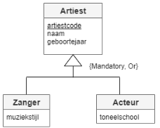

In dit voorbeeld is een ARTIEST ofwel ZANGER, ofwel ACTEUR, maar niet beide tegelijk. Er kunnen bovendien geen ARTIESTen bestaan die geen ZANGER noch ACTEUR zijn. Met andere woorden: er zijn enkel ZANGERs en ACTEURs.

**Voorbeeldtuples**

*ZANGER*

<table>
    <tr>
        <th>artiestcode</th>
        <td>naam</td>
        <td>geboortejaar</td>
        <td>muziekstijl</td>
    </tr>
    <tr>
        <td>LT</td>
        <td>Laura Tesoro</td>
        <td>1996</td>
        <td>pop</td>
    </tr>
    <tr>
        <td>WT</td>
        <td>Will Tura</td>
        <td>1940</td>
        <td>vlaams</td>
    </tr>
</table>

*ACTEUR*

<table>
    <tr>
        <th>artiestcode</th>
        <td>naam</td>
        <td>geboortejaar</td>
        <td>toneelschool</td>
    </tr>
    <tr>
        <td>TE</td>
        <td>Tine Embrechts</td>
        <td>1975</td>
        <td>Studio Herman Teirlinck</td>
    </tr>
    <tr>
        <td>KDG</td>
        <td>Koen De Graeve</td>
        <td>1972</td>
        <td>Studio Herman Teirlinck</td>
    </tr>
</table>

Net omdat er enkel ZANGERs en ACTEURs kunnen bestaan volstaat het om gescheiden relaties te creëren voor alle subtypes, die bovendien elk alle attributen bevatten van het supertype.

*Formele schrijfwijze:*

Zanger(<u>artiestcode</u>, naam, geboortejaar, muziekstijl)  
Acteur(<u>artiestcode</u>, naam, geboortejaar, toneelschool)  

#### {Optional, Or}

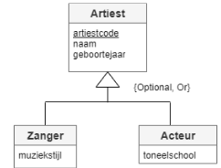

In dit voorbeeld bestaan er ARTIESTen zonder meer, dit zijn ARTIESTen die geen ZANGER en geen ACTEUR zijn. Een ZANGER en een ACTEUR erven alle attributen van een ARTIEST. Een ZANGER kan niet ook een ACTEUR zijn, en omgekeerd.

**Voorbeeldtuples**

*ARTIEST*

<table>
    <tr>
        <th>artiestcode</th>
        <td>naam</td>
        <td>geboortejaar</td>
    </tr>
    <tr>
        <td>PA</td>
        <td>Panamarenko</td>
        <td>1940</td>
    </tr>
    <tr>
        <td>RR</td>
        <td>Roger Raveel</td>
        <td>1921</td>
    </tr>
    <tr>
        <td>LT</td>
        <td>Laura Tesoro</td>
        <td>1996</td>
    </tr>
    <tr>
        <td>WT</td>
        <td>Will Tura</td>
        <td>1940</td>
    </tr>
    <tr>
        <td>TE</td>
        <td>Tine Embrechts</td>
        <td>1975</td>
    </tr>
    <tr>
        <td>KDG</td>
        <td>Koen De Graeve</td>
        <td>1972</td>
    </tr>
</table>

*ZANGER*

<table>
    <tr>
        <th>artiestcode</th>
        <td>muziekstijl</td>
    </tr>
    <tr>
        <td>LT</td>
        <td>pop</td>
    </tr>
    <tr>
        <td>WT</td>
        <td>vlaams</td>
    </tr>
</table>

*ACTEUR*

<table>
    <tr>
        <th>artiestcode</th>
        <td>toneelschool</td>
    </tr>
    <tr>
        <td>TE</td>
        <td>Studio Herman Teirlinck</td>
    </tr>
    <tr>
        <td>KDG</td>
        <td>Studio Herman Teirlinck</td>
    </tr>
</table>

Omdat er ARTIESTen kunnen zijn, die geen ZANGER en geen ACTEUR zijn, wordt daarvoor een aparte relatie voorzien. Voor elk subtype wordt ook een aparte relatie voorzien waarbij in het subtype verwezen wordt naar het supertype. Zo komt Panamarenko enkel in het supertype voor en wordt er vanuit geen enkel subtype gerefereerd naar Panamarenko.

*Formele schrijfwijze:*

Artiest(<u>artiestcode</u>, naam, geboortejaar)  
Zanger(<u>artiestcode</u>, muziekstijl)  
artiestcode: VS naar Artiest.artiestcode, verplicht  
Acteur(<u>artiestcode</u>, toneelschool)  
artiestcode: VS naar Artiest.artiestcode, verplicht 