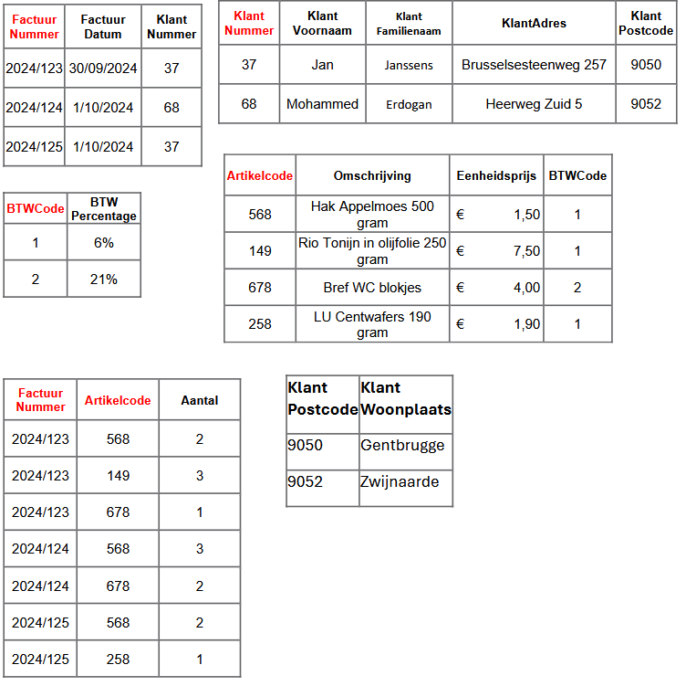

# DATABASES : Hoofdstuk 6 - Normalistatie

## Inleiding

> **Normalistatie** is in essentie een proces voor het evalueren en corrigeren van de structuur van tabellen om redundantie te elimineren.

Door redundantie te elimeren en de stuctuur van de databank te optimaliseren, worden anomalieën voorkomen, wordt het risico op fouten verminderden is de databank beter schaalbaar en gemakkelijker te onderhouden.

Normalistatie werkt via een reeks stappen (= **normaalvormen**)
- nulde normaalvorm (0NF)
- eerste normaalvorm (1NF)
- tweede normaalvorm (2NF)
- derde normaalvorm (3NF)

Structureel gezien is 3NF beter dan 2NF en 2NF beter dan 1NF,...

>[!important]
> Voor de meeste doeleinden is normalistatie tot 3NF voldoende.

Normalistatie tot de hoogste vorm (5NF) is niet altijd wenselijk.

Over het algemeen geldt hoe hoger de normaalvorm, hoe meer JOIN operaties nodig zijn om de gewenste uitvoer te registreren.

>[!important]
> Het databankmanagementsysteem heeft ook meer middelen nodig om te reageren op de vraag van eindgebruikers wanneer er meer JOIN operaties zijn. Een goed databankontwerp dient ook rekening te houden met de vraag van de gebruikers naar snelle prestaties.

## Het nut van normalistatie

- verminderen van redundantie en anomalieën door structureren gegevens op een consistente, efficiënte en georganiseerde manier
- verbeteren prestaties van de databank
- eenvoudiger te beheren en onderhouden

**Voorbeeld**

<table>
    <thead>
        <tr>
            <th>wncode</th>
            <th>werknemernaam</th>
            <th>functie</th>
            <th>loon</th>
            <th>departementcode</th>
            <th>departementadres</th>
        </tr>
    </thead>
    <tbody>
        <tr>
            <td>JJA60</td>
            <td>Jan Janssens</td>
            <td>manager</td>
            <td>6000</td>
            <td>HR</td>
            <td>Vredestraat 7, Brugge</td>
        </tr>
        <tr>
            <td>SDM70</td>
            <td>Stijn De Smet</td>
            <td>assistent</td>
            <td>3500</td>
            <td>IT</td>
            <td>Vogelmarkt 9, Gent</td>
        </tr>
        <tr>
            <td>EME75</td>
            <td>Eva Martens</td>
            <td>verantwoordelijke</td>
            <td>5000</td>
            <td>Marketing</td>
            <td>Stationsstraat 5, Aalst</td>
        </tr>
        <tr>
            <td>EWI85</td>
            <td>Emma Winters</td>
            <td>manager</td>
            <td>6500</td>
            <td>Marketing</td>
            <td>Stationsstraat 5, Aalst</td>
        </tr>
        <tr>
            <td>MB090</td>
            <td>Mohammed Bouazza</td>
            <td>assistent</td>
            <td>4000</td>
            <td>HR</td>
            <td>Vredestraat 7, Brugge</td>
        </tr>
    </tbody>
</table>

### Vermindering van gegevensredundantie

> **Gegevensredundantie** wil zeggen dat dezelfde informatie meerdere keren op verschillende plaatsen wordt opgeslagen.

Dit kan leiden to inconsistente gegevens.

Uit ons voorbeeld blijkt dat we de gegevens voor een departementadres op verschillende plaatsten moeten wijzigen wanneer dit veranderd.

### Vermijden van invoeg-, verwijder- en modificatie-anomalieën

#### Invoeganomalie

In een niet-genormaliseerde tabel kan je soms geen gegevens toevoegen zonder onvolledige, nutteloze informatie in te voeren. 

Het toevoegen van een nieuw departement in het voorbeeld is niet mogelijk zonder het toevoegen van een werknemer.

#### Verwijderanomalie

Het verwijderen van bepaalde gegevens kan er toe leiden dat ook andere, nog steeds relevante gegevens onbedoeld verwijderd worden.

Wanneer we in het voorbeeld de werknemer "Stijn De Smet" verwijderen, verwijderen we ook alle informatie van het departement "IT".

#### Modificatie-anomalie

Dit kan optreden wanneer dezelfde gegevens op verschillende plaatsen opgeslagen zijn. Het wijzigen van gegevens moet zo op al die verschillende plaatsen gebeuren, dit is foutgevoelig en kan leiden tot inconsistenties.

Wanneer we in ons voorbeeld het adres van het departement "Marketing" willen wijzigen moeten welke elke vermelding handmatig wijzigen.

#### Oplossingen anomalieën

We kunnen bovenstaande tabel normaliseren door de gegevens van de werknemers en de departementen gescheiden te houden.

<table>
    <thead>
        <tr>
            <th>wncode</th>
            <th>werknemernaam</th>
            <th>functie</th>
            <th>loon</th>
            <th>departementcode</th>
        </tr>
    </thead>
    <tbody>
        <tr>
            <td>JJA60</td>
            <td>Jan Janssens</td>
            <td>manager</td>
            <td>6000</td>
            <td>HR</td>
        </tr>
        <tr>
            <td>SDM70</td>
            <td>Stijn De Smet</td>
            <td>assistent</td>
            <td>3500</td>
            <td>IT</td>
        </tr>
        <tr>
            <td>EME75</td>
            <td>Eva Mertens</td>
            <td>verantwoordelijke</td>
            <td>5000</td>
            <td>Marketing</td>
        </tr>
        <tr>
            <td>EWI85</td>
            <td>Emma Winters</td>
            <td>manager</td>
            <td>6500</td>
            <td>Marketing</td>
        </tr>
        <tr>
            <td>MBO90</td>
            <td>Mohammed Bouazza</td>
            <td>assistent</td>
            <td>4000</td>
            <td>HR</td>
        </tr>
    </tbody>
</table>

<table>
    <thead>
        <tr>
            <th>departementcode</th>
            <th>departementadres</th>
        </tr>
    </thead>
    <tbody>
        <tr>
            <td>HR</td>
            <td>Vredestraat 7, Brugge</td>
        </tr>
        <tr>
            <td>IT</td>
            <td>Vogelmarkt 9, Gent</td>
        </tr>
        <tr>
            <td>Marketing</td>
            <td>Stationsstraat 5, Aalst</td>
        </tr>
    </tbody>
</table>

- we kunnen nu nieuwe departementen toevoegen zonder ook werknemergegevens in te voeren. 
- We kunnen de werknemer "Stijn De Smet" verwijderen zonder de informatie van het departement "IT" te verliezen.
- We kunnen het adres van het departement "Marketing" wijzigen zonder dat er inconsistente gegevens ontstaan.

### Verhoging van gegevensinconsistentie

Door redundantie te verminderen is er minder kan dat verschillende kopieën van dezelfde gegevens verschillende waarden bevatten.

### Betere gegevensintegriteit

Gegevensintegriteit houdt in dat de gegevens in de databank juist, volledig en geldig zijn. Normalistatie helpt bij het implementeren van integreitsregels door afhankelijkheden tussen de gegevens te structureren.

### Verbeterde onderhoudbaarheid en schaalbaarheid

Na verloop van tijd veranderen gegevens in een databank. Het bijwerken van een goed genormaliseerde databank is eenvoudiger en minder foutgevoelig, omdat de gegevens gestructureerd en logisch opgeslagen zijn.

## Functionele afhankelijkheid

Functionele afhankelijkheid en normalisatie zijn nauw aan elkaar verbonden. Het proces van normalisatieis gebaseerd op het identificeren en elimineren van functionele afhankelijkheden tussen attributen.

> **Functionele afhankelijkheid** beschrijft de relatie tussen attributen (kolommen) in een databank. Een attribuut B is functioneel afhankelijk van een attribuut A als de waarde van A de waarde van B bepaald.

Voor elke unieke waarde van A is er dus maar één corresponderende waarde van B.

Wanneer we de waarde van het attribuuttype A in een tupel kennen, kunnen we de waarde van de functioneel afhankelijke attribuuttypes eenduidig bepalen of terugvinden.

*Notatie:* A ➡️ B

We zeggen A bepaalt B of B is functioneel afhankelijk van A.

In het voorbeeld is werknemernaam FA van wncode en is functie FA van wncode.
Dit betekent dat de naam en de functie van de werknemer afhankelijk is van de wncode, aangezien elke wncode slechts aan één werknemer gekoppeld is.

wncode ➡️ werknemernaam, functie

### Partiële functionele afhankelijkheid

> **Partiële afhankelijkheid** komt alleen voor in tabellen met een *samengestelde primaire sleutel*.

B is partieel functioneel afhankelijk van A als B slechts functioneel afhankelijk is van een deel van A.

B is partieel afhankelijk als geldt: A ➡️ B en er is een $A' \subset A$, waarvoor geldt A' ➡️ B

<table>
    <thead>
        <tr>
            <th>wncode</th>
            <th>werknemernaam</th>
            <th>functie</th>
            <th>loon</th>
            <th>projectcode</th>
            <th>projectnaam</th>
            <th>gewerkteuren</th>
        </tr>
    </thead>
    <tbody>
        <tr>
            <td>JJA60</td>
            <td>Jan Janssens</td>
            <td>manager</td>
            <td>6000</td>
            <td>ANA</td>
            <td>Analytics</td>
            <td>20</td>
        </tr>
        <tr>
            <td>SDM70</td>
            <td>Stijn De Smet</td>
            <td>assistent</td>
            <td>3500</td>
            <td>HDP</td>
            <td>Hadoop</td>
            <td>50</td>
        </tr>
        <tr>
            <td>EME75</td>
            <td>Eva Mertens</td>
            <td>verantwoordelijke</td>
            <td>5000</td>
            <td>ANA</td>
            <td>Analytics</td>
            <td>10</td>
        </tr>
        <tr>
            <td>EME75</td>
            <td>Eva Mertens</tsd>
            <td>verantwoordelijke</td>
            <td>5000</td>
            <td>HDP</td>
            <td>Hadoop</td>
            <td>10</td>
        </tr>
    </tbody>
</table>

De primaire sleutel van deze tabel bestaat uit zowel wncode als projectcode, omdat gewerkte uren afhankelijk is van wncode als projectcode.

wncode, projectcode ➡️ werknemernaam, gewerkteuren

werknemernaam is partieelafhankelijk van wncode en projectcode want wncode ➡️ werknemernaam

gewerkteuren is wel functioneel afhankelijk van wncode en projectcode

### Transitieve functionele afhankelijkheid

Een transitieve afhankelijkheid bestaat als:

- Een niet-sleutelattribuut (bijv. attribuut C) functioneel afhankelijk is van een ander niet-sleutelattribuut (attribuut B)
- Dat niet-sleutelattribuut (B) is weer functioneel afhankelijk van de primaire sleutel (attribuut A)

Dit creëert een ketting van afhankelijkheden:

- A ➡️ B (primaire sleutel bepaalt B)
- B ➡️ C (B bepaalt C)
- Daarom is er indirect een afhankelijkheid: A ➡️ C (primaire sleutel bepaalt uiteindelijk ook C, via B)

C is dus transitief afhankelijk van A als geldt: (A ➡️ B) en (B ➡️ C) en niet (B ➡️ A)

<table>
    <thead>
        <tr>
            <th>wncode</th>
            <th>werknemernaam</th>
            <th>functie</th>
            <th>loon</th>
            <th>departementcode</th>
            <th>departementadres</th>
        </tr>
    </thead>
    <tbody>
        <tr>
            <td>JJA60</td>
            <td>Jan Janssens</td>
            <td>manager</td>
            <td>6000</td>
            <td>HR</td>
            <td>Vredestraat 7, Brugge</td>
        </tr>
        <tr>
            <td>SDM70</td>
            <td>Stijn De Smet</td>
            <td>assistent</td>
            <td>3500</td>
            <td>IT</td>
            <td>Vogelmarkt 9, Gent</td>
        </tr>
        <tr>
            <td>EME75</td>
            <td>Eva Martens</td>
            <td>verantwoordelijke</td>
            <td>5000</td>
            <td>Marketing</td>
            <td>Stationsstraat 5, Aalst</td>
        </tr>
        <tr>
            <td>EWI85</td>
            <td>Emma Winters</td>
            <td>manager</td>
            <td>6500</td>
            <td>Marketing</td>
            <td>Stationsstraat 5, Aalst</td>
        </tr>
        <tr>
            <td>MB090</td>
            <td>Mohammed Bouazza</td>
            <td>assistent</td>
            <td>4000</td>
            <td>HR</td>
            <td>Vredestraat 7, Brugge</td>
        </tr>
    </tbody>
</table>

In de bovenstaande tabel:

- wncode ➡️ departementcode
- departementcode ➡️ departementadres

Dus volgens de transitie is er een indirecte afhankelijkheid

- wncode ➡️ departementadres

### Identificeren van functionele afhankelijkheid

In de bovenstaande tabel gelden de volgende funtionele afhankelijkheden. Dit kan je bekomen door je voor elke kolom af te vragen hoe dit gegeven bepaald wordt.

- wncode ➡️ werknemernaam, functie, loon, departementcode, departementadres
- werknemernaam ➡️ wncode, functie, loon, departementcode, departementadres
- departementcode ➡️ departementadres
- departementadres ➡️ departementcode

Door logisch na te denken en het probleemgebied te bestuderen, is het voor de hand liggend dat de volgende functionele afhankelijkheid moet verdwijnen:

- werknemernaam ➡️ wncode, functie, loon, departementcode, departementadres

Men kan zich ook afvragen of op één adres slechts één departement gevestigd kan zijn. Dit blijkt helemaal niet zeker, bijvoorbeeld na overleg met de opdrachtgeven. De volgende functionele afhankelijkheid zal ook verdwijnen.

- departementadres ➡️ departementcode

Hierna blijven dan de volgende functionele afhankelijkheden over:

- wncode ➡️ werknemernaam, functie, loon, departementcode, departementadres
- departementcode ➡️ departementadres

## Normalisatieproces

Normalisatie van een relationeel model is een proces waarbij de gegeven relaties worden geanalyseerd om ervoor te zorgen dat ze geen overbodige gegevens bevatten. Er moet een stapsgewijze procedure worden gevolgd om een niet-genormaliseerd relationeel model te transformeren naar een genormaliseerd relationeel model. Deze procedure omvat verschillende tests
die achtereenvolgens worden geëvalueerd. Relaties die niet voldoen aan de tests, worden onderverdeeld in kleinere relaties.

Edgar F. Codd, de grondlegger van relationele databanken, definieerde het normalisatieproces en introduceerde het concept van normaalvormen (normal forms) om ervoor te zorgen dat databanken effectief omgaan met gegevensredundantie, anomalieën en inconsistenties. Elk niveau van
normalisatie verwijdert specifieke soorten problemen die kunnen optreden bij het ontwerp van databanken.

### Nulde normaalvorm opstellen en de functionele afhankelijkheden bepalen

In de voorbereidende stap werden de nodige gegevens verzameld door middel van gesprekken en documenten. We vertrekken van een ongenormaliseerde gegevensverzameling. We zeggen dat deze zich in de nulde normaalvorm bevindt (0NV). Dit is één grote verzameling (relatie) van alle gegevens
(attribuuttypes) uit de onderzochte informatiebron (document, scherm, formulier,…).

*Stappenplan nulde normaalvorm*

1. Stel de ongenormaliseerde tabel op, op basis van de onderzochte informatiebron (document,...)
    - Schrijf de tabel als een relatie door alle attribuuttypes op te sommen
    - Duid in deze relatie alle herhalende gegevens aan. Dit zijn de attribuuttypes die in de bekomen tabel meerdere waarden per rij hebben. Zet deze per groep tussen haakjes met een sterretje erbij.
    Het is mogelijk dat er meerdere herhalende groepen binnen een herhalende groep staan (genest). Deze noteren we dan simpelweg als volgt: (x, y, z, (a, b, c, (d, e, f)\*)\*)
    - Duid de sleutel aan door deze te onderlijnen. De sleutel is dat attribuut (of die combinatie van attributen) dat het hoogste niveau identificeert

2. Bepaal de functionele afhankelijkheden

**Voorbeeld**

Een kleine kruidenier wil een databank laten ontwerpen om gegevens van klanten, producten en facturen bij te houden.

Elk product heeft een BTWCode 1, 2 of 3 naargelang het BTWPercentage

Enkele voorbeeldfacturen:

Op basisn van de informatie kunnen we de ongenormaliseerde tabel opstellen en de volgende functionele afhankelijkheden afleiden.

FA's:

- FactuurNummer ➡️ FactuurDatum, KlantNummer, KlantNaam, KlantAdres, KlantPostcode, KlantWoonplaats
- KlantNummer ➡️ KlantNaam, KlantAdres, KlantPostcode, KlantWoonplaats
- KlantPostcode ➡️ KlantWoonplaats
- FactuurNummer, Artikelcode ➡️ Omschrijving, Eenheidsprijs, Aantal, BTWCode, BTWPercentage
- Artikelcode ➡️ Omschrijving, Eenheidsprijs, BTWCode, BTWPercentage
- BTWCode ➡️ BTWPercentage

*Formele schrijfwijze van de tabel(len):*

R0(<u>FactuurNummer</u>, FactuurDatum, KlantNummer, KlantNaam, KlantAdres, KlantPostcode, KlantWoonplaats, (Artikelcode, Omschrijving, Eenheidsprijs, Aantal, BTWCode, BTWPercentage)*)

### Eerste normaalvorm - Elimineren van de herhalende groepen

De eerste normale vorm (1 NF) stelt dat elk attribuuttype van een relatie atomair en enkelvoudig moet zijn. Samengestelde attribuuttypes of attribuuttypes met meerdere waarden worden dus niet getolereerd.
Een tabel bevindt zich in de eerste normaalvorm als de volgende voorwaarden worden vervuld:
- Geef afgeleide attribuuttypes
Een afgeleid attribuuttype is een procesgegeven zoals bijvoorbeeld leeftijd van een persoon. Dit kan je berekenen aan de hand van de geboortedatum.
- Geen samengestelde attribuuttypes
Een samengesteld attribuuttype is een gegeven dat nog kan opgesplitst worden. Een voorbeeld hiervan is adres dat is samengesteld uit straat, huisnummer, postcode, gemeente, land.
- Geen meerwaardige attribuuttypes
Een meerwaardig attribuuttype kan meerdere waarden bevatten. Meerwaardige attribuuttypes hebben we in R0 reeds aangeduid met een *(herhalende groepen).

*Stappenplan eerste normaalvorm*

1. Schrap alle herhalende groepen uit de nulde normaalvorm.
2. Zonder elke herhalende groep af in een nieuwe relatie. De sleutel van de relatie waaruit de
herhalende groep komt moet steeds meegenomen worden.
3. Kies een sleutel voor de nieuwe relatie, baseer je hiervoor op de reeds bepaalde functionele afhankelijkheden.
Opmerking: Indien de afgezonderde herhalende groep eveneens een herhalende groep bevat dien je deze stappen te herhalen totdat er geen herhalende gegevens meer zijn

**Voorbeeld:**

<table>
    <thead>
        <tr>
            <th>FactuurNummer</th>
            <th>FactuurDatum</th>
            <th>KlantNummer</th>
            <th>KlantVoornaam</th>
            <th>KlantFamilienaam</th>
            <th>KlantAdres</th>
            <th>KlantPostcode</th>
            <th>KlantWoonplaats</th>
        </tr>
    </thead>
    <tbody>
        <tr>
            <td>2024/123</td>
            <td>30/09/2024</td>
            <td>37</td>
            <td>Jan</td>
            <td>Janssens</td>
            <td>Brusselsesteenweg 257</td>
            <td>9050</td>
            <td>Gentbrugge</td>
        </tr>
        <tr>
            <td>2024/124</td>
            <td>1/10/2024</td>
            <td>68</td>
            <td>Mohammed</td>
            <td>Erdogan</td>
            <td>Heerweg Zuid 5</td>
            <td>9052</td>
            <td>Zwijnaarde</td>
        </tr>
        <tr>
            <td>2024/125</td>
            <td>1/10/2024</td>
            <td>37</td>
            <td>Jan</td>
            <td>Janssens</td>
            <td>Brusselsesteenweg 257</td>
            <td>9050</td>
            <td>Gentbrugge</td>
        </tr>
    </tbody>
</table>

<table>
    <thead>
        <tr>
            <th>FactuurNummer</th>
            <th>Artikelcode</th>
            <th>Omschrijving</th>
            <th>Eenheidsprijs</th>
            <th>Aantal</th>
            <th>BTWCode</th>
            <th>BTWPercentage</th>
        </tr>
    </thead>
    <tbody>
        <tr>
            <td>2024/123</td>
            <td>568</td>
            <td>Hak Appelmoes 500 gram</td>
            <td>€ 1,50</td>
            <td>2</td>
            <td>1</td>
            <td>6%</td>
        </tr>
        <tr>
            <td>2024/123</td>
            <td>149</td>
            <td>Rio Tonijn in olijfolie 250 gram</td>
            <td>€ 7,50</td>
            <td>3</td>
            <td>1</td>
            <td>6%</td>
        </tr>
        <tr>
            <td>2024/123</td>
            <td>678</td>
            <td>Bref WC blokjes</td>
            <td>€ 4,00</td>
            <td>1</td>
            <td>2</td>
            <td>21%</td>
        </tr>
        <tr>
            <td>2024/124</td>
            <td>568</td>
            <td>Hak Appelmoes 500 gram</td>
            <td>€ 1,50</td>
            <td>3</td>
            <td>1</td>
            <td>6%</td>
        </tr>
        <tr>
            <td>2024/124</td>
            <td>678s</td>
            <td>Brew WC Blokjes</td>
            <td>€ 4,00</td>
            <td>2</td>
            <td>2</td>
            <td>21%</td>
        </tr>
        <tr>
            <td>2024/125</td>
            <td>568</td>
            <td>Hak Appelmoes 500 gram</td>
            <td>€ 1,50</td>
            <td>2</td>
            <td>1</td>
            <td>6%</td>
        </tr>
        <tr>
            <td>2024/125</td>
            <td>258</td>
            <td>LU Centwafers 190 gram</td>
            <td>€ 1,90</td>
            <td>1</td>
            <td>1</td>
            <td>6%</td>
        </tr>
    </tbody>
</table>

*Formele schrijfwijze:*

R1.1 (<u>FactuurNummer</u>, FactuurDatum, KlantNummer, KlantVoornaam, KlantFamilienaam, KlantAdres,
KlantPostcode, KlantWoonplaats)  
R1.1 (<u>FactuurNummer</u>, <u>Artikelcode</u>, Omschrijving, Eenheidsprijs, Aantal, BTWCode, BTWPercentage)

### Tweede normaalvorm – Verwijderen van partiële afhankelijkheden

Een tabel bevindt zich in de tweede normaalvorm als:

- De tabel voldoet aan 1NF.
- Alle niet-sleutelattributen zijn volledig afhankelijk van de volledige primaire sleutel, niet slechts een deel ervan (geen partiële afhankelijkheden).

*Stappenplan tweede normaalvorm*

1. Zoek in de bekomen relaties van de eerste normaalvorm niet-sleutelattribuuttypes die partieel
afhankelijk zijn van de primaire sleutel.
2. Om de partiële afhankelijkheid weg te werken vormen we een nieuwe relatie bestaande uit het afhankelijke sleuteldeel + de niet-volledig afhankelijke attribuuttypes. Het afhankelijke sleuteldeel
vormt steeds de sleutel van de nieuwe relatie.
3. Verwijder de partieel afhankelijke attribuuttypes uit de oorspronkelijke relatie.
4. Schrijf het nieuwe model uit

**Voorbeeld**

*Formele schrijfwijze van de tabel(len)*

R2.1 (<u>FactuurNummer</u>, FactuurDatum, KlantNummer, KlantVoornaam, KlantFamilienaam, KlantAdres,KlantPostcode, KlantWoonplaats)  
R2.2 (<u>FactuurNummer, Artikelcode</u>, Aantal)  
R2.3 (Artikelcode, Omschrijving, Eenheidsprijs, BTWCode, BTWPercentage)

### Derde normaalvorm - Elimineren van transitieve afhankelijkheden

Een tabel bevindt zich in de derde normaalvorm als:

- De tabel voldoet aan 2NF.
- Er zijn geen transitieve afhankelijkheden, wat betekent dat iet-sleutelattributen niet afhankelijk mogen zijn van andere niet-sleutelattributen.

*Stappenplan derde normaalvorm*

1. Zoek op basis van de reeds bepaalde functionele afhankelijkheden de attribuuttypes die transitief afhankelijk zijn van één of meerdere niet-sleutelattributen.
2. Vorm een nieuwe relatie bestaande uit de transitieve attribuuttypes en het attribuuttype waarvan ze afhankelijk zijn. Dit attribuuttype vormt de sleutel van de nieuwe relatie.
3. Verwijder de transitief afhankelijke attribuuttypes uit de oorspronkelijke relatie
4. Schrijf het nieuw model uit

**voorbeeld**

*Formele schrijfwijze van de tabel(len)*

R3.1 (<u>FactuurNummer</u>, FactuurDatum, KlantNummer)  
R3.2 (KlantNummer, KlantVoornaam, KlantFamilienaam, KlantAdres, KlantPostcode)  
R3.3 (<u>KlantPostcode</u>, KlantWoonplaats)  
R3.4 (<u>FactuurNummer, Artikelcode</u>, Aantal)  
R3.5 (<u>Artikelcode</u>, Omschrijving, Eenheidsprijs, BTWCode)  
R3.6 (<u>BTWCode</u>, BTWPercentage)

### Het relationele model

Na het bepalen van de 3de normaalvorm benoemen we de gevonden relaties met een betekenisvolle naam. We vermelden ook de integriteitregels bij elke vreemde sleutel.

*Formele schrijfwijze van de tabel(len)*

Factuur (<u>FactuurNummer</u>, FactuurDatum, KlantNummer)  
KlantNummer: VS naar Klant.KlantNummer, optioneel  

Klant (<u>KlantNummer</u>, KlantVoornaam, KlantFamilienaam, KlantAdres, KlantPostcode)  
KlantPostcode: VS naar Plaats.Postcode, optioneel  

Plaats (<u>Postcode</u>, Woonplaats)  

Factuur/Artikel (<u>FactuurNummer</u>, Artikelcode, Aantal)  
FactuurNummer: VS naar Factuur.FactuurNummer, verplicht  
Artikelcode: VS naar Artikel.Artikelcode, verplicht  

Artikel (<u>Artikelcode</u>, Omschrijving, Eenheidsprijs, BTWCode)  
BTWCode: VS naar BTW.BTWCode, optioneel  

BTW (BTWCode, BTWPercentage)  

### Integratie

De voorgaande stappen kunnen doorlopen worden voor een aantal verschillende informatiebronnen (documenten, …) die aangeleverd worden door de opdrachtgever.

Elk van deze bronnen levert tabellen op die in de derde normaalvorm staan.

In deze stap worden gegevens uit meerdere tabellen gecombineerd op een manier die voldoet aan de regels van de derde normaalvorm