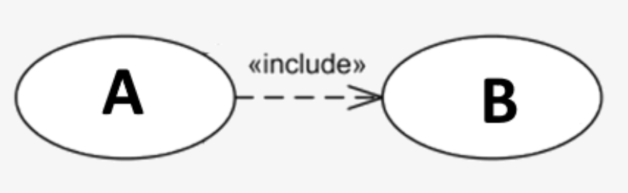

# Functional Analysis : Hoofdstuk 1 - Functionele Requirements

**Requirements**: Zijn de behoeften of de eisen van de klant waaraan een product moet voldoen.

Er bestaan:

- *Functionele requirements*: vertellen welke functionaliteiten het systeem moet bevatten, deze omvangen dus behoeften die door een actor op het systeem uitgevoerd moeten worden. Functionele requirements kunnen we éénduidig definiëren en vastleggen in use cases.

- *Niet-functionele requirements*

## Use Case Diagram

Een overzicht van alle beschikbare functionele requirements worden weergegeven in het use case diagram. 

Het bevat:

- Een overzicht van de **rollen** die toegang hebben tot het systeem
- Een overzicht van welke rol gebruik kan maken van welke functionaliteit op het systeem

Use case diagrammen kunnen "includes" en "extends" nodig hebben.

- Een **include** is het mechanisme wanneer we een functionaliteit uitvoeren een andere functionaliteit nodig is

> Een use case A voert steeds use case B uit bij een normaal verloop

- Een **extend** is het mechanisme wanneer we bij het uitvoeren van een functionaliteit (of use case) het uitvoeren van een andere functionaliteit nodig is.

> Een use case A voert een use case B uit bij een alternatief verloop

## Use Cases

### Inleiding

Een use case omschrijft in duidelijke, niet technische, taal het verhaal van een primary actor die het systeem gebruikt om een bepaald doel te bereiken.

> **Het doel** van een use case is om zowel met **de klant** het verhaal te kunnen controleren. (hebben we het verhaal voor zoals de klant het bedoeld?) Anderzijds gebruiken we ook de use case om naar de IT te communiceren om het systeem verder te ontwikkelen.

**Een use case** is een visie op het systeem met een bepaalde scope, afgebakend doel, waarin belanghebbende partijen in interactie treden met het systeem om dat welbepaald doel te bereiken.

Kenmerkend voor een use case: het zijn korte verhalen, beperkt tot een halve pagina.

> Hoe bepalen we welke verhalen we gaan uitwerken to een use case? Daarvoor gaan we opzoek naar de elementaire business processen die een gebruikers-doel voorstellen.

### Elementair business proces

Ze kunnen onder andere **summary goals** bevatten, dit zijn de hogere doelen van een bedrijf die een verzameling zijn van aparte doelen.

### Onderdelen

Een use case heeft de volgende onderdelen:

- **Primary actor**: persoon die het verhaal activeert. Dit is de persoon die de functionaliteit op het systeem wenst uit te voeren.
- **Stakeholder(s)**: een persoon die er belang bij heeft dat de primary actor zijn doel zal bereiken. Deze persoon neemt niet actief deel aan het verhaal.
- **Preconditie(s)**
    - We vermelden de niet triviale voorwaarden die voldaan moeten zijn alvorens een use case kan starten.
    - Zijn voorwaarden die door het systeem gevalideerd kunnen worden, alvorens het verhaal start
    - Bevat in vele gevallen een verwijzing naar een externe use case
- **Postconditie(s)**
    - Hier vermelden wat er door het systeem vervuld is na het uitvoeren van het scenario.
    - Hierin staan de bereikte wijzigingen van het systeem t.o.v. de status van het domeinmodel voor het starten van de use case
    - Niet elk alternatief verloop zal zijn postcondities bereiken
- **Normaal verloop**
    - Beschrijft "het main succes story"
    - Uitgeschreven plan hoe de use case het meeste gebruikt wordt
    - Oplopend chronologische genummerde actiestappen waarbij er een wisselwerking is tussen de primary actor en het systeem
    - > Onmogelijk dat het systeem en de primary actor in één stap iets tezamen doen
    - > Vermijd UI acties te beschrijven in het UCD
    - > We nemen aan dat een primary actor steeds de acties wil uitvoeren, bevestigingen en annulaties zijn overbodig, tenzij deze een speciaal verloop hebben.
- **Alternatief verloop**
    - Beschrijft het verhaal wanneer een stap uit het normaal verloop of een ander alternatief verloop afwijkt van het verhaal
    - Heeft als nummering de oorspronkelijk stap van het verhaal waaruit de afwijking start, gevolgd door de alfabetische nummering van de alternatieve verlopen voor die stap
    - Binnen het alternatief verloop start de nummering opnieuw met oplopende chronologische deelstappen
- **Domeinspecifieke regels**
    - Bevat een opsomming van alle relevante regels die te maken hebben met het domein van het probleem
    - Hier worden technische zaken vermeld voor ontwikkelaar, ontwerper, tester
- Op te klaren punten (optioneel)
    - Bevat alle zaken die nog onduidelijk waren bij het opstellen van de use case
    - Vooral bedoeld om te communiceren met de klant
    - Deze sectie zou leeg moeten zijn op het einde van het software-ontwikkelingsproces.