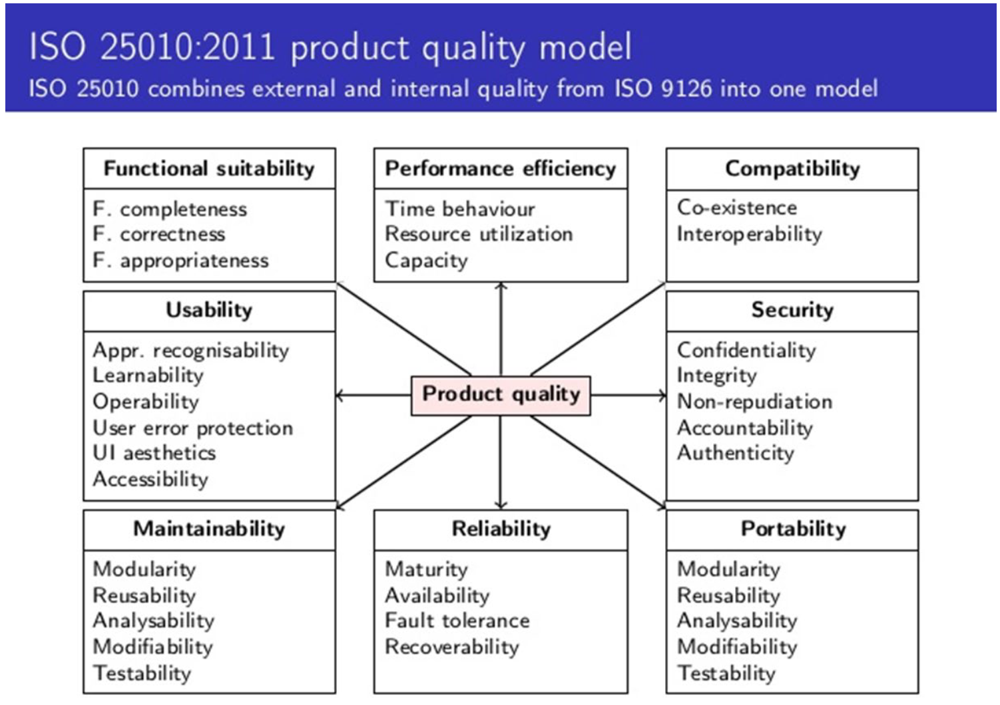

# Functional Analysis : Hoofdstuk 2 - Non-Functional Requirements

## Inleiding

We gaan gebruik maken van een template om de functionele requirements eenduidig vast te leggen. Hiervoor maken we gebruik van de S.M.A.R.T template.

Elk systeem wordt ontwikkeld voor een bepaalde reden. De eisen van zo een systeem dien vooraf eenduidig en duidelijk geformuleerd te worden. Dit wordt beschreven in **een business case**. Hierdoor hebben we een duidelijk oplijsting van alle behoeften die de stakeholders wensen in het systeem.

De behoeften van elke stakeholder zijn verschillend. (een baliebediede gebruikt het systeem anders dan de hotelmanager). Zo een business case bevat steeds een omschrijving van alle rollen en zal dus zeer uitgebreid zijn.

Een requirement is een eis die we stellen aan het systeem. We willen een bepaald gedrag en kwaliteit afdwingen van het systeem. Om te testen of het systeem aan deze eisen voldoet stellen we in eerste instantie **kritische successfactoren (KSF)** op. Nadien formuleren we meetbare acceptatiecriteria bij elke KSF.(hierdoor kunnen we bepalen op een objectieve manier indien een KSF bij een requirement al dan niet behaald is) Indien de KSF bij een requirement behaald is kunnen we stellen dat de requirement bereikt is. Voor een NFR leggen we de KSF en meetbare acceptatiecriteria vast in de S.M.A.R.T template.

## Soorten Non-Functional Requirements

We gebruiken de *ISO 25010:2011* standaard.

Deze standaard legt 8 hoofdsoorten vast:
- Functional Suitabiltiy of functionele geschiktheid
- Performance efficiency of prestatie-efficiëntie
- Compatibility of uitwisselbaarheid
- Usability of bruikbaarheid
- Security of beveiligbaarheid
- Maintainability of onderhoudbaarheid
- Reliability of betrouwbaarheid
- Portability of overdraagbaarheid

> Gevraag op examen: Student wordt verwacht te weten hoe we deze categorieën kunnen testen

## Non-Functional Requirement

Om een NFR vast te leggen in een testbaar gegeven maken we gebruik van een template dat S.M.A.R.T moet zijn of:

- Specifiek
- Meetbaar
- Acceptabel
- Realistisch
- Tijdsgebonden

### Template

Het template dat wij hanteren ziet er als volgt uit:

<table>
    <tr>
        <th>NFR</th>
        <th>Categorie NFR</th>
    </tr>
    <tr>
        <td>Indicator</td>
        <td>De naam van de NFR.</td>
    </tr>
    <tr>
        <td>Meetvoorschrift</td>
        <td>De wijze waarop de NFR gemeten kan worden.</td>
    </tr>
    <tr>
        <td>Norm</td>
        <td>De norm waaraan de NFR moet voldoen.</td>
    </tr>
</table>

Het template is zoals te zien is opgedeelt uit 4 delen:

#### Categorie NFR

Hier vermeld je zo specifiek mogelijk, op basis van de ISO norm, welk hoofd van de NFR je zal testen.

#### Indicator

In de indicator vermeld je de specifieke subcategorie, op basis van de ISO vorm en op basis van de hoofdcategorie, die je zal testen met deze NFR.

#### Meetvoorschrift

Bij het meetvoorschrift vermeld je zo specifiek mogelijk alle stappen die gevolgd moeten worden bij het uitvoeren van de NFR. (komt overeen met het scenario dat gevolgd moet worden) We vermelden hier onderandere welke personen de testen uitvoeren en welke stappen in combinatie met welke acties ze zullen uitvoeren.

#### Norm

Hieronder beschrijven welke resultaten we verwachten en aan waaraan deze moeten voldoen. Hier zien we dus wanneer aan een NFR voldaan werd.

### S.M.A.R.T

#### Specifiek

Antwoord beschrijven op de vraag "Wat wil ik bereiken?". We weten duidelijk welke stappen we moeten ondernemen en wat we precies willen testen. Er moet duidelijk uitgeschreven worden wie welke acties uitvoeren en hoe die precies uitgevoerd worden.

#### Meetbaar

Word bereikt wanneer we precies weten waaraan we kunnen merken of het resultaat behaald werd. Kunnen we dus met andere woorden de norm eenduidig toetsen en zo de meetresultaten evalueren om te controleren of het resultaat behaald is.

#### Acceptabel

Uit de template moet duidelijk blijken waarom we deze doelstelling willen bereiken. Is de NFR met andere woorden voldoende afgetoetst zodat hij aanvaardt kan worden door alle partijen indien we de norm bereiken.

#### Realistisch

Kunnen we opsplitsen in twee delen:

- Enerzijds moeten het meetvoorschrift en de norm haalbare acties bevatten die effectief en steeds op dezelfde manier uitgevoerd kunnen worden.
- Anderzijds moet het geheel opzich ook realistisch zijn.

Je NFR mag dus niet te groot zijn maar moet een duidelijk afbakend en realistisch scenario kunnen testen. Daarnaast moet je ook een realistische indicator testen voor een bepaald scenario

#### Tijdsgebonden

Een NFR is tijdsgebonden wanneer duidelijk beschreven is wanneer we beginnen aan onze test en wanneer deze eindigt. We kunnen dus duidelijk achterhalen wanneer aan de norm voldaan is. De periode waarin onze NFR uitgevoerd moet worden moet vast gelegt worden. (niet de exacte seconden)