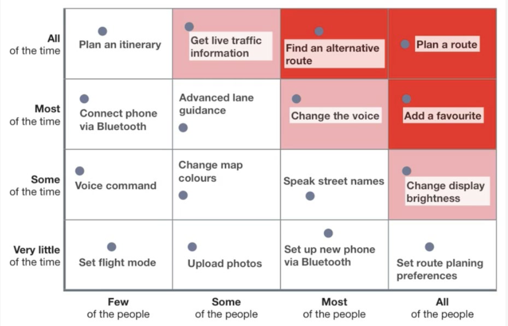

# Functional Analysis : Hoofdstuk 4 - Usability testing

## Inleiding

Doorheen de jaren zijn de vaardigheden die binnen de IT vereist zijn gewijzigd. Steeds meer vereiste vaardigheden zijn "testing", "ontwikkelen van gebruikersomgeving" en "ontwikkelen van het software-ontwikkelingsproces". 

Bij het ontwikkelen van de software is het nodig om de verschillende modellen op elkaar af te stemmen. Concreet hebben we 3 verschillende modellen:

- **Conceptueel model**: het model zoals de ontwerpen het opstellen. Met andere woorden het model zoals de ontwerper denkt dat het systeem er moet uitzien.
- **Mentaal model**: De voorstelling van hoe de gebruiker denkt dat de applicatie er moet uitzien.
- **Systeemmodel**: Het model hoe het systeem effectief werkt.

Het is van groot belang om te zorgen dat alle drie de modellen zo sterk mogelijk overeenkomen zodat de werking van het systeem optimaal is. Hierdoor krijgen we de bruikbaarheid van het systeem zo hoog mogelijk.

Om deze modellen te kunnen toetsen of testen gaan we eerst na wat we willen meten. We maken een onderscheid tussen:

- **User experience** of de gebruikservaring: Bevat alle aspecten die een gebruik ervaart wanneer hij interactie is met het product, service, omgeving of faciliteit.
- **Usability** of bruikbaarheid: De mate van effectiviteit, efficiëntie en tevredenheid die de gebruikers ervaren bij het behalen van specifiek doelstellingen in bepaalde omgevingen.

In dit hoofdstuk focussen we ons op het meten van de bruikbaarheid. We focussen ons op drie kernwaarden:

- *Effectiviteit*: Doet het product wat het beloofd te doen? Kan de gebruiker zijn doel bereiken?
- *Efficiëntie*: Hoeveel inspanning is er nodig voor de gebruiker om zijn doel te bereiken? Hoe snel en hoe vlot kan hij ze verwezenlijken?
- *Tevredenheid*: Is de gebruiker tevreden over hoe hij met het product moet werken?

> Alle drie deze kernwaarden helpen ons bij het testen van de bruikbaarheid van een product.

## Meten

De gemakkelijkste manier om de bruikbaarheid te meten is het gedrag van de "echte gebruikers" waar te nemen wanneer ze "echte taken" uitvoeren met het product. We testen dus op basis van enkele criteria, het is echter onmogelijk om alles te testen. Hierdoor zullen we keuzes moeten maken op basis van tijd, budget, middelen, risco,... Om van een kwaliteitsvollen meting te kunnen spreken moeten we minstens met de volgende vier basiscriteria gaan meten: 

- Succespercentage
- Aantal fouten per eenheid
- De gemiddelde tijd
- Subjectieve tevredenheid van de gebruiker

De eerste drie basiscriteria kunnen eenduidig gemeten worden. De subjectieve tevredenheid van de gebruiker kan op verschillende manier gemeten worden. In deze cursus zullen we die meten aan de hand van de SUS-methode.

Eens deze meting gebeurd zijn kunnen we de resultaten verwerken in een aantal conclusies omtrent de status van ons product. 

Op basis van de meetresultaten kunnen we:

- De voortuitgang van de verschillende versies evalueren
- Marktposities beter inschatten (doen we het slechter of beter als een concurrent, algemeen of op een specifiek gebied) 
- Snellere beslissingen nemen (stop/go). Is het product geschikt voor een release? Moeten er nog aanpassingen gebeuren?
- Bepalen of de projectleider een bonusverloning verdiend

Deze meting gebeuren op twee verschillende manier en in twee verschillende stadia tijdens het project. We hebben *formatief testen* en *summatief testen*.

## Formatief testen

Tijdens het formatief testen zal een testdeelnemer gebruik maken van een prototype om vooraf gedefinieerde taken uit te voeren. De deelnemer denkt hardop en vertelt zo welke acties hij uitoefend. Dit hoeft niet altijd uitgevoerd te worden op effectieve code, dit kan ook gebeuren aan de hand van de mockups.

Om te voldoen aan kwalitatieve testen gebeuren de formatieve testen minstens door 5 verschillende testdeelnemers, die elke onafhankelijk de testen uitvoeren, om niet beinvloedbaar te zijn. 

De test deelnemers worden begeleid door een testmoderator die de deelnemers instructies geef over welke functionaliteit getest moet worden. De moderator zal de testdeelnemers ook doorvragen wanneer hun gedrag niet geheel in lijn is met hetgene verwacht werd. 

Er is ook een observator/notulist aanwezig die het gedrag van de test deelnemers vastlegt. (dit kan dezelfde persoon als de testmoderator zijn)

Een typisch "think aloud" sessie ziet er als volgt uit:

1. Moderator **verwelkomt** de deelnemer en geeft uitleg over de test sessie, hij vraagt een eventuele pre-test of demografische vragen
2. Moderator verklaart **"hardop te denken"** en vraagt indien de deelnemer nog vragen heeft
3. Moderator/Deelnemer leest het **takenscenario hardop** en begint aan het testscenario terwijl ze hardop denken
4. Moderator/Waarnemers nemen **notities** van het **gedrag** van de deelnemer, opmerkingen, fouten en afwerkingen (succes of falen) van elke taak.
5. Moderator vraagt aan het einde van het scenario naar **subjectieve vragen** van de deelnemer of verwijst hem naar een online enquête.
6. Moderator bedankt de deelnemer, geeft een eventuele vergoeding en verwijst de deelnemer uit de testomgeving. 

> ⚠️ Deze manier van testen is vooral geschikt om specifieke ontwerpsfouten terug te vinden en te verbeteren. We willen dus onderliggende problemen vinden en aanpakken.

## Summatief testen

Een summatieve test wordt steeds uitgevoerd op een volledig werkend product. De deelnemers voeren hierop representatieve taken uit die de productsbehoeften weerspiegelen. 

Het resultaat van zo een summatieve test noemen we een **benchmark**.

Een bechmark bevat minstens de vier basiscriteria en stelt ons instaat de een vergelijking te maken tussen de verschillende benchmarks van de verschillende versies van ons product.

Om de subjectieve tevredenheid te testen maken we gebruik van de "System Usability Scale (SUS)" test methode. Deze geeft ons een gemiddelde score over de tevredenheid op basis van een vragenlijst. De vragen lijst bestaat uit positieve en negatieve stellingen over het product. 

Aan het einde van deze test weten we hoeveel % het product zou aanbevelen aan een vriend of hoeveel % vind dat de bruikbaarheid moet aangepast worden van het product. 

Om de score te bereken geeft een gebruiker een waarde tussen 1 (helemaal oneens) en 5 (helemaal eens). Nadien worden de waarden per stelling als volgt aangepast:

- Negatieve stelling: 5 - de waarde
- Positieve stelling: de waarde - 1 

Nadien tellen we de verkregen waarden samen en vermenigvuldigen we deze met 2.5. Zo krijgen we een waarde tussen 0 en 100 die we kunnen evalueren:

- <= 51 = **F**: de Usability moet met topprioriteit aangepakt worden
- 68 = **C**: de gemiddelde SUS-waarde
- \> 74 = **B**: waargenomen bruikbaarheid ban 70% voor alle geteste producten
- \> 80.3 = **A**: dit is het punt waar gebruikers het product aanbevelen aan een vriend.

> ⚠️ Summatief testen is niet zoals formatief testen (gericht op het vinden en verbeteren van ontwerpproblemen) maar dient vooral om het volledige product te evalueren aan de hand van vastgelegde criteria. 

## In de praktijk

In de realiteit zullen de usability testen door minstens 5 testers uitgevoer worden. Zijn vinden zo een 80% van de fouten of gebreken. We kunnen er zeker van uitgaan dat zij de grootste gebreken zullen terugvinden.

Het is echter niet zo nuttig om meer testers te implementeren. Usability testing is gedrag gedreven. Het gedrag tussen de gebruikers zal weinig of niet verschillen. De impact van een extra tester is daarom laag. Tot vijf testers is de impact van een extra tester aanzienlijk. Vijf testers wordt dan ook aanschouwd als een kantelpunt. 

Aangezien een product niet in eenmaal volledig opgeleverd wordt, maar iteratief en incrementeel ontwikkeld wordt, zal ook het proces van usability testing zicht herhalen. Per iteratie worden er testen uitgevoerd:

- 1ste iteratie: meeste significante problemen worden ontdekt
    - fix deze problemen...
- 2de iteratie: nieuwe problemen worden ontdekt
    - fix deze problemen...
- 3de iteratie: ...
    - ...

- ...

Indien we ervan uitgaan dat we 5-6 iteraties hebben alvorens ons product klaar is, en steeds 5 testers hebben. Dan zullen 25-30 gebruikers ons product getest hebben alvorens het op de markt komt.
Echter merken we dat dit zelden in praktijk zo tewerkgaat. Veel voorkomende fouten zijn:

- Men weet niet wat men wil testen
- Het team is niet betrokken
- De verkeerde groep testers (bv. mensen met teveel voorkennis)
- Men test het verkeerde
- Ineffeciënt organiseren van de test
- Geen planning hoe de test resultaten verspreid worden
- Geen iteraties om oplossingen te testen

## Voorbereiding

Voor we een usability test kunnen afnemen zijn er verschillende zaken die we moeten voorbereiden:

- Usability Test Plan
- Persona's
- Key Tasks
- Scenario's
- Mockups

### Usability Test Plan

De eerste stap uit de voorbereiding bestaat uit alle andere stappen in kaartbrengen. Er wordt een document aangemaakt waarin een overzicht te zien is hoe de test zal verlopen. Op het plan zien we informatie over het volgende:

- Doelstellingen voor de test
- Omschrijving van de personen die zullen deelnemen aan de test
- Taken die getest worden
- Locatie en tijdstip waarop de test zal doorgaan
- Gedetailleerd tijdschema van de test

### Persona's

Een persona is een gedetailleerde omschrijving van een bepaald type gebruiker van de uiteindelijke applicatie. Per type gebruiker stellen we een persona op zodat we ons kunnen inleven in dat type gebruiker, in zijn doelen en verwachtingen van de applicatie. Dit helpt het team om een gemeenschappelijk begrip van de gebruiker vast te leggen en beslissingen te nemen tijdens het ontwerpproces. Zo kan het ontwikkelingsteam zich focussen op de behoeften en verwachtingen van de gebruiker. Ten slotte worden persona's ook gebruikt om veronderstelling van de gebruiker weg te werken.

Om een persona op te stellen baseren we ons op ons eigen gebruikersonderzoek. Deze info is verkregen via observaties, klanteninformatie,... Het team werkt daarna op basis van de verkregen informatie, persona's uit vanuit verschillende perspectieven. Zo zijn we zeker dat alle gebruikers en hun specifieke noden aan bod komen. Deze persona's worden expliciet tijdens het ontwikkelproject gebruikt en zijn beschikbaar voor het volledige team. 

Aangezien persona's ontwikkeld worden voor een specifiek project zijn ze nadien niet meer bruikbaar. 

Als laatste stap worden de persona's ook geïntegreerd in de scenario's van de testgebruikers. 

### Key tasks

Om gerichter te kunnen gaan testen zijn we opzoek naar de kerntaken van de applicatie. De kerntaken zijn veel belangrijker als de niet kritische taken en moeten zo snel mogelijk getest worden. Een kerntaak is een taak die de gebruiker absoluut wil uitvoeren met het product om zijn doelstelling te bereiken. 

Om deze te bepalen proberen we de frequente, kritische of problematisch taken de identificeren. We beantwoorden de volgende twee vragen:

- Hoe vaak wordt het gebruikt?
- Door hoeveel gebruikers wordt het gebruikt?

Brengen we deze taken in kaart dan krijgen we de **Key Task Map**.
>Dit is een kaart met 16 zones waaruit we kunnen afleiden hoe vaak een taak wordt uitgevoerd en door hoeveel mensen.

In eerste instantie is het belangrijk om de functionaliteiten in de "rode zone" (altijd + iedereen, altijd + de meerderheid, meestal + iedereen) grondig te testen op usability en deze op punt te stellen.

### Scenario's

In de verschillende testscenario's beschrijven we hoe de personages hun doelen bereiken en welke gevoelens ze daar bij hebben. 

### Mock-Ups

Een mockup is een duidelijk uitgewerkte versie van de gebruikersinterface waarin duidelijk weergegeven wordt welke UI-elementen er aanwezig zullen zijn, met inhoud en opmaak en hoe deze geplaatst worden. Als een mockup ook echt werkt spreken we over een prototype.