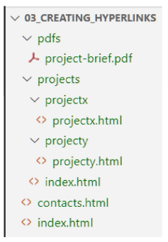
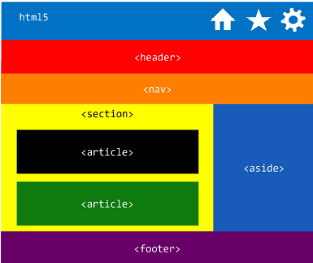

# Web Development 1 : HTML Basis - Deel 2

## Lijsten

HTML heeft 3 verschillende soorten lijsten:

- *Ordered list*:
    - Kan als attributen: start, type, reversed hebben

<table>
<tr>
<th>Syntax</th>
<th>Output</th>
</tr>
<tr>
<td>

```html
    <ol type="i">
        <li>First item</li>
        <li>Second item</li>
        <li>Third item</li>
    </ol>
```

</td>
<td>

<ol type="i">
    <li>First item</li>
    <li>Second item</li>
    <li>Third item</li>
</ol>

</td>
</tr>
</table>

- *Unordered list*:
    - Worden vaak gebruikt bij het maken van een navigatie-menu

<table>
<tr>
<th>Syntax</th>
<th>Output</th>
</tr>
<tr>
<td>

```html
    <ul>
        <li>First item</li>
        <li>Second item</li>
        <li>Third item</li>
    </ul>
```

</td>
<td>

<ul>
    <li>First item</li>
    <li>Second item</li>
    <li>Third item</li>
</ul>

</td>
</tr>
</table>

- *Lijst met beschrijving of definities*
    - Wordt gebruikt voor de FAQ

<table>
<tr>
<th>Syntax</th>
<th>Output</th>
</tr>
<tr>
<td>

```html
    <dl>
        <dt>200 OK</dt>
        <dd>The request succeeded</dd>
        <dt>404 Not Found</dt>
        <dd>The server can find the requeste resource. This code is most likely the most famous one on the internet, due to its frequent occurences</dd>
        <dt>500 Internal Server Error</dt>
        <dd>The server has encountered a situation it does not know how to handle.</dd>
    </dl>
```

</td>
<td>

 <dl>
        <dt>200 OK</dt>
        <dd>The request succeeded</dd>
        <dt>404 Not Found</dt>
        <dd>The server can find the requeste resource. This code is most likely the most famous one on the internet, due to its frequent occurences</dd>
        <dt>500 Internal Server Error</dt>
        <dd>The server has encountered a situation it does not know how to handle.</dd>
    </dl>

</td>
</tr>
</table>

Het is ook mogelijk om lijsten te subnesten. Hierbij wordt de gesubneste lijst in een subitem van een andere lijst geplaatst.

## Backline en inline elementen

Sinds HTML5 worden inline-level en block-level indeling voor elementen niet meer gebruikt. We bespreken de principes hier aangezien de termen vaak wel nog gebruikt worden.

Ook omdat de nieuwe indeling binnnen HTML5 nogal complex is.

- **Block elements**: Een block element start steeds op een nieuwe lijn en neemt de volledige breedte van de webpagina in.

- **Inline elements**: Een inline element begint niet op een nieuwe lijn en neemt enkel de breedte in die nodig is voor het element.

Daarbuiten zijn er ook 2 elementen die geen semantische betekenis hebben. nl. `<div>` en `<span>`

- `<div>` is een block element en een algemene container. Het wordt vaak gebruikt om elementen te groeperen. Bijvoorbeeld om ze later te kunnne stijlen met behulp van CSS of om gemeenschappelijke attributen zoals "lang" toe te voegen.

### Text-block level elementen

- `<blockquote>`: gebruikt voor langere citaten
- `<ul> <ol> <dl>`: functionaliteit reeds besproken
- `<figure>`: groepeert een illustratie met zijn bijschrift. Het hoeft niet een beeld te zijn. Het kan een grafiek, tabel, citaat of meer zijn.
    - `<figcaption>`: beschrijft het bijschrift van de figuur
- `<address>`: markeren van address informatie
- `<pre>`: behouden van tabs, witruimtes, etc in code. (pre-formatted)
- `<hr>`: een thematische scheiding tussen paragrafen.

### Text-inline elementen

- `<strong>`: een stuk tekst met een belangrijke betekenis. Wordt standaard door de browser in het vet aangeduidt.
- `<em>`: (emphasize) - de klemtoon leggen. De browser zal dit standaard cursief aanduiden.
- `<b>`: Gebruikt om de aandacht van de lezer op de tekst te leggen. Die verder niet bepaald belangrijk is.
- `<i>`: Gebruikt om tekst aan te duiden met als doel de leesbaarheid van de tekst te vergroten.
- `<small>`: aanvullende informatie, bv. copyright tekst
- `<cite>`: voor het markeren van de naam van een auteur of van een creatief werk (geen attribuut voor bron vermelding)
- `<q>`: voor korte citaten in de lopende zin. (quote) Gebruik het attribuut cite om de bron te vermelden
- `<abbr>`: gebruikt voor een afkorting
- `<dfn>`: markeert de eerste keer dat een definitie voorkomt
- `<code>`: markeren van programma code
- `<time>`: gebruikt om een tijdstip of datum aan te duiden
- `<samp>`: computer uitvoer
- `<kbd>`: gebruikersinvoer
- `<s>`: informatie die niet meer klopt (suppress)
- `<sub>`: gebruikt voor subscript
- `<sup>`: gebruikt voor superscript
- `<mark>`: markeer tekst (om tekst met speciale relevantie te markeren)
- `<ins>`: geeft aan dat informatie is toegevoegd
- `<del>`: geeft aan dat informatie is verwijderd

### Hyperlinks

#### Algemene hyperlinks

Het gebruik van (hyper) links maakt het mogelijk om in HTML van de ene pagina naar de andere te gaan.

Mogelijke links:

- naar een pagina binnen dezelfde website
- naar een pagina van een andere website
- naar een plaats binnen een pagina (bookmarks)
- een link voor een e-mail adres (opent de standaard e-mail client)

Klikbare inhoud: kan een afbeelding, een kop tekst, of zelfs een volledig artikel zijn.

<table>
<tr>
<th>Syntax</th>
<th>Output</th>
</tr>
<tr>
<td>

```html
<a href="https://www.hogent.be">Hogeschool Gent</a>
```
</td>
<td>

<a href="https://www.hogent.be">Hogeschool Gent</a>

</td>
</tr>
</table>

#### Navigation menu

Vaak plaatst men bij het aanmaken van een navigation menu de links in een ul-element

Waarden voor het href-attribuut:

- Zonder href-attribuut zal er niets gebeuren wanneer er op de link geklikt wordt
- `href=""` - dezelfde pagina zal geladen worden
- `href="#"` - er wordt naar de top van de pagina gesprongen

<table>
<tr>
<th>Voorbeeld</th>
<th>Output</th>
</tr>
<tr>
<td>

```html
<ul>
    <li><a>Home</a></li>
    <li><a href="pictures.html">Pictures</a></li>
    <li><a href="projects.html">Projects</a></li>
    <li><a href="social.html">Social</a></li>
</ul>
```

</td>
<td>

<ul>
    <li><a>Home</a></li>
    <li><a href="pictures.html">Pictures</a></li>
    <li><a href="projects.html">Projects</a></li>
    <li><a href="social.html">Social</a></li>
</ul>

</td>
</tr>
</table>

#### Absolute paden

Wanneer we een URL maken die verwijst naar een bestand binnen dezelfde website kunnen we gebruik maken van zowel absolute als relatieve paden.

Een absoluut pad start steeds met een `/`. Deze slash duidt de root van de website aan. In het onderstaand voorbeeld is de webroot "03_creating_hyperlinks".

**Voorbeelden**

```html
<a href="/contacts.html">contacts page</a>
<a href="/projects/index.html">project home page</a>

```

<p align='center'></p>

#### Relatieve paden

- Wanneer het bestand in dezelfde map staat als het huidig document, is enkel de bestandsnaam nodig in het href-attribuut.

    > Voorbeeld: hyperlink vanuit index.html naar contacts.html

    ```html
    <a href="contacts.html">contacts page</a>
    ```

- Wanneer het bestand een map lager staat, noteren we een slash "`/`" voor de bestandsnaam

    > Voorbeeld: hyperlink vanuit index.html naar index.html in projects

    ```html
    <a href="projects/index.html">project homepage</a>
    ```

- Om een map hoger te bereiken (parent map) gebruik je `../` in een relatief pad staat `..` voor de parent map en `.` voor de huidige map.

    > Voorbeeld: hyperlink in projectx.html naar /projects/index.html

    ```html
    <a href="../index.html">Projects page</a>
    ```

    > Voorbeeld: hyperlink in projecty.html naar project-brief.pdf

    ```html
    <a href="../../pdfs/project-brief.pdf">project brief</a>
    ```

#### Speciale hyperlinks

- Link openen in een nieuw tabblad via het **target** attribuut

    ```html
    <a href="http://www.w3.org" target="_blank">World Wide Web Consortium</a>
    ```
- Link die het sturen van een e-mail initieert

    ```html
    <a href="mailto:webmaster@hogent.be">Mail de webmaster</a>
    <a href="mailto:webmaster@hogent.be?subject=reactie">Mail de webmaster</a>
    ```

- Link die het bellen van een telefoonnummer initieert

    ```html
    <a href="tel:+3209828282">Bel de webmaster</a>
    ```

- Link die het versturen van een sms initieert

    ```html
    <a href="sms:+3209828282">Bel de webmaster</a>
    ```

- Een pdf weergeven of downloaden
    - weergeven in de browser: 
    
    ```html
    <a href="./pdf/h05.pdf">pdf van hoofdstuk 5</a>
    ```
    - bestand downloaden:

    ```html
    <a href="./pdf/h05.pdf" download="hoofdstuk 5">pdf van hoofdstuk 5</a>
    ```

#### Richtlijnen hyperlinks

- Hyperlinks moeten herkenbaar zijn
- De hypertekst moet:
    - het doel van de link voldoende duidelijke maken
    - informatief, wanneer het buiten de context wordt gelezen. Geen technisch verhaal over hoe de link werkt
- Onderstreep tekst niet als het geen hyperlink is

### Bookmark - links

Het is ook mogelijk om te linken naar een specifiek doel (document fragment) van een HTML document in plaats van naar het begin van het HTML document.

Om dit te doen moet je eerst een specifiek deel (=bladwijzer/bookmark) aanduiden. Je doet dit door een **id**-attribuut toe te kennen aan het element waarnaar je wilt linken. Dikwijls zal dit een heading element zijn.

```html
<h2 id="Mailing_address">Mailing Address</h2>
```

Om dan te linken naar het specifieke id voeg je op het einde van de url een #-teken toe gevolgd door het id.

```html
<a href="contacts.html#Mailing_address">mailing address</a>
```

Links binnen eenzelfde pagina komen vaak voor bij pagina's meet veel content of bij Single Page Applications. Alle content wordt in één keer geladen, maar is daarom nog niet helemaal zichtbaar.

Als je links maakt binnen eenzelfde pagina mag je de bestandsnaam weglaten. De url start dan met een #. Om een effect te kunnen zien moet de pagina lang genoeg zijn. (er moet gescrolled worden)

## Paginastructuur

Voor koppen gebruiken we de heading elementen. Hierbij houden we ons aan:
- `<h1>`: hoofdonderwerp, meestal de paginatitel. Meestal 1 h1-element per pagina
- `<h2>`: een ondertitel
- `<h3>`: tussen kopjes
- ...

HTML5 bevat elementen om de pagina in logische blokken in te delen.

<table align="center">
<tr>
<th>PRE HTML5</th>
<th>HTML5</th>
</tr>
<tr>
<td>

```html
<div id="header">
```
</td>
<td>

```html
<header>
```
</td>
</tr>
<tr>
<td>

```html
<div id="navigatie">
```
</td>
<td>

```html
<nav>
```
</td>
</tr>
<tr>
<td>

```html
<div id="main">
```
</td>
<td>

```html
<main>
```
</td>
</tr>
<tr>
<td>

```html
<div id="artikel">
```
</td>
<td>

```html
<article>
```
</td>
</tr>
<tr>
<td>

```html
<div id="kolomrechts">
```
</td>
<td>

```html
<aside>
```
</td>
</tr>
<tr>
<td>

```html
<div id="footer">
```
</td>
<td>

```html
<footer>
```
</td>
</tr>
</table>

- `<article>` - voor een zelfstandig stuk inhoud, dat onafhankelijk te hergebruiken is
- `<section>` - voor een onderdeel van een pagina waarvoor geen meer specifiek element is
- `<nav>` - voor de hoofdnavigatie
- `<aside>`- voor de 'zijdelingse' informatie
- `<header>` - voor het kopgedeelte
- `<footer>` - voor het footer gedeelte

<p align='center'></p>
