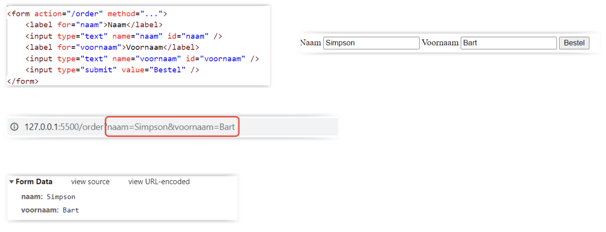

# Web Develeopment 1 : Hoofdstuk 3 - Tabellen en Formulieren

## Tabellen

Een tabel is een rechthoekig raster van rijen en kolommen. Waar kolommen en rijen kruisen krijgt men cellen. Elke cel kan informatie bevatten: tekst, getallen, koppelingen, afbeeldingen,...

**Syntax**:

Elke tabel begint met de `<table>`-tag.
Een rij wordt opgebouwd door de `<tr>`-tag.
Een cell kan bestaan uit een heading (`<th>`) of een datacel (`<td>`)

<table>
<tr>
<th>Syntax</th>
<th>Output</th>
</tr>
<tr>
<td

```html
<table>
<tr>
<th>Eerste heading</th>
<th>Tweede heading</th>
</tr>
<tr>
<td>Eerste datacel</td>
<td>Tweede datacel</td>
</tr>
</table>
```

</td>
<td>

<table>
<tr>
<th>Eerste heading</th>
<th>Tweede heading</th>
</tr>
<tr>
<td>Eerste datacel</td>
<td>Tweede datacel</td>
</tr>
</table>

</td>
</tr>
</table>

**Kenmerken**:
- Binnen elke cel loopt tekst automatisch door naar de volgende regel als de tekst te lang wordt binnen de cel.
- De meeste tags zoals `<strong>`, `<em>`, `<hr>`, ``,... kan je gebruiken binnen een cel
- Standaardopmaak:
    - `<th>` - hoofding voor rij en kolom: inhoud standaard gecentreerd en vet
    - `<td>` - gewone cellen: inhoud staat links gealigneerd
- Binnen elke cel kan je een nieuwe tabel beginnen (=geneste tabellen)

### Opmaak

Ook bij tabellen kunnen we de opmaak wijzigen door middel van css.

- Rand rond tabel en cellen:

    ```css
    table, th, td{
        border: 1px solid black;
    }
    ```

- Dit zorgt voor een probleem namelijk een dubbele rand. Oplossing is collapsing border gebruiken:

    ```css
    table{
        border-collapse: collapse;
    }
    ```
- Voorbeeld met enkel onderrand en witruimte:

    ```css
    table{
        border-collapse:collapse;
        font-size: 14px;
    }
    table, th, td{
        border-block-end: 1px solid black; /* bottom line  */
        padding: 10px 15px; /* 10px boven witruimte, 15px links en rechts  */
    }
    ```

We kunnen via HTML verschillende kolommen groeperen en op deze manier de kolommen samen eenzelfde opmaak geven.

Hiervoor gebruiken we de `<colgroup>`-tag.

- We specifiëren steeds de breedte waarover de groep zich spreid (via een span attribuut)
- We kunnen verschillende klasses toewijzen aan de groep doormiddel van een class attribuut
- We kunnen enkel border, background, visibilty en width properties toekennen via een "colgroup"
- voorbeeld: (groupeert de eerste 3 kolommen en wijst aan de volgende kolom de klasse last toe)
    ```html
    <colgroup>
        <col span="3">
        <col class="last">
    </colgroup>
    ```

### Structuur

Cellen kunnen ook samenengevoegd worden. We kunnen dit zowel over de kollommen als over de rijen.

- Samenvoegen cellen over 3 kolommen

    ```html
    <tr>
        <td colspan="3">Celinhoud</td>
        <td>Celinhoud</td>
    </tr>
    ```
- Samenvoegen cellen over 2 rijen

  ```html
    <tr>
        <td rowspan="2">Celinhoud</td>
        <td>Celinhoud</td>
    </tr>
    ```

Vaak kunnen we tabellen onderscheiden in de volgende items:

- header
- body
- footer

In HTML kunnen we deze beschrijven met volgende tags:

- `<thead>`
- `<tbody>`
- `<tfoot>`

> Deze informatie is interessant voor de screen readers en voor de opmaak in CSS.

In HTML tabellen kunnen we bijschriften schrijven doormiddel van de `<caption>`-tag. 

Deze wordt standaard boven de tabel weergegeven. Echter kunnen we dit doormiddel van CSS wel wijzigen:

```css
caption{
    caption-side: block-end;
}
```

## Formulieren

Doormiddel van formulieren (forms) kan men gegevens van de gebruiker verzamelen. We kunnen deze gebruiken om:

- je aan te melden op een website
- een online bestelling te maken
- te zoeken
- te chatten
- te bloggen
- te twitteren
- ...

Binnen deze formulieren zijn er verschillende mogelijkheden (form controls):

- Tekst ingeven:
    - namen, adres, e-mail: single-line
    - password: karakters worden niet getoond, maar vervangen door een sterretje
    - textarea: meerdere lijnen tekst kunnen ingegeven worden
- Keuzes:
    - radiobuttons: één enkele keuze maken
    - checkboxes: geen of meerdere keuzes mogelijk
    - keuzelijsten(dropdown list): één of meerdere keuzes maken uit een lijst
- Inhoud van formulieren verzenden met:
    - submit button
    - image button
- Bestanden uploaden

Door op een submit button te klikken worden de gegevens als *name/value* naar de server verstuurd. Hierna worden de gegevens mogelijks door een applicatie op de server verwerkt en teruggestuurd naar de webpagina.

- *name*: beschrijving van het onderdeel
- *value*: invoer van de gebruiker

Alle form-controls bevinden zich tussen de open en closing form-tag

```html
<form action="/order" method="post">

</form>
```

**belangrijke attributen**:
- *action*: geeft de site of de actie aan naarwaar de data verstuurd worden na het klikken van de submit-knop
    - action-item kan ook een e-mail adres bevatten

    ```html
    <form action="mailto:naam@hogent.be?subject=formulierresultaat" method="post">

    </form>
    ```

- *method*: bepaald de HTTP-methode die gebruikt wordt bij het verzenden van de data
    - **get**: de formulier-data wordt aan de url toegevoegd via naam-waarde paren
        - de data is zichtbaar in de browser en gelimiteerd in lengte
        - best enkel te gebruiken voor non-secure data
    - **post**: voegt de formulier data toe aan de header van de http-request (niet zichtbaar)
        - wordt gebruikt voor data die gebruikt wordt voor in een databank, gevoelige data, uploaden bestanden.
    
<p align='center'></p>

**andere attributen**:
- *id of name*: gebruikt om formulier op te maken of aan te spreken in Javascript
- *autocomplete*: bepaald indien autocomplete aanstaat voor de velden in het formulier. Kan ook afzonderlijk voor de form controls gebruikt worden

### Form controls

#### input

De`<input>`-tag is de belangrijkste meest gebruikt form-control in de fomulieren.

Het attribuut *type* bepaald welk type form-control het is:
- tekst
- wachtwoord
- checkbox
- e-mail
- url
- ...

Het attribuut *name* is een "verplicht" attribuut. Zonder dit attribuut worden de waarden niet doorgestuurd.

Ook hier wordt het attribuut *id* gebruikt voor de opmaak en het aanspreken in Javascript.

Form-controls waar de gebruiker zelf niets in typt hebben steeds een value nodig.

**input type radio-button**

- *name* moet overal dezelfde om de buttons aan elkaar te linken
- *value* moet ingevuld zijn, dit is de waarde dat verstuurd zal worden
- *checked* is een attribuut zonder waarde dat ingesteld kan worden wanneer er reeds een optie geslecteerd moet zijn

<table>
<tr>
<th>Syntax</th>
<th>Output</th>
</tr>
<tr>
<td>

```html
<input type="radio" name="levering" value="1618" />16-18u
<input type="radio" name="levering" value="1820" checked/>18-20u
<input type="radio" name="levering" value="2022" />20-22u
```
</td>
<td>

<input type="radio" name="levering" value="1618" />16-18u
<input type="radio" name="levering" value="1820" checked/>18-20u
<input type="radio" name="levering" value="2022" />20-22u
</td>
</tr>
</table>

**input type checkbox**

- *name* moet ingevuld zijn, maar moet niet overal dezelfde zijn
- *value* mag ingevuld zijn, staandaard waarde is "on"
- *checked* is een attribuut zonder waarde dat ingesteld kan worden wanneer er reeds een optie geslecteerd moet zijn

<table>
<tr>
<th>Syntax</th>
<th>Output</th>
</tr>
<tr>
<td>

```html
<input type="checkbox" name="extras" value="kaas" /> kaas
<input type="checkbox" name="extras" id="hesp" checked/> hesp
<input type="checkbox" name="extras" id="tomaten" checked/> tomaten
```
</td>
<td>

<input type="checkbox" name="extras" value="kaas" /> kaas
<input type="checkbox" name="extras" id="hesp" checked/> hesp
<input type="checkbox" name="extras" id="tomaten" checked/> tomaten
</td>
</tr>
</table>

**bestanden uploaden**