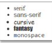

# Web Develeopment 1 : Hoofdstuk 4 - CSS Basis - Deel 1

## CSS

> Cascading Style Sheets is een verzameling van stijlregels om webpagina's op te maken.

Door gebruik te maken van stijlregels is er een verschill tussen inhoud en opmaak

**Stijlregels** bestaan uit:
- een **selector** - duidt aan welk(e) HTML element beïnvloed worden
- een **declaration block** - een property:value paar
    - property: identifier die de in te stellen CSS-eigenschap definieert
    - value: waarde voor de in te stellen eigenschap

### CSS toevoegen aan een webpagina

Er zijn drie verschillende manieren om css aan een pagina toe te voegen:

- **external stylesheet**
    - wordt in een extern bestand geplaatst
    - via het `<link>`-element wordt het .css-bestand verbonden aan het HTML-document
    - meestal de verkozen manier
    ```html
    <head>
        ...
        <title>CSS</title>
        <link rel="stylesheet" href="style.css">
    </head>
    ```
- **internal stylesheet**
    - CSS rules bevinden zich in het HTML bestand zelf
    - binnen een `<style>`- element in de `<head>` van het HTML document
    ```html
    <head>
        ...
        <title>CSS</title>
        <style>
            h2{
                color:white;
                background-color:red;
            }
        </style>
    </head>
    ```
- **inline styles**
    - CSS declarations die slechts van toepassing zijn op één element
    - geplaatst in het style-attribuut voor dat element
    ```html
    <h2 style="color:white; background-color:red;">Header</h2>
    ```

### Backgrounds

- Elk element heeft een background, standaard is dit transparant
- instellen van een achtergrondkleur door `background-color`
- achtergrondafbeelding:
    - `background-image`: stelt de afbeelding in
    - `background-repeat`: stelt het herhalen van de afbeelding in todat alle ruimte in het block gevuld is
    - `background-attachement`: standaard schuift een afbeelding mee met de rest van de pagina, we kunnen deze met deze property vastzetten.
    - `background-position`: stelt de positionering in van de afbeelding
    - `background-clip`: stelt de overloop van de afbeelding in
    - `background-origin`: helpt bij de plaatsing van de afbeelding
    - `background-size`: stelt de schaal in van de afbeelding

    > Al deze properties kunnen ook samengevat worden in 1 property `background`

#### background-image

>[!TIP]
> Het is steeds verstandig om ook de achtergrondkleur in te stellen (tint van de afbeelding), dan weten we zeker dat het contrast met de andere inhoud blijft wanneer de afbeelding niet geladen kan worden.

- Het pad van de afbeelding is relatief tov de stylesheet en niet de webpagina
- Meerdere background-images zijn ook mogelijk

#### background-repeat

- Standaard wordt de afbeelding herhaald tot alle ruimte in het block gevuld is
- *repeat*: horizontaal en verticaal herhalen (standaard optie)
- *repeat-x*: horizontaal herhalen
- *repeat-y*: verticaal herhalen
- *no-repeat*: niet herhalen
- *space*: zo vaak als past en de resterende ruimte tussen de afbeeldingen gelijk verdelen
- *round* zo vaak als past en de resterende ruimte vullen door de afbeelding te schalen
- we kunnen ook 2 waarden opgeven: eerste voor de horizontale en tweede voor de verticale richting

    ```css
    background-repeat: repeat no-repeat;
    ```

#### background-attachement

Een afbeelding schuift standaard mee met de webpagina. We kunnen deze ook vastzetten:

- *fixed*: vast tov venster
- *scroll*: scrolt mee met element waarop het gedefinieerd is (standaard)
- *local*: meeschuiven met de inhoud van het element als dat een schuifbalk heeft

#### background-position

- Positie in het venster
- Je geeft een waarde op voor horizontale en verticale positie:
    - Sleutelwoorden: 
        - *left, center, right, top, bottom*
        - standaard: *left top*
    - Percentages:
        - standaard: *0% 0%*
    - Lengtes:
        - standaard: *0 0*

#### background shorthand property

Shorthand properties zijn de CSS properties waarmee je de waarde van verschillende CSS-properties in één keer kunt instellen. Zo is de `background`-property een shorthand property

Het stelt de `background-color`, `background-image`, `background-repeat`, `background-position` in één keer in

Bij de `background`-property moeten de waarden in de juiste volgorde staan, maar mogen er waarden ontbreken

<table>
<tr>
<th>Standaard</th>
<th>Shorthand property</th>
</tr>
<tr>
<td>

```css
background-color: #000;
background-image: url(images/bg.gif);
background-repeat: no-repeat;
background-position: left top;
```
</td>
<td>

```css
background: #000 url(images/bg.gif) no-repeat left top;
```
</td>
</tr>
</table>

Best gebruik je of de shorthand property of the longhand properties. Wanneer we beiden door elkaar gebruiken wordt door de shorthand property sommige waarden als standaard ingesteld. Dit kan enkel vermeden worden wanneer we een unieke manier van werken hanteren.

Onderstaand voorbeeld zal de achtergrondkleur niet op red instellen. Deze wordt overschreven door de standaard waarde transparent in de tweede regel

```css
background-color: red;
background: url(images/bg.gif) no-repeat left top;
```

### gradients

Gradients kunnen:
- lineair zijn:
    - `linear-gradient`
- radiaal zijn:
    - `radial-gradient`

### Kleuren

Voor elk element kan je
- de tekstkleur instellen met `color`
- de achtergrondkleur instellen met `background-color`

Daarnaast kan je ook nog de kleur instellen van randen, schaduwen,... met `border-color`, `text-shadow`

Instellen van kleuren kan je op volgende manieren:
- kleurnamen zoals red, blue,...
    ```css
    h1{color:red;}
    ```
- RGB: definieren van de red, green, blue waarden
    - absolute waarden: (waarden tussen 0 en 255)
        ```css
        h1{color:rgb(255 237 0);}
        ```
    - relatieve waarden: (percentage tussen 0% en 100%)
        ```css
        h1{color:rgb(100% 50% 0);}
        ```
    - hier kunnen we ook een 4<sup>de</sup> component definieren: alpha channel
        - deze komt overeen met het transparantie niveau
        - absolute waarden: (getal tussen 0 en 1)
            ```css
            h1{color:rgb(100% 50% 0 / 0.5);} /* helft transparant */
            ```
            ```css
            h1{color:rgb(100% 50% 0 / 1);} /* volledige dekking */
            ```
            ```css
            h1{color:rgb(100% 50% 0 / 0);} /* volledig transparant */
            ```
        - relatieve waarden: (percentage tussen 0% en 100%)
            ```css
            h1{color:rgb(100% 50% 0 / 50%);} /* helft transparant */
            ```
            ```css
            h1{color:rgb(100% 50% 0 / 100%);} /* volledige dekking */
            ```
            ```css
            h1{color:rgb(100% 50% 0 / 0%);} /* volledig transparant */
            ```

- hexadecimale notatie
    - begint met # en elke component krijgt een hexadecimale waarde tussen 00 en ff
        ```css
        h1{color:#ff7f00;}
        ```

### Lijsten opmaken

#### list-style-type

Wordt gebruikt om het opsommingsteken van een lijst te stijlen

```css
ol{
    list-style-type: upper-alpha; /* Zal hoofdletters instellen als opsommingsteken */
}

ul {
    list-style-type: none; /* Zal geen opsommingsteken instellen */
}
```

> Vaak worden unordered lists gebruikt om navigaties in te stellen. Meestal wordt de list-style-type op none ingesteld.

#### list-style-image

Wordt gebruikt om een afbeelding als opsommingsteken in te stellen

- We kunnen een eigen afbeelding instellen als een bullet
- Het pad is relatief tov het css-bestand niet tov de html-pagina

```css
ul{
    list-style-image: url(../images/star.png);
}
```

#### list-style-position

Wordt gebruikt om de positie van een opsommingsteken te stijlen

Kan ingesteld worden op *inside* of *outside (default waarde)*

```css
ul{
    list-style-image: url(../images/star.png);
    list-style-position: inside;
}
```

#### list-style

Wordt gebruikt als de shorthand om de lijst te stijlen

```css
ul{
    list-style: url(../images/star.png) inside;
}
```

### Tekst en typografie

De CSS properties om tekst op te maken kunnen we indelen in twee categorieën:

- **font styles**:
    - lettertype - `font-family`
    - lettergrootte - `font-size`
    - normal-italic-bold - `font-style` of `font-weight`
- **text layout styles**:
    - regelafstand - `line-height`
    - uitlijning van de tekst - `text-align`

#### font styles

##### font-family

Wordt gebruikt om het lettertype in te stellen.

Aangezien niet alle lettertypes beschikbaar zijn op elk toestel geven we een lijst van lettertypes in.

```css
font-family: Georgia, 'Times New Roman', Times, serif;
```

- fallback systeem: het eerste lettertype dat beschikbaar is wordt door de browser geselecteerd
- de laatste font is bij voorkeur een *generische font*. Indien geen van de andere fonts aanwezig zijn, zal de browser zelf een acceptabele font selecteren.

<p align='center'></p>


> Wanneer de naam van een font spatie bevat plaats je dit in "" of ''

##### font-size

Wordt gebruikt om de grootte van het lettertype in te stellen.

Indien er geen grootte ingesteld vallen we terug op de default eigenschappen van de browser. In de meeste gevallen is **default font-size 16px**

We kunnen de font-size instellen door:

- *absolute size*: xx-small, x-small, small, medium (default), large, x-large, xx-large
- *relative size*: larger or smaller (dan het parent element)
- *length*: een getal in punten, pixels, em of rem
    - bij *em* wordt de font-size berekend tov het parent-element
    - voorbeeld
    ```css
    body{
        font-size: 10px;
    }
    h1{
        font-size: 1.5em; /* Zal overeenkomen met 15px (indien het een kind element van body is) */
    }
    ```
    - bij *rem* (root em) word de tekstgrootte berekent tov het root-element `<html>` (default 16px)
    - lost het probleem van samengestelde em's op 
- *percentage*: een getal in %

> W3C raadt het gebruik van em's en percentages aan voor een robuuste lay-out: de verhoudingen tussen de element zullen dan behouden blijven ongeacht de gebruikte default grootte.

##### font-size-adjust

Gebruikt om de tekstgrootte gelijk te houden wanneer er wordt teruggevallen op de 2<sup>de</sup> keuze in de font-family lijst

##### line-height

Gebruikt om de Regelafstand, de hoeveelheid wit tussend de tekst regels in te stellen.

> Best practise voor een doorlopende tekst is line-height: 1.5 (1.5 * font-size)

##### font-weight

Gebruikt om de vetheid (het gewicht/dikte) van het lettertype in te stellen
- mogelijke waarden:
    - 100-900
    - normal (400), bold (700)
    - bolder (vetter dan voorgaande tekst), lighter

##### font-style

Bepaalt indien de tekst normaal, cursief of schuin wordt weergegeven.

Waarden: normal, italic, oblique (schuin getrokken)

##### font-variant

Kleinkapitaal, zoals small-caps

##### font-stretch

Uitrekken of indrukken

##### font

De shorthand property: *font-style font-variant font-weight font-size/line-height font-family*

De eigenschappen *font-size* en *font-family* zijn verplicht en moeten in die volgorde als laatste voorkomen

```css
font: italic 1.2em/1.5 "Fira Sans", serif;
```


#### text layout styles

##### color

Kleur

##### text-align

Uitlijnen van de tekst (left, right, center, justify)

##### text-align-last

Uitlijnen van de laatste regel

##### text-decoration

Lijneffect:

- text-decoration-line: none, underline,...
- text-decoration-style: solid,...
- text-decoration-color

##### text-indent

Inspringen van de eerste regel van een tekstblok

##### text-orientation

Horizontale of verticale tekst

##### text-overflow

Overlopende tekst, bepaald welk visueel effect de gebruiker krijgt als er meer tekst is dan hij ziet (clip, ellipses)

##### text-shadow

Schaduw (horizontale verschuiving, verticale verschuiving, vervaging, optioneel een kleur)

##### text-transform

Hoofdletters, kleine letters (capitalize, uppercase, lowercase, none)

##### white-space

Witruimte al dan niet behouden (normal: wit wordt samengevoegd tot 1 spatie, pre: alles behouden,...)

##### letter-spacing

Ruimte tussen de letters

##### word-spacing

Ruimte tussen de woorden

##### word-break

Ruimte tussen de woorden

##### overflow-wrap

Is het afbreken van een woord toegestaan

## CSS Selectors

### Universal Selector

Dit zijn de regels die van toepassing zijn voor elk element in de pagina.

```css
*{
    color: red;
}
```

### Type Selector

Dit zijn de selectors die dezelfde naam hebben als het element dat ze stylen

Ze zijn van toepassing voor elk 'optreden' van dat element

```css
h1{
    color: red;
}
```

### Class en ID selectors

Dit zijn selectors van specifieke elementen, gebruiken het attribuut class of id

- id - selectie van slechts één element
- class - selectie van meerdere elementen
    - elk element kan een of meerdere class-waarden hebben. Elke class-waarde kan voorkomen bij één of meerdere elementen.

```css
#archives{
    color: green;
}
.link{
    color: red;
}
.extlink{
    background-color: rgb(255, 220, 226);
    font-size: 1.2rem;
}
```

#### Class selectors

- de selector `.link` is een verkorte notatie voor `*.link`
- wil je bv. enkel de a-elementen met class="link" selecteren dan gebruik je de selector `a.link`
    - merkop: geen spatie tussen a en .link
    >[!tip]
    > Best practise: prefix de class selector niet met een type selector. Meenstal wil je elk element met de opgegeven class stijlen.

### Selector list

- gebruik een selector list als je verschillende elementen dezelfde opmaak wil geven
- de elementen worden in de selector gescheiden van elkaar doormiddel van een komma

```css
h1, .link{
    color: red;
}
```

### Descendant combinator

- Selecteert alle elementen die afstammen van een element (hoeft niet een rechtstreeks child-element te zijn)
- voorbeeld: selecteert alle p die afstammen van div

    ```css
    div p{
        background-color: lightblue;
    }
    ```

### Child combinator

- Selecteert de (directe) kinderen van een element
- voorbeeld: selecteer alle a die (directe) kinderen zijn van p

    ```css
    p > a{
        background-color: lightblue;
    }
    ```

### Sibling combinator

- Sibling elements zijn elementen die dezelfde parent hebben
- er zijn twee sibling combinators:
    - *adjacent sibling combinator* (+)
    - *general sibling combinator* (~)

```css
h1 + p { /* Paragrafen die onmiddelijk na een h1 komen */
    font-weight: bold;
}
p ~ p { /* Alle paragrafen na een paragraaf */
    font-weight: bold;
}
```

### Attribute selectors

Zijn van toepassing op elk element met:
- een bepaald attribuut [attr]
- met een bepaalde waarde voor een attribuut:
    - [attr=value] - de attribuutwaarde is exact gelijk aan de value
    - [attr*=value] - de attribuutwaarde bevat de value
    - [attr^=value] - de attribuutwaarde start met de value

```css
a[href]{ /* <a> elements with a href attribute */
    color: purple;
}
```

```css
a[href^:"http"]{ /* <a> elements with a href attribute starting with http*/
    background-color: purple;
    font-size: 1.2rem;
}
```

### Pseudo-class selectors

- elementen selecteren, op basis van een speciale toestand van het element gebeurd doormiddel van pseudo-classes
- Een hyperlink kan zich in verschillende toestanden bevatten:
    - niet bezocht - `a:link`
    - bezocht - `a:visited`
    - actief - `a:active` (weinig gebruikt)
    - met cursor over gaan - `a:hover`
- Een pseudo-class start altijd met een ":" en dan de naam van een pseudo-class (GEEN SPATIES!)

```css
/* we verwijderen de onderstreping bij alle links */
a{
    text-decoration: none;
    color: red;
    font-size: 1.2rem;
}

/* en als er gehoverd wordt over een link dan onderstrepen we de link */
a:hover{
    text-decoration: underline;
}
```

#### (tree-structural) pseudoclasses

- `:first-child` - een element dat het eerste child is van zijn parent-element

    - voorbeeld: een p-element dat het eerste 'child' is van zijn 'parent'-element

        ```css
        p:first-child{
            background-color: lightblue;
        }
        ```

- `:last-child` - een element dat het laatste child is van zijn parent-element
- `:only-child` - een element waarvan de ouder geen andere child-elementen heeft
- `:first-of-type` - het eerste element van dat type
- `:last-of-type` - het laatste element van dat type
- `:only-of-type` - het enige element van dat type
- n-child selectors

    - `:nth-child` - elk zoveelste child-element
        - start bij het eerste child
    - `:nth-last-child` - nu gerekend vanaf het laatste child
    - `:nth-of-type` - elk zoveelste element van een type
    - `:nth-last-of-type` - nu gerekend vanaf laatste element

    - n = een getal of een expressie: an, an+b, n+b, -n+b, -an+b
        - `li:nth-child(2)` - 2<sup>de</sup> item
        - `li:nth-child(3n)` - 3\*0, 3\*1, 3\*2, ... item
        - `li:nth-child(2n+3)` - (2\*0)+3, (2\*1)+3, (2\*2)+3, ... item
        - `li:nth-child(6n-4)` - (6\*0)-4, (6\*1)-4, (6\*2)-4, ... item
        - `li:nth-child(-3n+12)` - elk 3<sup>de</sup> item binnen de eerste 12 items
    - Even of oneven children selecteren: "even" ipv 2n of "odd" ipv 2n+1

- `:empty` - leeg element

- om een bepaald deel van een geselecteerd element op te maken:
    - `::first-line` - de eerste regel opgemaakte tekst van een element
    - `::first-letter` - de eerste letter
    - `::before` - voor de inhoud van een element
    - `::after` - na de inhoud van een element