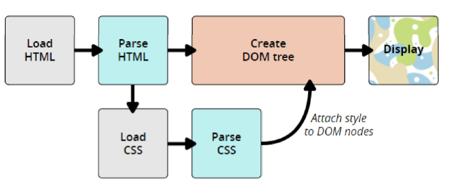
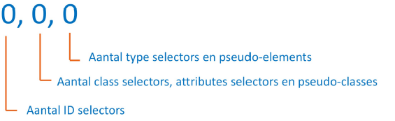

# Web Develeopment 1 : Hoofdstuk 5 - CSS Basis - Deel 2

## De 'Cascade'

Een van de fundamentele ontwerpprincipes van CSS is 'cascading'.

Soms zullen er meerdere CSS stijlen van toepassing zijn op eenzelfde element. In dat geval bepaald de 'Cascade' welke CSS stijl er zal toegepast worden.

- We weten inmiddels dat verschillende elementen standaard al een opmaak hebben. Deze opmaak is afkomstig van de 'browser stylesheet'. In technische documenten wordt er verwezen naar **de user agent stylsheet**
- Indien we zelf nu stijlen instellen voor zulke elementen dan zijn er twee verschillende stijlen ingesteld. een door de browser en in onze stijlsheet (**author stylesheet**). Hier zal dus belangrijk zijn welke stijl wordt toegekend. In de meeste gevallen zal dit die van de author stylesheet zijn.
- Ook zelf creëren we soms stijlen die van toepassing zijn op eenzelfde element

```css
/* elementen met een class extlink krijgen een rode kleur */
.extlink{
    color: red;
}
/* alle a-elementen krijgen een groene kleur */
a{
    color: green;
}
```

```html
<p>
    An external link to
    <a href="http://en.wikipedia.org" class="extlink">Wikipedia</a>
</p>
```

Welke kleur zal de link van dit voorbeeld krijgen?
> De link zal een rode kleur krijgen omdat de class selector specifieker is dan de type selector.

### Inheritance - inleiding

- Wanneer we een article-element en al zijn 'descendants' dezelfde tekstkleur willen geven, dan hoeven we niet voor elk van de 'descendants' de kleur in te stellen. Het volstaat om de kleur in te stellen voor het article-element. De 'descendants' van het article-element erven dan de kleur over.

- Niet alle CSS eigenschappen worden overgeërfd. Dit zijn hoofdzakelijk de tekst-gerelateerde CSS-eigenschappen

- `font-family` en `font-size` zullen we meestal instellen op de body (parent van alle elementen). Alle element in de body zullen deze eigenschappen overerven.

### CSS verwerking door browsers

<p align='center'></p>

- Nadat de browser een HTML document geladen heeft, wordt een boomstructuur (DOM tree) van alle elementen gemaakt.
- Als de boomstructuur opgebouws is, leest de browser alle stijlinformatie en berekent voor elk HTML-elementin de boomstructuur een waarde voor elke CSS-eigenschap.
- Die berekening gebeurd als volgt:
    1.  Werd er een waarde toegekend (in een stylesheet of inline) dan wordt die gebruikt <br>
        Werd er meerdere keren een waarde toegekend. Dan bepaald de **cascade** welke waarde wordt toegepast. <br>Hierbij hebben inline declaration met dezelfde importance steeds voorrang op declaration uit een stylesheet
    2. Indien geen waarde wordt toegekend, wordt nagegaan of er een waarde wordt overgeërfd.
    3. Zoniet, dan wordt **de initial value** voor deze eigenschap gebruikt.

### De 'Cascade' - origin, importance, specificity, source order

- CSS stijlen kunnen afkomstig zijn uit 3 verschillende stylesheets:
    - User agent stylesheets (User-Agent Origin)
       - Browsers hebben een default stylesheet
        - Deze bevat de standaardstijlen die de browser toepast op een pagina. Ze kunnen overschreven worden door een user of author stylesheet
    - User stylesheets (User Origin)
        - Een bezoeker kan ook eigen stylesheets toevoegen omwille van user **accessibility**.
        - Wordt weinig gebruikt
    - Author stylesheets (Author Origin)
        - Stijlen ingesteld door de web developers.
- Daarnaast hebben we ook nog de inline styles die (standaard) voorrang hebben op alle andere styles.

- De prioriteit van een declaration kan verhoogd worden door er **!important** achter te plaatsen.
    - Heeft steeds voorang op een gewone (ook inline) declaratie

    ```css
    h1{
        text-decoration: none !important;
    }
    ```

> **De cascade** is het mechanisme waarbij een browser alle declaraties die op een element betrekking hebben een bepaalde prioriteit toekend en zo de uiteindelijke waarde bepaald voor de eigenschap.

- Eerst wordt gekeken naar **de origin** en **de importance**. 
    - Normale declaraties in de *author stylesheet* hebben steeds voorrang op de normale declaraties in de *user agent stylesheet*
    - Hebben twee declaraties dezelfde origin en importance dan wordt er gekeken naar welke van de bijhorende selectors de meest specifieke is. Met andere woorden welke heeft de hoogste **specificity**
    - Als twee declaraties dezelfde origin, importance en specificity hebben dan wint het laatst gespecifieerde.

#### Cascade: origin - importance

Voorrangsregels voor origin - importance
- Important user agent declarations
- Important user declarations
- Important author declarations
- Normal author declarations
- Normal user declarations
- Normal user agen declarations

#### Cascade: specificity

- Hebben twee declaraties dezelfde origin en importance dan wint de declaratie met de selector met de hoogste **specificity**
- Dit wordt uitgedrukt met 3 getallen:

<p align='center'></p>

- De universal selector (*) wordt niet meegerekend en heeft specificity 0.

### Inheritance - overerving

- Werd er geen waarde opgegeven in de cascade, dan wordt er gekeken of de eigenschap overerfbaar is. Indien dit het gezval is, dan wordt de waarde overgeërfd van het parent element.

Welke properties worden overgeërfd?
 - tekst gerelateerde properties
 - list properties