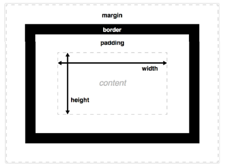

# Web Development 1 : Hoofdstuk 6 - CSS Lay-out - Box Model

## Weergave elementen

Wanneer we spreken over layout in CSS is het interessant een onderscheid te maken tussen block- en inline-elementen

### Block elementen

- Nemen in de breedte de maximale ruimte in die ze krijgen van hun parent element
- De standaard breedte en hoogte wordt bepaald door de inhoud
- Worden voorafgegaan en gevolgd door een overgang naar een nieuwe regel.
- Worden dus standaard onder elkaar geplaatst
- Voorbeelden: header, footer, nav, article, h1, p, div,...

### Inline elementen

- Zijn elementen die dezelfde regel kunnen delen met andere elementen en in de breedte enkel de ruimte innemen die ze nodig hebben om hun inhoud weer te geven.
- Ze worden niet voorag gegaan en gevolgd door de overgang naar een nieuwe regel.
- Worden dus standaard naast elkaar geplaatst
- Voorbeelden: a, img, em, strong, span, input, label,...

### CSS property: display

- De basismethod om de layout van een pagina te wijzigen is het wijzigen van de **display** property. Elk element heeft een default waarde voor de display property, maar deze kan overschreven worden.
- Enkele mogelijke waarden voor **display** zijn:
    - *inline*: element krijgt de eigenschappen van een inline element
    - *block*: element krijg de eigenschappen van een block element
    - *inline-block*: behoudt de eigenschappen van een block element, maar wordt in de pagina (in de flow) weergegeven als een inline element.
    - *none*: element wordt niet weergegeven (neemt ook geen ruimte in)

<p align='center'></p>

Standaard heeft een `<li>`-element:
```css
display: list-item;
```
Dit zorgt voor een block weergave met een bijkomende marker box. Vroeger overschreef men de waarde `list-item` met `inline` of `inline-block` om de unordered list weer te geven als een horizontale navigatiebalk. Tegenwoordig wordt dit gedaan met Flexbox.

**Opmerkingen**
- Het is niet de gewoonte om inline elementen om te zetten naar block elementen.
- inline-block elementen worden niet altijd rechtstreeks tegen elkaar weergegeven. Gewoonlijk bestaat er een kleine ruimte (een spatie) tussne twee inline-block elementen. Dit is het geval als er zich één of meerdere spatie(s) of andere witruimte tussen de twee inlin-block elementen bevindt in de HTML code.

> Bijgevolg is het meestal meer aangewezen om de nieuwerre layout-methoden **Flexbox** en **CSS grid** te gebruiken waar vroeger inline-block elementen werden gebruikt.

### CSS property: visibilty

Naast met `dispay: none;` kunnen we ook met de eigenschap `visibilty` een element verbergen.

De mogelijke waarden voor deze eigenschap zijn:
- `visible` (default)
- `hidden` - verbergt het element, maar behoudt de ruimte die het element inneemt.

## CSS boxmodel

- Voor elke element zal de browser geen, één of meerdere boxes genereren. Afhankelijk van de waarde van de `display` property.
- De opbouw van een box wordt beschreven in het CSS boxmodel.
- Elk element van een webpagina wordt gepresenteerd door een box met de volgende onderdelen:
    - **Content** - bevat bv. tekst, afbeeldingen
    - **Padding** - ruimte rond de content, zorgt ervoor dat de rand (border) niet direct aan de content vasthangt
    - **Border** - een rand rond de padding
    - **Margin** - ruimte rond de border. Deze wordt niet beïnvloed door een achtergrondkleur van het element en is volledig transparant.

<p align='center'></p>

- Totale ruimte die een blok inneemt in de layout:
$$\text{total width} = \text{margin-right + border-right + padding-right + content width}\text{ + padding-left + border-left + margin-left}$$
$$\text{total height} = \text{margin-top + border-top + padding-top + content height}\text{ + padding-bottom + border-bottom + margin-bottom}$$

### width en height

De default breedte van een element wordt bepaald door de `display` property:
- *block* - de box neemt de volledige horizontale ruimte in voorzien door de parent
- *inline* en *inline-block* - neemt de breedte in van de inhoud

De default hoogte van een element wordt zowel voor block als inline elementen bepaald door de inhoud.

Via de properties `width` en `height` kan je expliciet de breedte en hoogte instellen van een element. Standaard stellen deze properties de width en height in van de content area.

⚠️ je kan geen width/height instellen voor inline elementen. Deze nemen steeds de hoogte en breedte van de inhoud.

De hoogte en breedte kan uitgedrukt worden in:
- CSS pixels: *px*
- percentage - relatieve waarde tov de parent container: *%*
- *em* - relatieve waarde tov de grootte van het gebruikte lettertype
- *rem* - relatieve waarde tov de grootte van het gebruikte lettertype van het root element

>[!tip]
> Stel bij voorkeur de hoogte niet in.
> - Wanneer de inhoud verandert, moet ook de hoogte aangepast kunnen worden
> - De gebruiker kan de tekstgrootte aanpassen waardoor er problemen ontstaan.
> - Bij afbeeldingen kan dit wel

### margin en padding

> **margin** - is de ruimte aan de buitenkant van een element. We gebruiken dit voor creatie van witruimte tussen de elementen.

Een marge is steeds transparant. We zien de achtergrondkleur van het parent element.

> **padding** - is de witruimte tussen de inhoud en de rant.

We zien de achtergrondkleur van het element waarop de padding wordt toegepast. Indien er geen achtergrondkleur wordt toegepast zien we de achtergrondkleur van het parent element.

- CSS heeft doorgaans hetzelfde effect voor inline en block elementen.
- Voor padding en margin geldt dit niet:
    - Je kan ruimte links en rechts toevoegen aan een inline element via margin-left/margin-right/padding-left/padding-right
    - Maar margin-top/bottom werkt niet bij een inline element.

```css
p{
    padding-top: 10px;
    padding-right : 25px;
    padding-bottom: 10px;
    padding-left: 5px;
}

p{
    padding: 10px 25px 10px 5px; /* top right bottom left */
}

p{
    padding: 10px 25px; /* top&bottom right&left */
}
```


**Horizontaal centreren**

>[!important]
> Men kan een block element horizontaal centreren door de linker- en rechtermarge in te stellen op `auto`.
> Het is wel zeker belangrijk om een width in te stellen

```css
div{
    width: 80%;
    margin 0 auto;
}
```

> Verticaal centreren kan enkel door Grid of Flexbox te gebruiken.

Indien we gebruik maken van percentages, wordt onze padding en margin berekend op basis van de breedte van het omvattend (parent) element.

### border

We kunnen 3 waarden instellen van een border:
- de breedte - *border-width* (px, %, em; rem, thin, medium, thick)
- de kleur - *border-color* (kleurwaarde of *transparent*)
- de stijl - *border-style* (none, hidden, dotted, dashed, solid, double)

All deze eigenschappen kunnen we combineren in een shorthand:

```css
border: 1px solid #000;
```

Bij een transparante rand zie je de achtergrondkleur van het element.

Elk van deze eigenschappen kan ook afzonderlijk ingestel worden per zijde van het element:

```css
p{
    border-top: thick dashed black;
    border-bottom-witdh: 10px;
    border-bottom-color: red;
    border-bottom-style: dashed;
}
```

### collapsing margins

Wanneer de bottom margin van een element de top margin van een ander element raakt, is het resultaat niet de som, maar de grootste margin.

Elke wanneer er geen padding, borders zijn tussen parent en child zullen de marges samenengevoegd worden en de grootste toegepast worden.