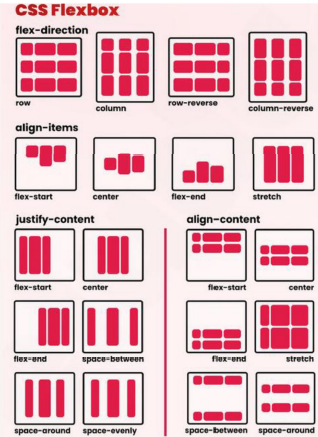
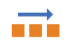

# Web Development 1 : Hoofdstuk 7 - CSS Lay-out - Flex

## Basisconcepten - CSS Layout

De normale flow (position: static) van een pagina stapelt alle block elementen op elkaar. Elk block element begint op een nieuwe lijn. Zelfs als de breedte van een element wordt aangepast (verminderd) zal een onderliggend element niet deze ruimte innemen, tenzij men ingrijpt in de normale flow.

Om de normale flow te doorbreken zijn er de volgende mogelijkheden:
- flexbox lay-out: flex
- grid lay-out
- float lay-out: float
- relatieve positionering
- absolute positionering
- fixed positionering

## CSS Flex Lay-out

> Flexbox staat voor Flexible Box. Met deze lay-outmodule voor CSS kan je adaptieve ontwerpen (responsive design) maken. 

Naargelang van de grootte van het scherm en de richting (horizontaal, verticaal), worden website-elementen automatisch:
- gerangschikt
- een hoogte en breedte toegekend

### Flexible Box Layout vs Grid Layout

In tegenstelling tot 'Flexible Box Layout', dat een twee dimensioneel lay-outsysteem is, is 'Grid Layout' een tweedimensioneel lay-outsysteem.

Grid en flex kunnen samen gebruikt worden om complexe lay-outs te maken.

### Flexbox

Flexbox is een één dimensionele manier in CSS om delen van je webpagina eenvoudig te lay-outen in rijen en/of kolommen.

> Handig om moeilijkheden zoals verticaal centreren op te lossen

**Basisidee**: elementen positioneren langs assen
- Er is een *main axis* en een *cross axis*
- We spreken niet meer over links en rechts of horizontaal verticaal.
- De main axix loopt default horizontaal van links naar rechts en de cross axix verticaal van boven naar onder.

<p align='center'></p>

#### Flex container

- Er is steeds een omvattende container
- De *rechtstreekse children* van deze container zullen steeds op een *flexibele* wijze getoond worden: **flex items**
- CSS property om van de omvattende container een flexbox te maken is:
    - `display: block flex;` (vroeger ookwel `display: flex;`)
    - `display: inline flex;` (vroeger ookwel `display: inline-flex;`)
- De eerste waarde bepaalt het outer display type. De omvattende container is dus een block of een inline element
- De tweede waarde zorgt ervoor dat de rechtstreekse children flex-items worden. Deze volgen niet meer de standaard lay-out

- Flex containers hebben een main axis en een cross axis
    - Standaard gaat de main axis van links naar rechts en de cross axis van boven naar onder
    - Kan aangepast worden met de *flex-direction* property
- De container wordt opgevuld langs de main axis

<table>
<tr>
<th>CSS</th>
<th>Direction</th>
</tr>
<tr>
<td>

```css
flex-direction:row; /* default value */
```
</td>
<td>

<p align='center'></p>
</td>
</tr>
<tr>
<td>

```css
flex-direction:column; 
```
</td>
<td>

<p align='center'></p>

</td>
</tr>
<tr>
<td>

```css
flex-direction:row-reverse; 
```
</td>
<td>

<p align='center'></p>

</td>
</tr>
<tr>
<td>

```css
flex-direction:column-reverse; 
```
</td>
<td>

<p align='center'></p>

</td>
</tr>
</table>

#### flex gap

- Witruimte tussen kolommen en rijen, worden 'gutters' genoemd, creeër je met `column-gap` en `row-gap` of met de shorthand `gap`
- Als `gap` twee waarden heef is de eerste `row-gap` en de tweede `column-gap`
- Mogelijke waarden:
    - length (px, em, rem)
    - percentages

#### `flex-wrap`

Indien de container de flex-items niet meer langs de main-axis kan plaatsen (te weinig ruimte) vallen de flex-items standaard buiten de flex container.

Kan gewijzigd worden met `flex-wrap`.
```css
flex-wrap: nowwrap; /* default  */
flex-wrap: wrap; 
flex-wrap: wrap-reverse;
```

#### items uitlijnen

- langs de main-axis: `justify-content`

```css
justify-content: flex-start; /* default  */
justify-content: flex-end;
justify-content: center;
justify-content: space-around; /* Rond elk item evenveel witruimte  */
justify-content: space-between; /* Tussen elk item evenveel witruimte  */
justify-content: space-evenly; /* Voor, na, tussen elk item evenveel witruimte */
```

- langs de cross-axis: `align-items`

```css
align-items: stretch; /* default  */
align-items: flex-start;
align-items: flex-end;
align-items: center; 
align-items: baseline; /* Aligneert volgens de onderkant vd tekst  */
justify-content: space-evenly; /* Voor, na, tussen elk item evenveel witruimte */
```

- Distributie van ruimter langs de cross-axis met **align-content**. Deze eigenschap heeft geen effect op single-line containers.

```css
align-content: flex-start;
align-content: flex-end;
align-content: center;
align-content: stretch;
```

- wijzigen volgorde items: `order`
    - standaardwaarde is 0
    - items worden geordend van klein naar groot

- hoeveel mag een item groeien/verkleinen: `flex-grow` en `flex-shrink`
    - 0: niet groeien
    - positief: groei in verhouding met andere items

- initiële grootte bepalen alvorens `flex-grow` en `flex-shrink` worden toegepast: `flex-basis`
    - Wanneer waarde op auto staat:
        - Width wordt gebruikt bij horizontale tekst mode
        - Height bij verticale tekst mode
    - `flex-basis` heeft voorrang op ingestelde width voor het item

- flex-shorthand: `flex`
    ```css
    flex-grow: 2;
    flex-shrink: 1;
    flex-basis 50em;

    flex: 2 1 50em; /* shorthand  */
    ```

- absolute flex items
    - `flex-basis` krijgt een expliciete waarde van 0
    - voorbeeld:

        ```css
        flex: 1 1 0;
        ```
        - flex items kunnen groeien (waarde 1) & krimpen (waarde 1)
        - startpunt: elk item neemt geen ruimte in (flex-basis: 0), dus alle ruimte in de flex-container is vrije ruimte die kan worden verdeeld
        - als resultaat zijn je flex-items even breed

- relative flex items
    - `flex-basis` wordt ingesteld op **content**
    - voorbeeld:

        ```css
        flex: 1 1 content;
        ```
        - flex items kunnen groeien (waarde 1) & krimpen (waarde 1)
        - startpunt: ingenomen ruimte wordt eerst bepaald door de **max-content** van de flex-items

    - `flex-basis` wordt ingesteld op **auto** (initial value)
    - voorbeeld:

        ```css
        flex: 1 1 auto;
        ```
        - flex items kunnen groeien (waarde 1) & krimpen (waarde 1)
        - startpunt: ingenomen ruimte wordt eerst automatisch bepaald door de **oorspronkelijke grootte** van de flex items
            - waarde van **width** indien width werd ingesteld op flex-items
            - **max-content** indien niet expliciet een width werd ingesteld

#### flexbox en margin

- margin instellen op auto zal de vrije ruimte verplaatsten
- rechtermarge instellen zorgt dat daar de vrije ruimte geplaatst wordt.
```css
li:nth-child(1){
    margin-inline-end: auto;
}
```
- beide margins instellen zorgt dat de vrije ruimte langs beide kanten verspreid wordt
```css
li:nth-child(1){
    margin-inline-end: auto;
    margin-inline-start: auto;
}
```