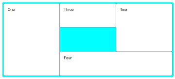

# Web Development 1 : Hoofdstuk 8 - Lay-out - Grid, float, position

## CSS Grid

### Basisconcepten CSS Grid

> De CSS Grid Layout is een twee dimensionaal laypout model voor CSS. Het heeft veel mogelijkheden voor de **positionering** van boxes en hun inhoud, alsook voor het controleren van de afmetingen (sizing) van de boxes.

- Een grid betaat uit (denkbeeldige) horizontale en verticale lijnen die een grid container opdelen in rijen, kolommen en cellen. Te vergelijken met een tabel.

### Inleidend voorbeeld CSS Grid

Beschouw een element met daarin een aantal child elements.

<table>
<tr>
<th>Met Grid</th>
<th>Zonder Grid</th>
</tr>
<tr>
<td>

```html
<div class="grid-container">
    <div>item 1</div>
    <div>item 2</div>
    <div>item 3</div>
    <div>item 4</div>
    <div>item 5</div>
</div>
```
</td>
<td>

```html
<body>
    <header>Header</header>
    <nav>Navigation</nav>
    <main>Main area</main>
    <footer>Footer</footer>
</body>
```
</td>
</tr>
</table>

**Hoe gebruiken we hiervoor CSS Grid Layout?**

- Creëer een grind container met `display: block grid;` of (vroeger) `display: grid;`
    - het eerste deel `block` duidt aan dat de container een block element is
    - het tweede deel `grid` heeft als gevolg dat alle **directe** kind-elementen van deze `grid container`-element, grid items worden
    - we definiëren dus niet enkel de *grid container* maar ook impliciet de *grid items*

- Definieer *de grid* (het aantal rijen en/of kolommen en hun hoogte/breedte)
    - `grid-template-columns`
    - `grid-template-rows`

```css
.grid-container{
    display: block grid;
    grid-template-columns: 150px 150px 150px;
    grid-template-rows: 100px 100px 100px 100px;
}
```

> Note: grid items worden automatisch rij per rij in de grid geplaatst.

*Grid items positioneren op de grif met line numbers*:

```css
.grid-container{
    display: block grid;
    grid-template-columns: 150px 150px 150px;
    grid-template-rows: 100px 100px 100px 100px;
}
div:nth-of-type(2){
    grid-row: 3/5;
    grid-column: 2;
}
```

### CSS Grid Layout

Grid layout zorgt voor een goede scheiding tussen inhoud (html) en opmaak (css). We kunnen een html-element een andere positie op de grid geven zonder dat we daarvoor de markup (html) moeten wijzigen.

### Algemene procedure Grid Layout

1. Creëer een *grid container*. Hiermee definieer je impliciet ook de *grid items*
2. Definieer *de grid*
3. Plaats de *grid items* op de grid

#### Creëer de *grid container*

Dit kan door het creëren van een block-level-element:

```css
display: block grid;
```

> vroeger door: `display: grid;`

Dit kan ook door het creëren van een inline-level-element:

```css
display: inline grid;
```

> vroeger door: `display: inline-grid;`

Het maken van een *grid container* heeft als gevolg dat alle directe children *grid items* worden. Een `grid container` zelf is dus een block of een inline element.

#### Definieer de *grid*

Er zijn 3 properties die de expliciete grid van een grid container:

```css
grid-template-rows
grid-template-columns
grid-template-areas
```

De uiteindelijke grid kan uiteindelijk groter zijn door de grid-items die buiten de 'expliciete grid' geplaatst zijn.

In dat geval zullen er impliciet tracks gecreëerd worden.

De afmetingen van de tracks worden bepaald door `grid-auto-rows` en `grid-auto-columns`

##### `grid-template-rows` en `grid-template-columns`

De waarde van `grid-template-rows` (en `grid-template-columns`) kan een **\<track-list>** of een \<auto-track-list>

Mogelijke track-sizes bij een \<track-list> zijn:

- \<length>
- \<percentage>
- \<flex>
- min-content
- max-content
- minmax(min, max)
- fit-content(value)
- auto

voorbeelden \<track-list>:

```css
grid-template-columns: 20ch 200px 200px;
grid-template-columns: 20% 40% 60%;
grid-template-columns: 100px 1fr 2fr;
grid-template-columns: minmax(100px, 200px);
grid-template-columns: fit-content(40%);
grid-template-columns: auto 100px 1fr;
```

*de fr-eenheid (\<flex> CSS data type)*

- Met de fr-eenheid kan je 'flexible grid tracks' (rijen of kolommen) maken.
- De fr-eenheid stelt een fractie in van de 'leftover space'. De leftover space komt overeen met de ruimte die niet ingenomen wordt door de 'non-flexible grid tracks'

*`repeat()`-functie*

Met de `repeat()`-functie kan je een deel van de 'track-list' herhalen

<table>
<tr>
<th>

Old
</th>
<th>

with `repeat()`-functie
</th>
</tr>
<tr>
<td>

```css
grid-template-rows: 1fr 1fr 1fr;
```
</td>
<td>

```css
grid-template-columns: repeat(3, 1fr);
```
</td>
</tr>
<tr>
<td>

```css
grid-template-columns: 20px 1fr 2fr 1fr 2fr 1fr 2fr 1fr 2fr;
```
</td>
<td>

```css
grid-template-columns: 20px repeat(4, 1fr 2fr);
```
</td>
</tr>
</table>

##### `grid-auto-rows` en `grid-auto-columns`

- in de vorige voorbeelden hebben we de kolommen (column tracks) expliciet gedefinieerd met `grid-template-columns`-property en hebben we de rijen impliciet gecreëerd.
- het instellen van de hoogte van deze impliciet gecreëerde rijen doe je via `grid-auto-rows` (analoog voor de kolommen)
- de initial value voor deze properties is **auto**. Impliciet gecreëerde rijen (en kolommen) zijn dus 'auto-sized'.
- ook hier kunnen we dezelfde 'track-sizes' gebruiken (bv. `minmax()`)

*`repeat()` met `auto-fill` en `auto-fit`*

- De waarde voor grid-template-columns (en grid-template-rows) kan
niet alleen een \<track-list> zijn (zie vroeger), maar ook een \<auto-track-
list>.
- Bij een \<auto-track-list> gaan we bij de `repeat()`-functie, als eerste
argument i.p.v. een getal op te geven, de waarde auto-fill of auto-
fit gebruiken.

voorbeeld:
```css
grid-template-columns: repeat(auto-fill, minmax(150px, 1fr));
```

Bij dit voorbeeld geven we zelf geen vast aantal kolommen op bij de `repeat()`-functie maar laten we de browser het aantal kolommen bepalen `auto-fill`

De overige leegruimte wordt automatisch verdeeld tussen het aantal tracks.

> `auto-fill` en `auto-fit` werken op dezelfde manier, behalve als er lege tracks zijn.

#### positioneren van grid items op de grid

> Grid items kunnen ook over meerdere rijen en kolommen overspannen.

- Als je *grid lines* definieert dan krijgen de lijnen waaruit de grid bestaat automatische nummers. Je kan dan deze lijnnummers gebruiken om een *grid item* expliciet te positioneren op de grid.

>[!tip]
> Gebruik inspector, layout, om de line numbers, line names van de grid te tonen.

- De getallen verwijzen naar de lijnen en niet naar de kolommen
- Er zijn ook negatieve lijnnummers mogelijk.

voorbeeld:

<table>
<tr>
<td>

```css
.box1 {grid-column-start: 1; grid-column-end: 2; grid-row-start: 1; grid-row-end: 4;}
.box2 {grid-column-start: 3; grid-column-end: 4; grid-row-start: 1; grid-row-end: 3;}
.box3 {grid-column-start: 2; grid-column-end: 3; grid-row-start: 1; grid-row-end: 2;}
.box4 {grid-column-start: 2; grid-column-end: 4; grid-row-start: 3; grid-row-end: 4;}
```
</td>
<td>

```html
<div class="grid-container">
    <div class="box1">One</div>
    <div class="box2">Two</div>
    <div class="box3">Three</div>
    <div class="box4">Four</div>
</div>
```
</td>
</tr>
<tr>
<td colspan="2">

<p align='center'></p>

</td>
</tr>
</table>

In het vorige voorbeeld werd elke `grid-row-end` en `grid-column-end` expliciet vermeld. Als het item echter maar één track (rij of kolom) overspant, mag je de `grid-row-end` of de `grid-column-end` waarden weglaten. Het vorige voorbeeld kan dus ook als volgt geschreven worden:

<table>
<tr>
<td>

```css
.box1 {grid-column-start: 1; grid-row-start: 1; grid-row-end: 4;}
.box2 {grid-column-start: 3; grid-row-start: 1; grid-row-end: 3;}
.box3 {grid-column-start: 2; grid-row-start: 1;}
.box4 {grid-column-start: 2; grid-column-end: 4;}
```
</td>
<td>

```html
<div class="grid-container">
    <div class="box1">One</div>
    <div class="box2">Two</div>
    <div class="box3">Three</div>
    <div class="box4">Four</div>
</div>
```
</td>
</tr>
</table>

- in plaats van het 'end' lijnnummer op te geven, kan je ook het aantal tracks opgeven dat je wilt overspannen.

Voorbeeld:

<table align="center">
<tr>
<td>

```css
grid-row-start: 1;
grid-row-end: 4;
```
</td>
<td>

```css
grid-row-start: 1;
grid-row-end: span 3;
```
</td>
</tr>
</table>

- Grid items kunnen ook overlappen. We kunnen doormiddel van de `z-index` aangeven welk *grid item* er op de voorgrond weergegeven wordt.

**Er bestaan ook shorthands voor het plaatsen van *grid items*:**

- `grid-column`
- `grid-row`
- `grid-area`

<table>
<tr>
<td>

```css
/* Zonder shorthands */
.box1 {grid-column-start: 1; grid-column-end: 2; grid-row-start: 1; grid-row-end: 4;}
.box2 {grid-column-start: 3; grid-column-end: 4; grid-row-start: 1; grid-row-end: 3;}
.box3 {grid-column-start: 2; grid-column-end: 3; grid-row-start: 1; grid-row-end: 2;}
.box4 {grid-column-start: 2; grid-column-end: 4; grid-row-start: 3; grid-row-end: 4;}
```
</td>
<td>

```css
/* Met shorthands */
/* start / end */
.box1 {grid-column: 1; grid-row: 1/4;}
.box2 {grid-column: 3; grid-row: 1/3;}
.box3 {grid-column: 2; grid-row: 1;}
.box4 {grid-column: 2/4; grid-row: 3;}
```
</td>
</tr>
<tr>
<td colspan="2">

<p align='center'></p>

</td>
</tr>
</table>

*Het kan echter nog korter geschreven word doormiddel van `grid-area`*

```css
/* Met grid-area */
/* grid-row-start / grid-column-start/ grid-row-end / grid-column-end */
.box1 {grid-area: 1 / 1 / 4 / 2;}
.box2 {grid-area: 1 / 3 / 3 / 4;}
.box3 {grid-area: 1 / 2 / 2 / 3;}
.box4 {grid-area: 3 / 2 / 4 / 4;}
```

- Het is ook mogelijk achterwaards te tellen bij de lijnnummers. Zo zijn volgende gelijk in het voorbeeld:

```css
/* Zonder achterwaards tellen: */
.box2 {grid-column: 1; grid-row: 1/4;}
/* Met achterwaards tellen */
.box2 {grid-column: 1; grid-row: 1/-1;}
```

- Witruimte tussen kolommen en rijen, genoemd 'Gutters' maken we aan door `column-gap` en `row-gap` of de shorthand `gap` te gebruiken.

> Sommige browsers gebruiken nog de oude notaties met de prefix `grid-`:
> - `grid-column-gap`
> - `grid-row-gap`
> - `grid-gap`

#### `grid-template-area` property

Een andere manier om *grid items* op de grid te plaatsen is met de `grid-template-areas` property. Hiermee creëer je namen voor grid areas die je dan kan gebruiken in bv. de `grid-area` property om grid items te plaatsen in een grid area.

Vorig voorbeeld herwerken we met grid-area's. Merk op:
- er wordt een rij gemaakt per string
- je kan meerdere rijen of kolommen overspannen door de naam te herhalen
- je kan voor cellen zonder een naam een "." gebruiken
- de waarde van `grid-template-areas` de structuur van de grid visualiseert.

```css
.grid-container{
    diplay: block grid;
    grid-template-columns: repeat(3, 1fr);
    grid-template-rows: repeat(3, 100px);
    grid-template-areas:
    "one three  two"
    "one .      two"
    "one four   four";
}
.box1{grid-area: one;}
.box1{grid-area: two;}
.box1{grid-area: three;}
.box1{grid-area: four;}
```

#### named grid lines

We kunnen niet enkel namen geven aan grid areas. Maar ook aan grid lines. Het voorbeeld zie er dan als volgt uit:

```css
.container{
  display: block grid;
  grid-template-columns: [start] 1fr [start-midden] 1fr [midden-einde] 1fr [einde];
  grid-template-rows: [start] 100px [start-midden] 100px [midden-einde] 100px [einde];
}
.box1 {
  grid-column-start: start;
  grid-row-start: start;
  grid-row-end: einde;
}

.box2 {
  grid-column-start: midden-einde;
  grid-row-start: start;
  grid-row-end: midden-einde;
}

.box3 {
  grid-column-start: start-midden;
  grid-row-start: start;
}

.box4 {
  grid-column-start: start-midden;
  grid-column-end: einde;
  grid-row-start: midden-einde;
}

```

#### box alignment in css grid

- Om items uit te lijnen langs de *block axis* gebruik je de properties `align-items` en `align-self`

- Om items uit te lijnen langs de *inline axis* gebruik je de properties `justify-items` en `justify-self`

**Voorbeeld**:

<table>
<tr>
<th>HTML</th>
<th>CSS</th>
</tr>
<tr>
<td>

```html
<div class="wrapper">
    <div class="item1">Item 1</div>
    <div class="item2">Item 2</div>
    <div class="item3">Item 3</div>
    <div class="item4">Item 4</div>
</div>
```
</td>
<td>

```css
.wrapper{
    display: block grid;
    grid-template-columns: repeat(8, 1fr);
    grid-gap: 10px;
    grid-auto-rows: 100px;
    grid-template-areas:
    "a a a a b b b b"
    "a a a a b b b b"
    "c c c c d d d d"
    "c c c c d d d d";
}
.item1{grid-area: a;}
.item2{grid-area: b;}
.item3{grid-area: c;}
.item4{grid-area: d;}
```
</td>
</tr>
<tr>
<td colspan="2">

<p align='center'></p>

</td>
</tr>
</table>

##### block axis

- de `align-self` property stelt de uitlijning van een grid item binnen de grid area/cell langs de **block axis**
- de default voor `align-self` komt overeen met *stretch*. Bij elke andere waarde worden de afmetingen van het item automatisch berekend zodat de inhoud er net in past.
- de `align-items` property stelt de `align-self` property in voor alle grid-items. De `align-items` propery stel je in op de grid-container.

**Voorbeeld met `align-items`:**

```css
.wrapper{
    align-items: start;
}
```
<p align='center'></p>

**Voorbeeld met `align-self`:**

```css
.item2 {align-self: start;}
.item3 {align-self: end;}
.item4 {align-self: center;}
```
<p align='center'></p>

##### inline axis

- de `justify-self` property stelt de uitlijning in van een grid item binnen zijn grid area/cell langs de *inline axis*
- de default voor `justify-self` komt overeen met stretch. Bij elke andere waarde worden de afmetingen van het item automatisch berekend zodat de inhoud er net in past.
- de `justify-items` property stelt de `justify-self` property in voor alle grid items
- de `justify-items` property stel je in op de grid container

**Voorbeeld met justify-self:**

```css
.item2{justify-self: start;}
.item3{justify-self: end;}
.item4{justify-self: center;}
```

<p align='center'></p>

**Voorbeeld centreren op container niveau**

> Dit doen we door op de container de `align-items` en `justify-items` in te stellen. Dit zal alle grid items centreren.

```css
.wrapper{
    align-items: center;
    justify-items: center;
}
```
<p align='center'></p>

- de `align-content` en `justify-content` properties worden gebruikt als de grid tracks (rijen of kolommen) niet de volledige grid container innemen. Je kan in dit geval de tracks zelf uitlijnen binnen de container.

## Float

### Floating elements

Elementen worden uit de normale flow gehaald. Men kan dan meegeven in welke richting (right, left) ze zullen vlotten binnen hun bevattende container (parent block). Elementen worden tegen de opgegeven rand geplaatst.

De overige elementen binnen deze container (parent block) zullen dan vrijgekomen plaats proberen op te vulle en zullen zich rond het element plaatsen.

Het is duidelijk dat voor het vlottende element een breedte zal moeten worden ingesteld.

> Een block element neemt altijd de maximale breedte in van de bevattende container.

### Floating stacking order

Floating elements worden vaak gebruikt om block elementen naast elkaar te plaatsen, dit kan echter voor problemen zorgen.

Floating elements vlotten eerst tegen de bovenrand van de parent en dat tegen de volgende beschikbare rand.

- Een oplossing hiervoor kan zijn om het element dat vastzit, de float ervan te clearen:

    ```css
    clear; left;
    ```
- Om terug te keren naar de normale flow van een pagina, moeten we de **floatende elementen clearen**. Clear kan left, right, both, none, als waarden aannemen.

- Probleem: de background en border van parent loopt niet to onder de floating elements
    - oplossing 1: voeg een extra leeg element toe

    ```html
    <p>Lorem ipsum dolor sit amet consectetur adipisicing elit. Quaerat assumenda repellendus, ut, ducimus, molestiae ullam sed minima eligendi nisi quam praesentium deserunt autem nostrum neque laboriosam quidem qui iste dolore.</p>
    <div></div>
    ```
    ```css
    p:nth-of-type(4){
        clear: left;
    }
    div > div{
        clear: both;
    }
    ```

    - oplossing 2: display flow-root toepassen op parent-element

    ```css
    div.clearfix{
        display: flow-root;
    }
    ```

## Position

Om de normale flow te doorbreken bekijken we nu:
- relatieve positionering: `position: relative`
    - verplaatst het element relatiev tov zijn positie in de normale flow. Dit heeft geen invloed op de positie van de andere elementen.
    - offset wordt bepaald door:
        - verticale verplaatsing: **top - bottom**
        - horizontale verplaatsing: **left - right**
- absolute positionering: `position: absolute`
    - verplaatst het element relatief tov zijn eerste niet static parent element, of het boidy element indien alle parent elementen static zijn. Voor de overige element is het alsof deze nooit aanwezig is geweest in de normale flow. Ze nemen dus posities in zonder rekening te houden met het absolute gepositioneerde lement. Bij het scrollen beweegt het element mee.
    - offset (px - % - em) wordt bepaald door:
        - verticale verplaatsing: **top - bottom**
        - horizontale verplaatsing: **left - right**
- fixed positionering: `position: fixed`
    - Vaste positionering verplaatst het element relatief tov het browser
    venster. Voor de overige elementen is het alsof dit element nooit
    aanwezig is geweest in de normale flow. Ze nemen dus posities in zonder
    rekening te houden met het vast gepositioneerde element. Bij het scrollen
    beweegt het element NIET mee. Wordt gedaan bij menubalken die niet
    mogen meescrollen.
    - offset (px - % - em) wordt bepaald door:
        - verticale verplaatsing: **top - bottom**
        - horizontale verplaatsing: **left - right**

De normale flow: `position: static`

### positionering: z-index

- Indien de positionering van elementen gewijzigd worden, kan het zijn dat
elementen gaan overlappen. De volgorde van de elementen in de html
pagina bepaalt welke bovenaan staat: het bovenste element zit steeds
onder een element daaronder (stapelen van dozen, te beginnen met het
eerste element)
- Deze volgorde kan gewijzigd worden door de `z-index`. de mogelijke waarde
is een geheel getal. Hoe hoger de waarde, hoe hoger op de stapel.