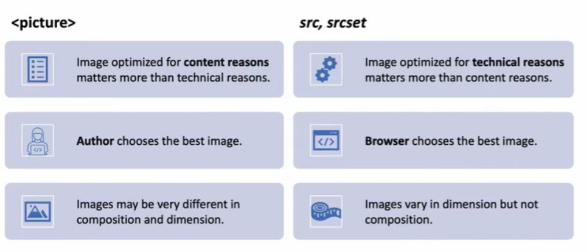

# Web Development 1 : Hoofdstuk 9 - Layout - Responsive

## Inleiding

***Waarom responsive design?***

- beter user experience
- meer bezoekers
- hogere SE ranking
- betere laadtijden
- beheersbare ontwikkeling & onderhoud
    - geen aparte ontwikkeling voor verschillende devices

***Hoe?***

- HTML en CSS gebruiken om pagina's geschikt te maken voor alle soorten schermen en devices.
    - Lay-out van pagina kan wijzigen
    - inhoud kan verborgen/getoond worden
    - elementen kunnen anders getoond worden
        - menu's, buttons, tekst,...

***Mobile first***

- Start de ontwikkeling met focus op mobile experience
    - minimaal, maar bevat alle belangrijke elementen
    - focus op inhoud
- geleidelijk opschalen voor grotere schermen
    - meer mogelijkheden voor extra inhoud
    - meer toeters en bellen

## De viewport

> A **viewport** representts the part of the document you are viewing

- op grotere schermen komt dit overeen met de grootte van het browser venster
- op mobile devices kom de viewport overeen met het volledig scherm
    - de grootte van het browser venster kan op een mobiel niet aangepast worden.

- mobiel: **visual & layout viewport**
    - *visual viewport*: bevat het gedeelte van de pagina dat momenteel op het scherm wordt getoond
    - *layout viewport*: is groter dan de visual viewport en bevat de layout van de volledige pagina. (css werkt met deze afmetingen)

    - De *visual viewport* toont een deel van wat beschikbaar is in de *layout viewport*
    - Door te zoomen (in/uit), te 'pannen', portrait/landscape mode te gebruiken breng je een ander deel van de *layout viewport* in de *visual viewport*

- De grootte van de viewport wordt bepaald door de fabrikant van de browser
- Bij volledig uitzoomen komt de volledige viewport in de visual viewport
- Probleem:
    - pagina wordt gebouwd tov de layout viewport breedte
        - uitgedrukt in DIP - Device independent pixels
    - Bij het openen van de pagina gaat de browser uitzoomen om je de volledige pagina te tonen in de **visual viewport**

- via de *viewport meta tag* wordt het mogelijk de viewport width gelijk te stellen aan de device width

>[!important]
> Het is belangrijk steeds de viewport width gelijk te stellen aan de device width bij 'Responsive Web Design'

- **width = device-width**
    - breedte waarop we werken is de breedte van het device in DIP 
- **initial-scale = 1.0**
    - 1 DIP = 1 CSS pixel

```html
<head>
    <meta name="viewport" content="width=device-width, initial-scale=1.0">
</head>
```

> [!tip]
> Maak gebruik van de responsive web developer tools in de browsers

## Media Queries

> A **media query** is a method of testing certain aspects of the user agent or device that the document is being displayed in.

- `@media`
- aspecten: **media type & media features**
    - logische expressie die *true* of *false* is
    - afhankelijk van het resultaat van de tekst kan bepaalde opmaak al dan niet toegepast worden.

**voorbeeld:**

```css
@media screen and (min-width: 800px){
    p {
        background-color: chocolate;
        color: lightyellow;
    }
}
```

Als het venster waarin de pagina bekeken wordt een breedte heeft die groter of gelijk aan 800px is, dan krijgen p-elementen een 'chocolate' achtergrondkleur en 'lightyellow' gekleurde tekst.

- De user agent gaat media queries automatisch her-evalueren indien relevante eigenschappen wijzigen. (bv. bij het wijzigen van het venster)

>[!important]
> De volgorde waarin de media queries geplaatst worden is belangrijk

**media type**

- *all*: komt overeen met eender welk device
- *print*: komt overeen met printers en devices in een modus om te printen (bv. een browser in print-preview modus)
- *screen*: komt overeen met alles dat niet overeen komt met print

**media features**

- *viewport/page afmetingen*
    - bv. width, height, aspect-ratio, orientation
- *kwaliteit*
    - bv. via resolution kan je queriesz maken die rekening houden met de resolutie van het device
- *kleur*
    - bv. via color kan je queries maken die rekening houden met de kleurdiepte van het device
- *interactie*
    - bv. via pointer kan je queries maken die rekening houden met de accuraatheid van het pointing device (touchscreen vs muis/touchpad)

Voorbeelden:

```css
@media (min-width: 500px){
    /* CSS toepassen wanneer viewport width >= 500px */
}
@media (max-width: 50em){
    /* CSS toepassen wanneer viewport width <= 50em */
}
@media (min-aspect-ratio: 1/1){
    /* CSS toepassen wanneer viewport width >= viewport height */
}
@media screen and (min-width: 500px) and (max-width:= 800px){
   /* CSS toepassen wanneer viewport size >= 500px EN viewport size <= 800px is */
}
@media screen and (min-width: 500px), screen and (max-width:800px) {
/* CSS toepassen wanneer viewport size >= 500px OF viewport size <= 800px */
}
@media not print {
/* CSS toepassen voor non-printing */
}
@media screen and (orientation:landscape) {
/* CSS toepassen wanneer viewport width >= viewport height*/
}
/* at time of writing this works only in FireFox! */
@media screen and (height>500px) {
/* CSS toepassen wanneer viewport height >= 500px*/
}
```

### breakpoints

> het punt waarop we layout kenmerken van een pagina gaan wijzigen noemen we een breakpoint

>[!tip]
> **Keuze van breakpoints:**
<table align="center">
<tr>
<td>320px-480px</td>
<td>Mobile devices</td>
</tr>
<tr>
<td>481px-768px</td>
<td>iPads, Tablets</td>
</tr>
<tr>
<td>769px-1024px</td>
<td>Small screens, laptops</td>
</tr>
<tr>
<td>1025px-1200px</td>
<td>Desktops, large screens</td>
</tr>
<tr>
<td>1201px and more</td>
<td>Extra large screens, TV</td>
</tr>
</table>

**Laat je vooral leiden door de inhoud van de pagina om 'jouw' breakpoints te vinden**

>[!tip]
> - zorg voor een **tap-area** van minstens 45 op 45 pixels voor buttons links, ... op schermen zonder accuraat pointing device (= gem afdruk vinger)
> - maak minimaal gebruik van absolute waarden in CSS maak gebruik van relatieve waarden (%, vw, em, rem)
> - gebruik `max-width: 100%` op img elementen zodat de afbeelding niet uit hun container kunnen vloeien
> - layout is geen exacte wetenschap, gebruik tips, baseer je op best practices, maar gebruik ook je gevoel om te beslissen of iets al dan niet OK oogt. 

## Reponsive images

> An image is considered **responsive** if it retains its quality on varying device sizes without having an unpleasant impact on performance.

- afbeelding dragen voor meer dan 60% bij in het dataverkeer
- afbeeldingen wegen zwaar op resources zoals geheugen processor en bandbreedte en beïnvloeden grotendeels de **laadtijd**.

> Wanneer de laadtijd van een pagina van 1 naar 3 seconden gaat verhoogt de kans met 32% dat de site verlaten wordt.

- afbeelden schalen = verlies aan **kwaliteit**

### formaten

- **bitmap** based
    - afbeelding is raster van pixels
    - elke pixel is een waarde die een kleur voorstelt
    - foto realisme
    - bij schalen verlies je aan kwaliteit
    - bestandsgrootte hangt af van resolutie, kleurdiepte, compressie-techniek
- **vector** based
    - coördinaten en geometrische vormen
    - niet foto realistisch
    - kleine bestandsgrootte
    - schalen zonder verlies aan kwaliteit

### Pixels

- device pixel - hardware pixel
- CSS pixel - logische pixel
- vroeger vielen device pixels en CSS pixels 1 op 1 samen
- met de komst van retina (high density) schermen is er een gap ontstaan tussen de twee

### afbeelding kiezen

> only one image should load, even if many are specified

- een afbeelding moet scherp zijn
    - schermen met hoge resolutie -> afbeeldingen met hoge resolutie
    - schermen met lage resolutie -> afbeeldingen met lage resolutie zodat geen bandbreedte verkwist wordt
- afbeeldingen moeten kunnen krimpen en uitzetten
- afbeeldingen moeten soms bijgesneden worden (art direction)
- afbeeldingen kunnen aangeboden worden in verschillende formaten
    - zorg ervoor dat alternatieven voorhanden zijn indien formaat niet ondersteund wordt door browser.

>[!tip]
> ***DO NOT...***
```html
<body>
    <div class="fake-responsive">
        
        
    </div>
</body>
```
```css
@media (max-width: 500px){
    .big{
        display: none;
    }
}
@media (min-width: 501px){
    .tiny{
        display: none;
    }
}
```
> Op deze manier worden steeds de 2 afbeeldingen geladen.

#### Resolutie

```html
<body>
    
</body>
```

```css
img{
    max-width: 100%;
}
```

- de afbeelding schaalt mee met het venster
- mogelijks maak je gebruik van een relatief groot bestand om kwaliteit te garanderen op een hoog resolutie scherm. 
    - wordt ditzelfde 'groot' bestand ook bij lage resolutie schermen geladen dan verkwist je bandbreedte
- mogelijks maak je gebruik van een relatief klein bestand om laadtijd in te korten
    - dan wordt je afbeelding niet mooi getoond op een hoog resolutie scherm

***Oplossing***: resolution switching

- wij bieden een *aantal versies van eenzelfde afbeelding* aan
- de *browser gaat zelf kiezen* welke versie geladen wordt
- wij helpen de browser door wat extra informatie te voorzien bij elke versie (pixel density, width/sizes)
- de browser kan naast onze informatie ook gebruik maken van andere informatie, we kunnen dus niet voorspellen welke versie gelanden zal worden
    - viewport afmetingen
    - kwaliteit van het netwerk
    - voorkeursinstellingen van de gebruiker

**Hoe?**

- gebruik maken van een `srcset`-attribuut bij het img-element
    - op deze manier bied je verschillende versies aan
- extra informatie voorzien bij elke versie
    - optie 1: pixel density beschrijven
    - optie 2: grootte beschrijven

**Voorbeeld 1:**

```html

```

- `srcset`-attribuut heeft als waarde een lijst van image URLs
- bij elke URL staat ook een x-descriptor die aangeeft voor welke pixel density het bestand bedoeld is
- de URL in het `src`-attribuut wordt gebruikt door browsers die srcset niet ondersteunen

> **nadeel** is dat geen rekening wordt gehouden met de grootte waarop de afbeelding zal gerendered worden. 

**Voorbeeld 2:**

```html

```

- `srcset`: bij elke URL staat nu een w-descriptor die de exacte breedte (in pixels) aangeeft van de afbeelding
- het `sizes`-attribuut verduidelijkt voor de browser hoeveel pixels er effectief nodig zijn door de breedte van de gerenderde image aan te geven.

> op deze manier kent de browser de eigenschappen van de afbeelding en de grootte van de uiteindelijk gerenderde afbeelding

- het `sizes`-attribuut bevat een breedte (CSS lengte)
    - klassieke eenheden: 55px, 10em
    - of relatief tov de breedte van de viewport (eenheid vw)
        - 33.3 vw is een derde van de breedte van de viewport
        - 100vw is de volledige breedte van de viewport
- de lengte word gekoppeld aan een media query, deze worden sequentieel overlopen tot de eerste passende gevonden wordt.

- Bij gebruik van `srcset` heb je zelf geen controle over de versie van de afbeelding die de browser zal laden.

> enkel te gebruiken voor verschillende versies van 1 en dezelfde afbeelding

- soms wil je zelf controle over de afbeelding die geladen wordt
    - kiezen uit verschillende afbeeldingen, uit anders uitgesneden afbeeldingen, uit afbeeldingen in verschillende formaten
- maak in deze gevallen gebruik van **het picture element**

#### het `picture`-element

Use cases:

- art direction: jij bepaalt welke afbeelding er onder welke condities moet gebruikt worden
    - je kan totaal verschillende afbeeldingen aanbieden
        - aangepast aan de viewport
    - je kan afbeeldingen aanbieden die op verschillende manieren uitgesneden zijn
        - focus op element van afbeelding behouden
    - typische toepassing: **hero image**
- alternatieve afbeeldingsformaten

```html
<picture>
    <source media="(min-width: 1200px)" srcset="images/runner-wide.jpg">
    <source media="(min-width: 700px)" srcset="images/runner-narrow.jpg">
    
</picture>
```

- **source** elementen
    - `srcset`-attribuut met URL naar afbeeldingen en
    - `media`-attribuut met query die bepaalt wanneer deze afbeelding gebruikt wordt
    - volgorde is belangrijk!
- het `img`-element wordt gebruikt om het geselecteerde element te tonen
    - de URL van het src attribuut wordt enkel gebruikt indien picture niet ondersteund is door de browser, of indien er geen enkele media query voldoet

>[!tip]
> gebruik 'nieuwe' afbeeldingsformaten zoals `.webp` en `.avif`
>   - betere compressie (kleiner bestanden)
>   - betere kleurdiepte, dynamiek,...
>   - animatie, transparantie,...
> maar voorzie via het `picture`-element een **fallback
>   - voor browsers die het formaat niet ondersteunen

```html
<picture>
    <source srcset="example.avif" type="image/avif">
    <source srcset="fallback.webp" type="image/webp">
    
</picture>
```

- via het `srcset`- `type`-attribuut kan je verschillende formaten voorzien
- via het `src`-attribuut kan je steeds een fallback voor de browser voorzien

```html
<picture>
    <source srcset="images/runner-wide-2x.jpg 2x, images/runner-wide.jpg"
    media="(min-width: 1200px)">
    <source srcset="images/runner-narrow-2x.jpg 2x, images/runner-narrow.jpg"
    media="(min-width: 700px)">
    
</picture>
```

- in het `srcset`-attribuut kan je ook weer gebruik maken van een lijst met URLs met **pixel density/width descriptors**
    - combinatie van art direction en resolution switching
    - redelijk complex

<p align='center'></p>