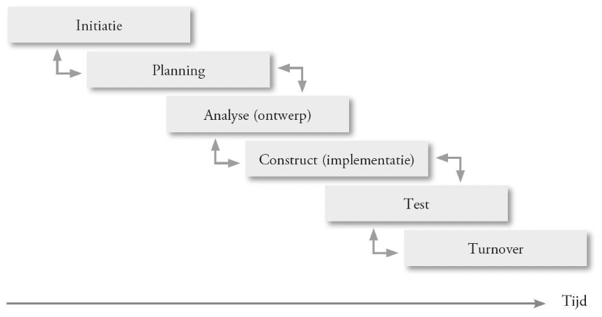

# It2business : Hoofdstuk 1 - Project Management - Deel 2

## Hoe gaan we van initiatie tot oplevering?

> #Faseren

### Scope

De scope bepaalt wat we gaan realiseren in het project, maar even goed wat we niet gaan realiseren.
- Zorgt voor een duidelijke aflijning van wat we willen realiseren
- Geeft de klant ook een zekerheid over wat die kan verwachten

> **Scope** beschrijft in detail de inhoud van het project. De scope bepaalt wat er door het project wordt opgeleverd. In die zin is de scope te beschouwen als de inhoudelijke grens van het project?

### Deliverables

Om te bepalen welke activiteiten we moeten doen in ons project, moeten we eerst bepalen wat we gaan realiseren
- Zowel de tastbare als niet-tastbare resultaten
- Zowel het eindreulstaat als de tussentijdse resultaten
- Zowel de zaken die we wel opleveren als deze die we niet opleveren

> **Een deliverable** is een finaal of tussentijds product dat wordt opgeleverd als resultaat van een projectactiviteit. Het opleveren en valideren van een deliverable is vaak noodzakelijkj om een activiteit, een fase of een project af te sluiten.

De deliverables worden gebruikt om de doorlooptijd van het project in te schatten
- Projectmeetings
- Uitsturen van communicatie
- opleveren (deel) van de software
- Testplan
- Documentatie
- Opleiding eindgebruikers

De deliverables organiseren het werk, zorgen dat we de vooruitgang van het project kunnen opvolgen en dienen als basis om het opgeleverde werk te evalueren

De deliverables zullen worden opgesplitst in werkpakketten en activiteiten (WBS) en bepalen dus de doorlooptijd van een project.

### Milestone

Een deliverable is een opgeleverd product, een milestone is een checkpoint op de projecttijdlijn

> **Een milestone** is een momentopname op de projecttijdlijn dat wordt aangegrepen om de status van oplevering te monitoren. Een milestone is veelal niet gelinkt aan een individuele taak of een individuele deliverable.

Een milestone heeft dus geen doorlooptijd. Het is een momentopname in het project waarop we de status checken en kijken of we "on track" zijn.

### Projectmatig werken

Projectmatig werken heeft 2 benaderingen:

- projecten uitvoeren
- projecten managen

> Beide benaderingen lopen uiteraard parallel maar hebben ook elk een aparte set van activiteiten, deliverables en milestones

#### Projecten uitvoeren

*Projectuitvoering omvat alle activiteiten die direct bijdragen tot de oplevering van het product.*

- In de projectuitvoering zitten alle activiteiten die direct gelinkt zijn met de oplevering van het product: de analyse, het development, het testen, ...
- In elke projectuitvoering komen we een aantal fases tegen

##### Projectfases

- De projectfases zien we in principe terugkomen in elk project
- Afhankelijk van de projectmethodologie, zijn sommige fases korter of langer en kunnen ze ook parallel lopen of in een andere volgorde
- De gekozen methodologie hangt af van de context, het project, het bedrijf,...
- Er is niet één waarheid, maar er is wel een consensus over de verschillende fases (andere naam, zelfde definitie)
- De initiatie bevat alle activiteiten om een project op te starten: analyse van de processen en de requirements, de haalbaarheidsstudie en de commerciële fase
- Het is mogelijk dat na de initiatiefase beslist wordt om geen project op te starten

##### Projectparameters

*Staffing*

- Staffing heeft betrekking op de teamleden van het project en de inspanning die ze moeten leveren
- We merken op dat er vanaf het begin van het project gradueel steeds meer teamleden bijkomen met een hoogtepunt tijdens design, development en testing
- Nadat de oplossing positief getest is, zien we dat het aantal teamleden sterk begint af te nemen tot iedereen van het project verdwenen is

*Accuraatheid van de scope vs veranderingen*

- Hoe verder het project vordert, hoe duidelijker de scope gezien het product meer finaal wordt
- Dit betekent dat de kost van wijzigingen ook hoger wordt gezien het product bijna afgewerkt is
- Afhankelijk van de gekozen methodologie wordt het probleem van de veranderingskost meer of minder groot:
    - Waterfall heeft het grootste risico gezien er geen feedback is tussen de fases
    - Agile/SCRUM lost dit op door kleine stukken op te leveren en steeds feedback te vragen

*Vrijheidsgraden vs risico's*

- Hoe verder het project vordert, hoe meer beslissingen zijn genomen en hoe minder vrijheden er nog zijn
- Dit zorgt uitderaard ook voor een vermindering van het risico, gezien de onzekerheid afneemt
- Voor de projectmanager is dit een goede evolutie gezien die minder met risicomanagement kan bezig zijn 

#### Project managen

> Project managen is een discipline die noodzakelijk is om het actieplan uit te tekenen, uit te voeren en te bewaken opdat de projectdoelstellingen en het product volgens de gemaakte afspraken en op de meest efficiënte wijze worden gerealiseerd

- In projectmanagement zitten alle activiteiten die betrekking hebben op het ondersteunen en opvolgen van het project.

##### Project managen, een noodzaak?

- Noodzaak?
    - Opvolgen van 6 constraints (zie foto)
    - best practice
    - Probleem van kosten en veranderingen managen
- Verschillende methodologieën (PMI, Prince2)
    - zorgen voor een toolbox
    - basis is gelijk, verschillen in terminologie en uitvoering
    - boek is gebaseerd op principes van PMI

- Met de opkomst van Agile wordt de vraag naar PM soms in vraag gesteld
- Maar een project is meestal niet alleen een IT project
- Bedrijfsmanagement hecht groot belang aan opvolging