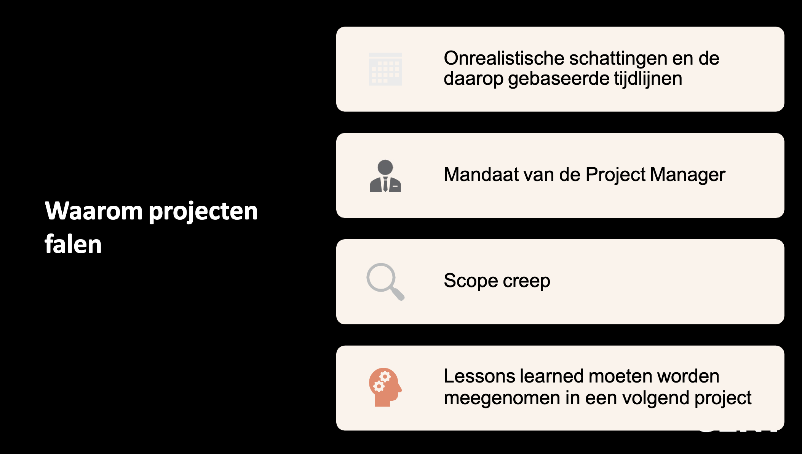
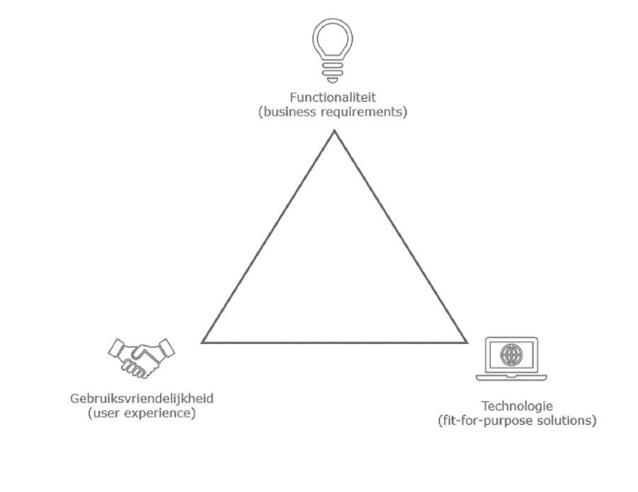
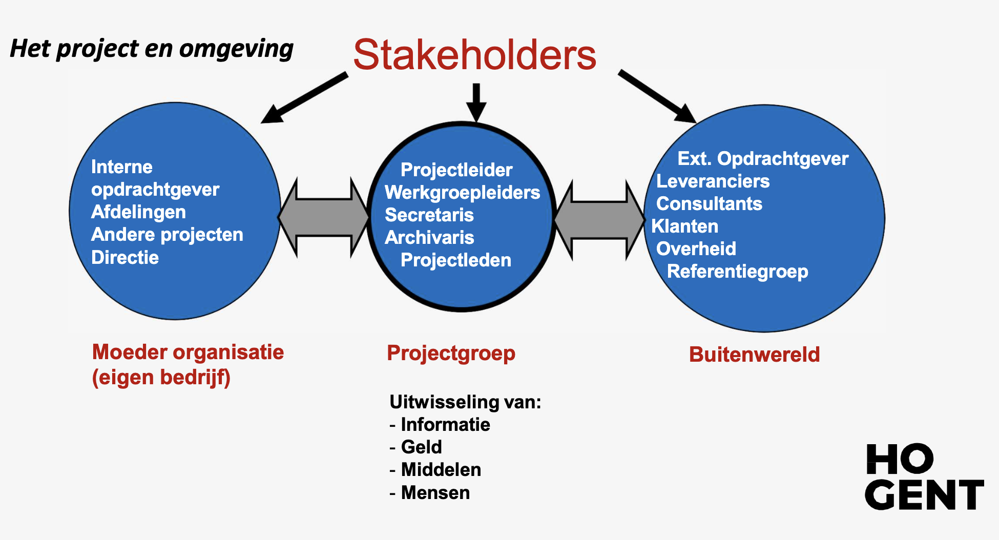

# It2business : Hoofdstuk 1 - Project Management - Deel 3

## Welke rollen en factoren leiden to een succesvolle oplevering? 

>#organiseren

### Projectsucces

Moeilijk eenduidig te schetsen, enerzijds is er de visie van de klant en die van de projectmanager.

- Visie van de klant: klantentevredenheid
  - Verwachtingen, vereisten en voorwaarden
  - Wanneer aan alle 3 voldaan is, is het project een succes
  
> De **succesvolle oplevering** van een project wordt gekenmerkt door een 100%-match met de vereisten van de klant. Daarin staat de goedkeuring van deliverables door de klant centraal.

- Behoeften van de klant in kaart brengen is dus belangrijk om het project succesvol af te ronden
  
- Visie van de projectmanager:
  - Niet enkel de deliverables zijn belangrijk
  - Ook de manier waarop het project wordt uitgevoerd
  - De PM volgt op of het Project Management Plan wordt opgevolgd

#### Waarom falen projecten?

- Heel veel projecten blijken niet te voldoen aan de vereisten van de klant door zowel interne als externe redenen:
  - Interne redenen: binnen de bevoegdheid van de project manager
  - Externe redenen: buiten de bevoegdheid van de project manager

- Onderzoek toont aan dat er heel wat redenen zijn waarom een project faalt:
  
**Voornaamste redenen:**

1. *Onduidelijke projectdoelstellingen:*
   - Afspraken maken over wat de doelstellingen en verwachte resultaten zijn.
   - Oplossingen moeten voldoen aan de wens van de klant
2. *Slechte planning van resources:*
   - Resources zijn: vaak niet ongelimiteerd beschikbaar en sterk bevraagd
   - Goede planning opmaken die rekening houdt met de beschikbaarheden van de resources is daarom belangrijk
3. *Slechte communicatie en stakeholdermanagement in de organisatie:*
   - Een project is enkel succesvol als het eindresultaat gebruikt wordt en voldoet aan de wensen van de gebruikers
   - Spendeer voldoende tijd aan het identificeren van en de communicatie met deze betrokkenen
4. *Slecht gedefinieerde project scope:*
   - de scope bepaalt de inhoudelijke grens van ons project
   - de scope moet zo correct mogelijk definieerd worden
5. *Slechte inschattingen van tijd en kosten:*
   - project moet opgeleverd worden tegen de prijs en de deadline die werd afgesproken
   - het inschatten van de benodigde tijd en kost is een moeilijke oefening
   - de juiste experten moeten betrokken worden bij deze inschattingen
6. *Slecht risicomanagement:*
   - risico's zijn gebeurtenissen die zich kunnen voortdoen en die een impact kunnen hebben op het project
   - risico's moeten vooraf geidentificeerd worden om de impact op het project te minimaliseren
7. *Onervaren projectmanagers:*
   - de rol van projectmanager is niet iets dat aangeleerd kan worden
   - wanneer deze ervaring ontbreekt kan dit leiden tot beslissingen die een negatieve invloed hebben op het project.
8. *Gebrek aan gestructureerde opvolging:*
   - een belangrijke taak van de projectmanager is opvolging en evaluatie van de projectvoortgang

> Bovenstaande factoren zijn niet limitatief. Dit zijn de meest voorkomende factoren waarom een project kan falen.

- Een project leiden wil ook zeggen dat men zeer opmerkzaam moet zijn voor veranderingsaanvragen.
  - Waken over correctheid en volledigheid van de analyse van de veranderingsaanvraag
  - Impact dient onderzocht te worden alvorens de aanvraag goedgekeurd wordt 
  - Vaak blijkt de impact achteraf groter dan voorzien

### Projecten in een organisatie

- projecten worden uitgevoerd in een organisatie
- de organisatie heeft dus ook een directe invloed op het al dan niet succesvol afronden van een project
  - projectmanager heeft vaak niet een mandaat om alle medewerkers aan te sturen of in te zetten op het project
- het is belangrijk dat de organisatie achter het project staat
- cultuur is hierbij ook belangrijk:
  - een sterke hiërarchie leidt vaak tot lange goedkeuringsprocessen
  - in de pharmaceutische sector zullen de kwaliteitseisen heel hoog liggen
  - extra testruns kunnen nodig zijn naar gelang het risco binnen de sector (financiële/farmaceutische sector...)
  
#### Ownership van digitale initiatieven

- Digitale initiateiven zijn niet langer enkel voor IT
  - business komt vaak ook met oplossingen
  - balans tussen noden, gebruiksvriendelijkheid en de technische oplossing

> Sterke tadem tussen IT en business. Op deze 3 speerpunten. Elke partij heeft min of meer inspraak op de speerpunten, maar heeft steeds een stem.
> - behoefte zal eerst en vooral door de business uitgesproken worden
> - business kan suggesties voor technologische keuzes doen
> - eind oordeel voor technische keuze zal bij de it-experten liggen
> - op gebied van UX slaan business en IT best de handen in elkaar

#### Rollen binnen een IT project

> Veel rollen kunnen actief zijn op een project. Afhankelijk van de scope en omvang van het project kunnen deze aanwezig zijn.
> Juiste mensen aanboord krijgen is van groot belang

1. *Projectmanagement Office (PMO)* (projectbureau)
   - Zorgt voor consistentie op vlak van methodologie, templates, tools en rapportering
   - Staat in voor het ontwikkelen van project management expertise in de onderneming
   - Zorgt voor het afstemmen van de staffing over verschillende projecten heen
   - Administratieve taken: zorgen voor lokalen, computers, users,...
   - Belangrijk bij de planningsfase en de projectopvolging
2. *Functionele manager*
   - Leidt een afdeling binnen een bedrijf waar het project wordt uitgevoerd
   - Balans tussen dagelijks werk en project werk (medewerkers niet alle tijd laten opnemen door het project)
   - Input voor de scope en de vereisten
   - Verantwoordelijk voor de bedrijfsprocessen die aan de basis liggen van de oplossing
   - Zetelt vaak in de stuurgroep van het project
3. *Proceseigenaar*
   - De expert aangaande het business proces dat we proberen te verbeteren met het project
   - Levert cruciale input tijdens de concept- en ontwerpfase
   - Identificeert de mogelijke wijzingen en verbeteringen aan het proces
   - Zorgt voor een aanvaarding van de wijzigingen in de organisatie
4. *Sleutelgebruiker*
   - De sleutelgebruiker (of keyuser of kerngebruiker) is een ervaren gebruiker van een proces of subproces
   - Leveren de vereisten in concept- en ontwerpfase
   - Spelen cruciale rol bij de oplevering omdat ze eerste aanspreekpunt zij voor collega's
   - Staan bij go-live in voor de verificatie van de applicatie
   - Voeren de eerste (functionele) testen uit
   - Zijn het klankbord op de werkvloer en dragen boodschappen van het project uit naar de collega's
5. *Sponsor*
   - Draagt de eindverantwoordelijkheid over het project
   - Stelt de middelen ter beschikking om het project te kunnen uitvoeren
   - Initieert de projectvraag
   - Directe communicatie tussen project manager en de sponsor
   - Zetelt meestal in de stuurgroep van het project
6. *Stuurgroep*
   - Centraal rapporterings- en beslissingsorgaan van het project
   - Wordt in principe periodiek gerorganiseerd (maandelijks bvb) maar er is flexibileit nodig om de stuurgroep samen te roepen wanneer nodig
   - Rapporteren van de status
   - Nemen van belangrijke beslissingen ifv het project
7. *Business analyst / functional consultant*
   - Ondersteunt en adviseert de business rond de optimalisatie van de processen
     - Inventarisseren van de wensen, vereisten en bestaande problemen (AS - IS)
     - Definiëren van het te bereiken streefdoel voor alle betrokken personen en processen (TO - BE)
   - Werkt aan de harmonisatie van processen en procedures
   - Schrijft de business case mee uit
   - Zijn vooral actief bij de start van het project
8. *Technisch expert*
   - Niet noodzakelijk een developer
   - Schrijven de applicatie
   - Staan in voor de technische oplevering van het product
   - Configureren of data-analyse kan ook tot de taken behoren
   - Dragen vooral bij tijdens de implementatiefase maar kunnen ook in het voortraject betrokken worden
   - Schrijven de technische specificatie
   - Voeren de (technische) testen uit en lossen eventuele bugs op
   - Staan mee in voor de support na go-live
9.  *(Data-)Architect*
    - Bewaakt de "big picture" inzake IT-architectuur
    - Zorgt ervoor dat nieuwe keuzes passen in de bestaande architectuur
    - Zorgt dat de communicatie tussen verschillende systemen op een uniforme manier gebeurd
    - Is vooral tijdens de eerste fases betrokken bij het project in een advies rol
10. *Testmanager*
    - Stelt het testplan op
    - Kiest de testing tools
    - Coördineert het uitwerken van testscenario's
    - Volgt het uitvoeren van de testen en de resultaten ervan op
    - Zorgt ervoor dat de acceptance criteria worden gerespecteerd en gehaald alvorens het project live gaat
11. *Tester*
    - Voert de testen uit
    - Maakt in principe niet zelf de testscenario's om objectiviteit te garanderen
    - Rapporteert aan de testmanager
    - Vooral aanwezig in de testfase
    - Testers kunnen zowel interne als externe medewerkers zijn
12. *Transitiemanager*
    - Bereidt het cut-over plan voor en zorgt voor de validatie ervan
    - Organiseert de cut-over en waakt over de uitvoering ervan
    - Werkt nauw samen met de projectmanager tijdens de cut-over fase
13. *Change Control Board (CCB)*
    - Wordt samengeroepen om wijzigingen te bespreken en goed te keuren
    - Zorgt er dus voor dat scope creep onder controle wordt gehouden
  
    > **Scope creep**: betekent dat er tijdens een project * onverwachte of ongeplande uitbreidingen* van de afgesproken scope plaatsvinden 
    - Frequentie van samenkomen is niet vast maar zal bepaald worden op basis van de vragen
    - Bestaat uit de sponsor, architecten, functionele managers, team leads, ...
    - De projectmanager legt de vragen voor en verantwoordt ze  
14. *UX/IU Designer*
    - Legt zich toe op het visuele aspect en het gebruiksgemak van een oplossing
    - Komt vooral in beeld tijdens de conceptfase en de ontwerpfase voor het afleveren van mock-ups en designs
    - Ook de employee experience mag niet vergeten worden bij de invoering van digitale tools
15. *Project Manager*
    - Opvolging en evaluatie va project activiteiten
    - Zorgen dat teamleden optimaal kunnen werken
16. *Scrum master* (Agile)
    - Zorgt ervoor dat scrum teams optimaal kunnen werken en zal de zogeheten "impediments" wegnemen
17. *(Proxy) Product owner* (Agile)
    - Brug tussen business en IT
    - Stelt prioriteiten aangaande user stories
    - Geeft verduidelijkingen aan het technische team
    - Levert feedback op basis van demo's en testen
    - > Indien dit profiel bij het IT team zit, spreken we van **een proxy product owner**

#### Competentie

Een competentie is de combinatie van:
- kennis
- vaardigheden
- houding
- gedrag
die nodig is om in een bepaalde beroeps-situatie goed te kunnen functioneren.

*Competenties van de projectleider*

- enthousiast anderen te kunnen motiveren
- het lef hebben zich als een leider te gedragen
- taakgericht kunnen werken
- goede communicatieve vaardigheden bezitten
- om kunnen gaan met conflicten
- hoofd- en bijzaken van elkaar onderscheiden (helikoperview)
- afhankelijkheden kunnen identificeren
- vooruitkunnen denken
- pro-actief zijn
- kunnen onderhandelen, bijvoorbeeld met de opdrachtgever
- kunnen omgaan met onzerkeheden
- kunnen organiseren en delegeren

*Verantwoordelijkheden van de projectleider*

- Onderhandelen met opdrachtgever
- Zorgen voor het juiste plan van aanpak (PvA)
- Bekend maken van PvA
- Goedkeuring verkrijgen PvA
- Voortgang rapporteren
- Zorgen voor externe communicatie
- De dagelijkse leiding nemen binnen het team
- Werkverdeling binnen het projectteam
- Voorzitten van de projectteamvergaderingen
- Zorgen voor een goede motivatie binnen projectteam
- Oplossen van conflicten
- Projectleden "uit de wind houden"
- Bewaken van de planning,  budget en kwaliteit
- Voorschrijven hulpmiddelen en technieken