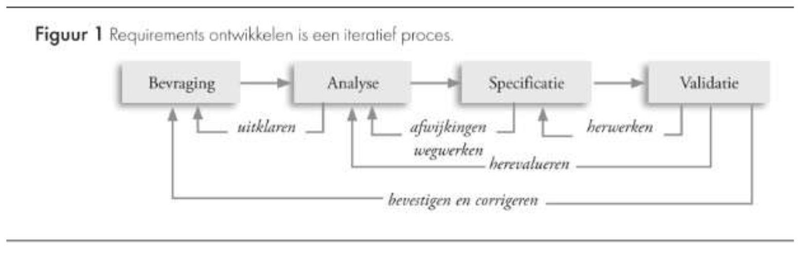
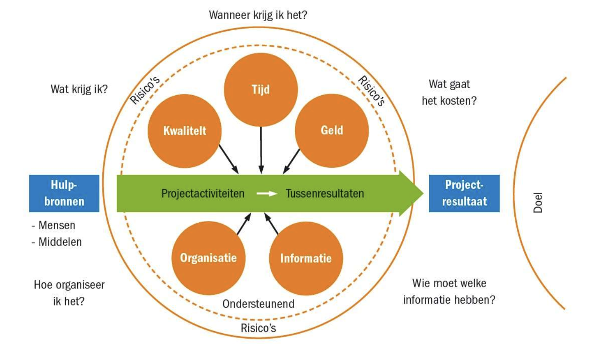
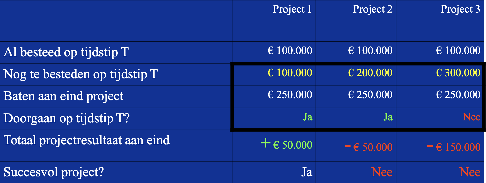
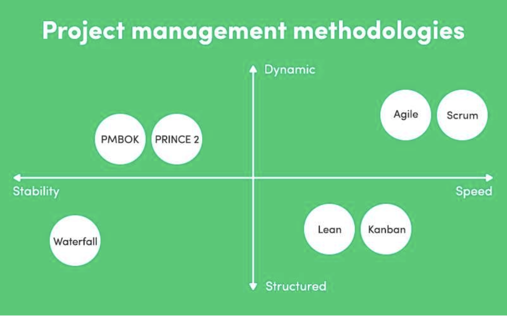

# It2business : Hoofdstuk 1 - Project Management - Deel 4

## Wat zijn de noden van onze klant?

> #requirements analyseren

### Proces van requirementsanalyse

1. *Bevragen*
   - Definieer productvisie en projectscope
   - Identificeer gebruikersgroepen en hun eigenschappen (eventueel met sleutelgebruikers)
   - Definieer user requirements en welke meerwaarde dit oplevert
   - Definieer digitale triggers
2. *Analyseer*
   - Moddeleer de omgeving &rarr; visuele ondersteuning
   - Haalbaarheid van requirements
   - Prioritiseren van requirements
   - Beschrijf technische vereiste
3. *Specifieer* 
    > = eenduidige communicatie van wat er concreet vereist wordt
4. *Validatie*
    > = formeel akkoord van de vereisten opdat project succesvol is (scope!)

#### Type vereisten

| Term                             | Definitie                                                                                                                                                     | Voorbeeld                                                                            |
| -------------------------------- | ------------------------------------------------------------------------------------------------------------------------------------------------------------- | ------------------------------------------------------------------------------------ |
| *Business requirement*           | Strategische doel van het bedrijf dat de software implementeert                                                                                               | 'We hebben een webshop nodig om onze verkoop te kunnen stimuleren'                   |
| *Business rule*                  | Een policy, richtlijn of standaard die een bepaalde voorwaarde stelt aan de software. Is geen requirement op zich, maar leidt tot een of meerdere equirements | 'Elke bestelbon moet ondertekend worden door een manager'                            |
| *Constraint*                     | Een beperking die wordt opgelegd waardoor de keuzes die we kunnen maken beperkter worden.                                                                     | 'In ons bedrijf is enkel JAVA-kennis aanwezig'                                       |
| *External interface requirement* | Beschrijving van een link tussen verschillende systemen en/of hardware                                                                                        | 'Betalingen online gebeuren via PayPal'                                              |
| *Feature*                        | Een set van functionaliteiten die een logisch geheel en een meerwaarde voor de klant vormen                                                                   | 'Er moet een productcatalogus ter beschikking zijn'                                  |
| *Functional requiremen*          | Een beschrijving van hoe het systeem zich zal gedragen onder bepaalde omstandigheden                                                                          | 'Als een product niet op voorraad is, moet de verwachte levertermijn getoond worden' |
| *Non-functional requirement*     | Een beschrijving van een eigenschap van het systeem                                                                                                           | 'De webshop moet ook kunnen worden getoond op mobiel toestellen'                     |
| *System requirement*             | De systeemvereisten die nodig zijn om een softwareproduct te kunnen maken                                                                                     | 'Het inloggen in de webshop vereist een tweestapsverificatie'                        |
| *User requirement*               | Taken die een user moet kunnen uitvoeren                                                                                                                      | 'Een verkoper moet alle bestelbonnen kunnen bekijken'                                |

#### Deliverables

> Zijn de documenten van de vereisten

1. Scope statement
2. User stories
3. Software requirements specification (SRS)

### Beheersen van een project

#### Beheersing in de praktijk

- Planning vooraf (T)
  - Activiteiten en werkuren
  - Dependecies
  - Nodige resources
  - Milestones - wanneer moet/kan iets af zijn
- Voortgangsbewaking (T, I)
  - Rapporteren
  - Tijdsverantwoording - Trello (Estimate/Time Spent/Time Remaining)
  - Weekverslag
- Overleggen (I, O)
  - Wekelijkse meetings
  - Demo's, stand-up
  - Skype/hipchat/slack/discord
- Planning aanpassen (T)
- Bewaking budget (G)
  - Startbudget = koopt eindproduct
  - Kosten blijven opvolgen en afzetten tegen over projectvoortgang en het totale budget
  - Kosten baten blijven evalueren &rarr; scope aanpassen of stopzetten van project kan als gevolg optreden
- Bewaking kwaliteit (K)
  - Op basis van specificaties een verwachting
    - Roeiboot verwachting waterdicht, maar zeewaardig tijdens hevige storm is onredelijk
  - Tussentijdse kwaliteitscontroles zijn nodig
  - Kwaliteit heeft zijn prijs
  - SMART doelstellingen
- Verspreiding en archivering info
  - Wiki - confluence
  - Ontwerpen en documentatie
- Bewaking projectdoel (O)
  - Scope-creep
  - Afwegen van de wijzigigen
    - Geen wijzigingen toesten &rarr; minder bruikbaar eindresultaat
    - Te veel wijzigigen toestaan &rarr; tijd/kost in gevaar
  - Financiële consequenties schriftelijk duiden aan opdrachtgever
  - Officieel wijzigingsverzoek
- Bedreigingen project (O)
  - Motivatie zakt weg
  - Taakverdeling onduidelijk
  - Meningsverschillen
  - Eigen doelen
  - Besluitvorming te traag
  - Onduidelijk doel
  

### Project risico's

- Gevaar voor schade of verlies door onzekere gebeurtenis
- Grootte risico = kans x gevolg
- Kans kan klein zijn maar met grote gevolgen
- Scope - planning - materiaal - mensen - organisatie ...

#### Risico analyse

- Inventariseer risico's
- Analyseer risico's
- Formuleer maatregelen
  - Preventief/repressief
  - Overdragen
  - Acceptatie

#### Project stoppen?

### Project management methoden

- System Development Methodology
  - Automatisering
  - Strakke fasering - waterval
- Scrum
- Prince2
  - Checklist, richtlijnen, Project Initiation Document
- PMBoK
  - Best practises
- P6

