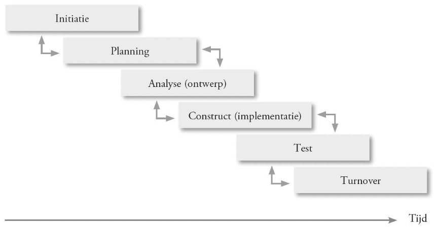
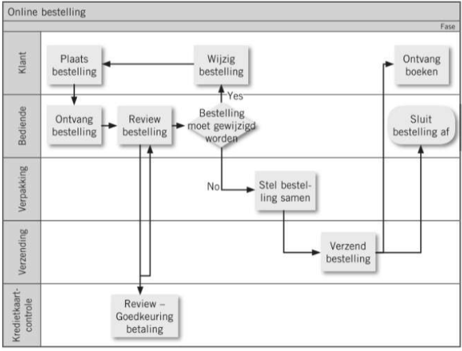

# It2business : Hoofdstuk 1 - Project Management - Deel 5

## Wat is de impact van ons digitaal initiatief op de organisatie?

> #processen

### Process requirements

> **Process requirements** zijn de vereisten die een bedrijfsproces heeft ten aanzien van de ondersteunende digitale oplossing. Om die in kaart te brengen is het noodzakelijk de concrete bedrijfsprocessen uit te tekenen en te beschrijven zodat mogelijke optimalisaties in deze bedrijfsprocessen geïdentificeerd kunnen worden

- 90% van de digitalisering in bedrijven gebeurd ter ondersteuning van bedrijfsprocessen
- Optimalisatie en verbetering zijn belangrijke drivers van projecten

### Beschrijving en doel

- Digitale tools zijn meestal niet de kernactiviteit van een onderneming maar zorgen ervoor dat de onderneming haar kernactiviteiten succesvol kan uitvoeren.
  
- Voorbeelden *kernprocessen*:
  - In productiebedrijven worden de productielijnen en het warehousemanagement gestuurd door digitale toepassingen: order picking, voorraadbeheer, aansturen machines,...
  - In transportbedrijven worden optimale bezetting en routes berekend
  - In verkooporganisaties wordt het verkoopproces ondersteund door facturatieprogramma's, online betaal mogelijkheden, CRM-systemen...
- Voorbeelden *ondersteunende processen*:
  - HR-toepassingen zorgen ervoor dat lonen berekend worden, vakantie kan worden aangevraagd en kandidaten kunnen online solliciteren
  - De boekhouding verloopt in elk bedrijf via gespecialiseerde software
  - De IT-dienstverlening wordt op haar beurt weer ondersteund door IT-toepassingen: opvolgen incidenten, aanvraag materiaal,...
- Voorbeelden *waarbij digitale oplossingen deel uitmaken van het product of dienst*:
  - Mobile banking
  - Fysiek speelgoed dat een nieuwe dimensie krijgt online
  - Opslag van documenten gebeurt nu digitaal
- Het is duidelijk dat digitale oplossingen niet bestaan zonder de processen die ze dienen te ondersteunen
  - Vooraf onderzoeken hoe digitalisatie deze processen optimaal kan onderzoeken
  - Bepaling van de winst die digitalisatie kan genereren
  - Zeker belangrijk bij externe partijen die betaald worden (ROI! = Return on Investement)

### Voordelen

#### Input business case

- De business case bepaalt de return on investment van een project
- Beslissingen om het project al dan niet te laten doorgaan worden genomen op basis van de business case
- Een duidelijke winst in de processen kan de ROI verhogen
- Hiervoor is een goede kennis van de processen nodig: in kaart brengen van de huidige processen en de gewenste veranderingen.
- Ook de links tussen processen kunnen belangrijk zijn

#### Input analysedocument

- Het analysedocument dient gevalideerd te worden
- Veranderingen kunnen geïdentificeerd worden
- Ook hier een duidelijk beeld van de huidige en gewenste situatie
- Helpt de developers omdat de flow duidelijker wordt
- Als de process flow goed gedocumenteerd wordt, is er meestal minder input nodig van de sleutelgebruikers

#### Input testfase

- De testscenario's kunnen zich baseren op de business flow
- Wanneer we werken met swimlanes, zijn ook de verantwoordelijkheden duidelijk en is het makkelijk terug te vinden wat automatisch gebeurt en waar er nog een actie vereist is
- Er wordt vermeden dat er delen van het proces vergeten worden.
- Gebruik van process flows voor testing vergroot de herkenbaarheid van de scenario's voor eindgebruikers.

#### Input change management

- Door het gebruik van swimlanes weten we wie welke rollen zal uitvoern in de vernieuwde processen
- Als we deze vergelijken met de huidige processen, wordt snel duidelijk waar er grote veranderingen zullen optreden bij gebruikers
- Sommige rollen zullen misschien volledig geautomatiseerd worden
- Dit kan een input zijn voor training of zelfs een wijziging van de jobinhoud
- Tijdig inspelen op deze wijzigigen verlaagt de weerstand tov verandering

### Rollen

- *Business analist*:
  - Zal de procesbeschrijving opmaken en adviezen formuleren naar verbetering
  - Interviews met gebruikers, haalt informatie uit bestaande documenten,...
  - Past eventueel best practices toe
  
  > Een **best practice** is een bepaalde manier van werken of een bepaalde opzet van een applicatie die op basis van verschillende eerdere implementaties tot stand is gekomen en de beste manier van werken identificeert binnen een bepaald domein, een bepaalde taak of applicatie.

- *Process owner*:
  - Verantwoordelijk voor een proces of een subproces
  - Geeft initiële input over het proces
  - Neemt eindbeslissingen bij mogelijk wijzigigen
- *Eindgebruikers*:
  - Ze voeren de taken uit in het proces
  - Kunnen vaak meer detail geven dan de proces owner
  - Vaak verschillen de uitgevoerde taken van wat er beschreven staat.
- *Sleutelgebruikers*:
  - Specifieke groep van eindgebruikers met een zeer goede kennis van het proces
  - Nemen deel aan het project als vertegenwoordigers van de eindgebruikers

### Deliverables

*Process flowcharts*
  - Beschrijft de verschillende stappen van een project
  - Beschrijft welke gegevens er worden doorgegeven
  - Beschrijft welke output er gegenereerd wordt
  - Geeft afhankelijkheden weer met andere processen
  - Geeft de verschillende rollen weer aan de hand van swimlanes
  - Voorbeeld: 

  - Het opmaken van een flowchart kan soms zeer complex worden, daarom splitsen we deze vaak op in subprocessen of werken we met verschillende niveau's
    - Niveau 1: ondernemingsprocessen
      - Grote processen zoals productie, sales, warehousing
      - Geeft vooral volgorde en afhankelijkheden weer
      - Nog geen rollen
    - Niveau 2: afdelingsprocessen
      - Verschillende processen per afdeling
      - Bijvoorbeeld binnen sales onderscheiden we: bestelling, facturatie, dienst-na-verkoop
    - Niveau 3: deelprocessen
      - Wanneer we kijken naar het proces van de bestelling kan dit bestaan uit: bestelbon opmaken, bestelling klaarmaken, bestelling verzenden
    - Niveau 4: taken
      - Hier bekijken we dan één deelproces in detail met de taken die tot dat deelproces behoren en de rollen die nodig zijn om deze taken ui te voeren.

### Afhankelijkheden

- In deze fase worden niet alle vereisten in detail bepaalt. Het maken van proces requirements is vooral belangrijk om de opportuniteiten te identificeren voor het project. Het bepalen van de functionele requirements is onderdeel van de requirementsanalyse
- Procesbeschrijvingen kunnen in de volgende fases gebruikt worden als input voor analyse, testen en change management
- Het is wel belangrijk te onthouden dat dit voorbereidend werk is en verder zal uitgewerkt worden als het project effectief wordt uitgevoerd
- Processen worden meestal niet uitgetekend in het kader van een specifieke digitale oplossing

### Aandachtspunten

- Reserveer voldoende tijd voor het analyseren van processen
  - Opstellen van processen kan zeer veel tijd kosten
  - Het hoe en waarom van bepaalde taken is niet altijd duidelijk
  - Processen worden uitgevoerd door verschillende personen die allemaal moeten betrokken worden
- Betrek de juiste gebruikers
  - Diegenen die het hardts roepen zijn vaak ontevreden
  - Onderscheid maken tussen proces en persoonlijke problemen
- Beheers de complexiteit
  - Te complexe procesbeschrijvingen zijn niet leesbaar door alle deelnemers aan het project
  - Gebruik software of splits processen op in deelprocessen
  - Gebruik een gemeenschappelijke terminologie en stem het gebruik van iconen af
- Houd rekening met de vervaldatum
  - Beperkte houdbaarheid: reorganisatie of wettelijke wijzigingen wijzigen ook de processen
  - Zeker wanneer er een lange tijd zit tussen de voorbereiding en het eigenlijke project
- Controleer afhankelijkheden met andere processen
  - Een proces staat zelden op zichzelf
  - Breng de impact in kaart van wijzigingen in het proces op andere processen
  - Belangrijk voor de business case!

### BPMN

**BPMN** is een standaard in business process modeling ontwikkeld door de Object Management Group die tracht de kloof tussen het ontwerpen van bedrijfsprocessen en het implementeren ervan te overbruggen. BPMN maakt businessprocessen begrijpelijk voor zowel business analisten als ontwikkelaars en zorgt ervoor dat de processen gemakkelijk te onderhouden zijn door eindgebruikers en managers.