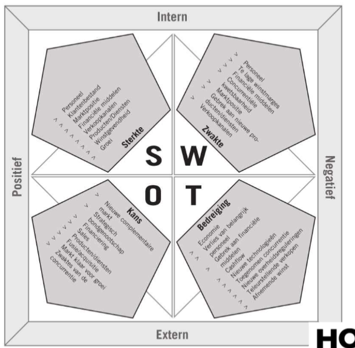

# It2business : Hoofdstuk 1 - Project Management - Deel 6

## Is ons initiatief haalbaar en winstgevend?

> #business case

### Concept

Het **concept** is het uitgewerkte idee van een project. De requirements en de processen die het project initialiseren zijn geïdentificeerd. In deze fase wordt, onder andere op basis van een business case, nagegaan of een project een voldoende grote opbrengst heeft en of er voldoende ondersteuning kan gevonden worden binnen de onderneming.

- Meestal uitgewerkt door de projectmanager, sponsor, eindgebruiker en de business analist.

### Drivers voor projecten

#### Projecten gedreven door factoren van buitenaf

- Noodzakelijk om het voortbestaan van de onderneming te garanderen
- Legale wijzigingen: invoering GDPR, invoer Euro,...
- Omgevingsfactoren: economische crisis, cyberattacks, nieuwe type klanten
- Conceptfase is beperkt want de business case is duidelijk
- Snelle uitvoer is gewenst

#### Projecten gedreven door optimalisatietrajecten

- Nood om een proces efficiënter uit te voeren
- Duidelijke nood aan verbetering maakt business case vrij eenvoudig
- Verzekeren van engagement in de organisatie
- Kostenbesparing is belangrijke winst
- Conceptfase: vooral weerstand verminderen en sleutelgebruikers identificeren
  - Inzetten van change agents

#### Projecten gedreven door verbeteringstrajecten

- Aangebracht door de eindgebruikers: nieuwe manier van werken kan tot verbetering leiden
- Business case: geen directe vraag vanuit het management dus winst moet bewezen worden
- Engagement is meestal geen probleem, maar verandering moet wel door alle gebruikers gedragen worden

#### Projecten gedreven door nood aan onderscheidend vermogen

- Klanten verwachten dat digitalisatie deel uitmaakt van het aanbod producten en diensten
- Bedrijven moeten blijven innoveren om competitief te blijven
- Digitale projecten moeten proactief zijn ipv reactief
- Conceptfase: overtuigen van alle partijen dat de digitale oplossing een meerwaarde heeft

### Activiteiten conceptfase

- Afhankelijk van de driver van het project, maar toch **twee** activiteiten die terug komen in het eerste deel van de conceptfase:
  - Het maken van een SWOT-analyse
  - Het opstellen van de business case: kosten-baten analyse
  - Het opstellen van een risico-analyse: bekijken van de bedreigingen en opportuniteiten
  - Voorstelling en goedkeuring aan het management: beslissing of het project kan doorgaan
- Deze activiteiten kunnen meerdere keren herhaald worden:
  - Business case niet voldoende duidelijk
  - Prioriteiten stellen
- Na goedkeuring door het management volgen nog volgende activiteit:
  - Aanstelling projectmanager: opvolgen budgetten en afstemmen van de verschillende partijen

### Rollen en verantwoordelijkheden

- Business analist: opstellen business case
- Eindgebruiker/sleutelgebruiker: leveren input voor het concept
- Sponsor/management: goedkeuring van het project op basis van de business case
- Projectmanager: overzicht bewaren en haalbaarheid van het project bewaken

### Deliverables

#### Business case

De **business case** geeft een antwoord op de vraag of een project winstgevend zal zijn op de middellange of lange termijn. Op basis van de kosten-batenanalyse in de business case zal een project al dan niet opgestart worden. De business case onderzoekt met andere woorden de levensvatbaarheid van een project.

- Beschrijven van de business requirements: het "waarom"
- Oplijsten van de kwantitatieve en kwalitatieve gevolgen
  - Verhogen van de klanttevredenheid
- Beschrijving van het betrokken bedrijfsproces
- Beschrijving van de oplossing op hoog niveau (nog niet hoe de oplossing zal geïmplementeerd worden)
- SWOT-analyse: weegt de sterktes en zwaktes af tegen de kansen en bedreigingen uit de omgeving
    

    - vragen SWOT analyse:
      - Is er voldoende expertise in de organisatie? (intern)
      - Is er voldoende budget beschikbaar? (intern)
      - Is de deadline realistisch en haalbaar? (intern)
      - Zijn er nieuwe technologieën die we kunnen aanwenden? (extern)
      - Zijn er best practices te vinden? (extern) 
      - Behalen we met het project een competitief voordeel? (extern)
      - Zijn er tendensen op de markt die het project kunnen beïnvloeden? (extern)
- Economische assessement: berekening van de ROI
  - Op middellange termijn
  - Altijd negatief bij de start
  - Ook rekening houden met extra kosten na het project: onderhoud, upgrades, wijzigingen, assumpties,...
  - Aanbeveling tot beslissing
    - Zowel positief als negatief
    - Advies voor het management dat de eindbeslissing neemt
    - Neutraliteit is belangrijk

#### Scope statement

- Afwijkingen worden enkel toegestaan door een change request

> Een change request is een vraag tot wijziging die niet was opgenomen in de oorspronkelijke offerte. Meestal bestaat er een vooraf vastgelegde procedure die bepaalt hoe de berekening van de kost en de goedkeuring van de change request moet verlopen.

- Redenen tot wijziging:
  - Fouten in de planning
  - Fouten in de assumpties
  - Externe veranderingen
  - Nieuwe of veranderende vereisten
- Teveel wijzigen houdt een risico in voor het project wanneer deze niet op een correcte manier gevalideerd worden.

> **Scope creep** is het steeds (organisch) uitbreiden van de oorspronkelijke scope zonder dat er formele wijzigigen gebeuren aan de oorspronkelijke scope met aanpassing van budget en planning waardoor ook de formele goedkeuring van deze wijzigingen ontbreekt.

#### Risico-analyse

- Identificeren van mogelijke problemen die zich kunnen voortdoen
- Uitwerken van acties om deze risico's te beperken of te vermijden
  
  > **Een risico** is een mogelijke gebeurtenis die, wanneer ze zich voordoet, een negatieve of positieve impact zal hebben op het eindresultaat van het project. Afhankelijk van de waarschijnlijkheid dat het risico zich zal voordoen en de impact op het project, zal het risico een hogere prioriteit krijgen.

- Bepalen van het gewicht van een risico: wat is de impact en hoe groot is de kans dat het probleem zich zal voordoen?

### Afhankelijkheden

- Uitwerking op hoog niveau
- Vastleggen van verwachtingen
- Concept is het ijkpunt in het project
  
### Aandachtspunten

- Hoe rekening met verschillende scenario's
  - Werk met een optimistisch, realistisch en pessimistisch scenario
  - Gebruik de risico-analyse om de scenario's te ondersteunen
- Maak realistische inschattingen
  - Betrek experts
  - Wees volledig en wees realistisch
- Vergeet de randactiviteiten niet
  - Testen, data-migratie, installatie,...
  - Verantwoordelijkheid moet duidelijk zijn
- Bouw flexibiliteit in
  - Veranderingen zullen voorkomen
  - Zorg dat resources voldoende flexibel zijn